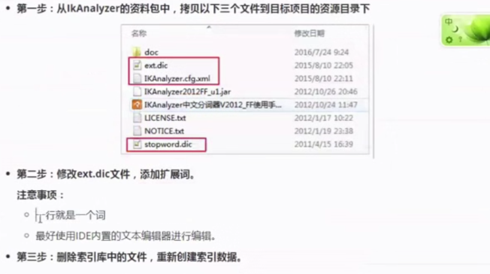
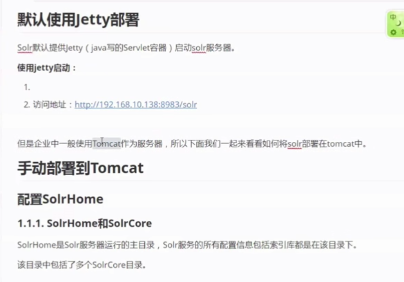
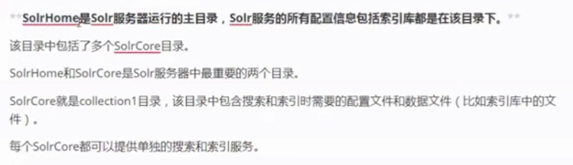
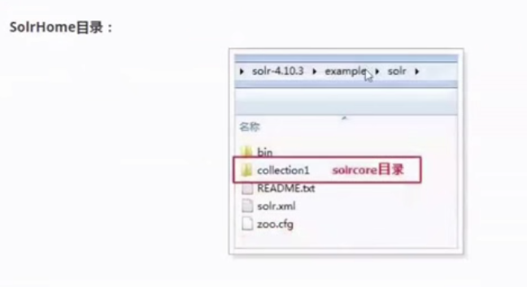
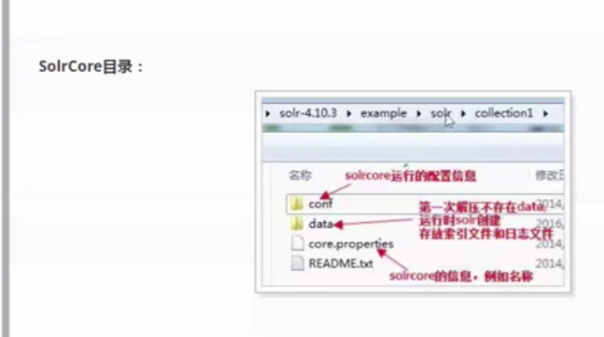
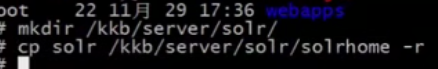
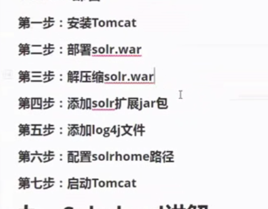
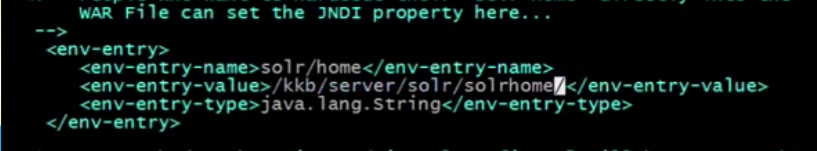
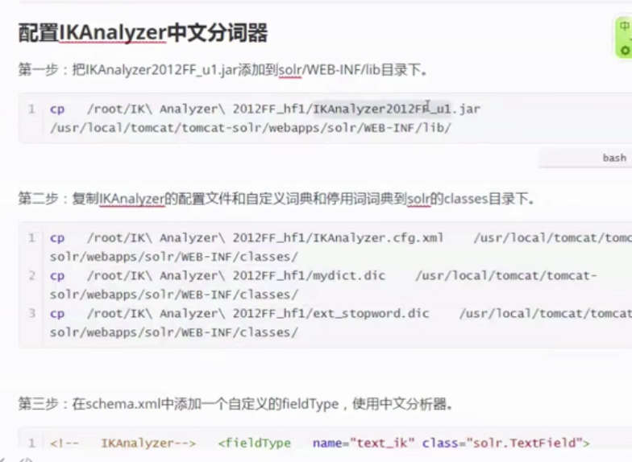
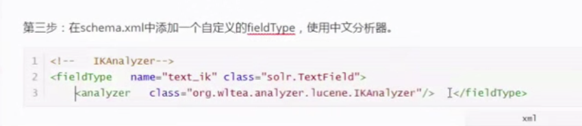

# Lucene 和 Solr

##  一、 什么是全文检索

先建立索引，再对索引进行搜索的过程就叫全文检索


## 二、Solr 和 ES的 比较

速度比较

- 当单纯对已有数据进行搜索时，Solr 更快

- 当实时建立索引时，Solr 会产生 IO 阻塞，es 更快

- 随着数据量的增加 Solr 会变慢，es 没有什么变化

  

  

  实时搜索与传统搜索的区别

  

## 三、 全文检索的流程


## 四、全文检索流程分析

创建索引流程

table -> document

row -> field


条件树，先 and  后 or


term 是 最小单位

倒排链表（按词找文档）


#### 相关性排序

相关性自然打分

​	tf - idf 越大权重越高

人为影响分数

​	设置 Boost 值（**加权值**）


ELK


最后形成了，倒排链表（按词找文档）


### 四 、Lucene 应用代码

Luke 工具


### 五、field 域

- Field 属性

  是否分词（tokenizer）

  是否索引(indexed)

  是否存储(stored)

  注意：商品描述可以索引但不存储

- Field 常用类型

  

  ......

- Field 域的设计


### 六、中文分词器

默认是 standard_analyzer，中文分词器 ik_anlyzer

- 使用

   ik_anlyzer

- 扩展词库

  

> 注意：创建索引和搜索使用的分词器必须一致


#### 七、 Solr 

​	Solr  是已经开发好的 web 服务，使用 http 请求远程连接，功能丰富 

​	Lucene 是一堆jar，需要耦合到自己的应用中

​	

​	




进入	example 目录下 

slor 就是 SolrCore





start.jar  使用  jetty 部署

```
java -jar start.jar
```


使用 tomcat 部署






mkdir classes


cp resources/log4j  ../classes


vim  web.xml 




配置中文分词器



​	

​	

solrcore 下有个 schema.（重要）


tomcat 的几个端口


启动完成之后 打开网址

text_id


ntstat  -plnt


