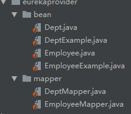

# MyBatis

### 开发流程

> 可以使用配置文件方式和配置文件 + 接口方式
>
> 推荐使用 配置文件 + 接口方式 ,因为使用接口方式可以指定返回值类型，更方便开发
>
> 但是必须把配置文件和接口放在同一个目录下

1. 添加依赖

   ```xml
   <dependency>
   	<groupId>org.mybatis</groupId>
   	<artifactId>mybatis</artifactId>
   	<version>3.5.2</version>
   </dependency>
   
   <dependency>
   	<groupId>mysql</groupId>
   	<artifactId>mysql-connector-java</artifactId>
   	<version>5.1.25</version>
   </dependency>
   ```

2. 添加一个实体类

   ```java
   @Data
   public class Dept {
       private Integer deptNo;
       private String deptName;
       private String loc;
   }
   ```

3. 添加核心配置文件

   ```xml
   <?xml version="1.0" encoding="UTF-8" ?>
   <!DOCTYPE configuration
           PUBLIC "-//mybatis.org//DTD Config 3.0//EN"
           "http://mybatis.org/dtd/mybatis-3-config.dtd">
   <configuration>
       <properties resource="db.properties"></properties>
       
       <!--给指定包下的类添加别名-->
       <!--比如： resultType 指定的类名就不需要加报名了-->
       <typeAliases>
           <package name="com.kkb"></package>
       </typeAliases>
       
       <environments default="development">
           <environment id="development">
               <transactionManager type="JDBC"/>
               <dataSource type="POOLED">
                   <property name="driver" value="${db.driver}"/>
                   <property name="url" value="${db.url}"/>
                   <property name="username" value="${db.username}"/>
                   <property name="password" value="${db.password}"/>
               </dataSource>
           </environment>
       </environments>
       <mappers>
   
           <!--指定 mapper 文件的路径-->
           <mapper resource="com/kkb/mapper/DeptMapper.xml"></mapper>
   
           <!--单个 class-->
           <!--<mapper class="com.kkb.mapper.DeptMapper"/>-->
   
           <!--扫描指定包（推荐）-->
           <!--<package name="com.kkb.mapper"></package>-->
       </mappers>
   </configuration>
   ```

4. 添加 mapper

   > 注意：namespace 表示接口路径，如果mapper+接口的方式，则必须和接口路径一致

   ```xml
   <?xml version="1.0" encoding="UTF-8" ?>
   <!DOCTYPE mapper
           PUBLIC "-//mybatis.org//DTD Mapper 3.0//EN"
           "http://mybatis.org/dtd/mybatis-3-mapper.dtd">
   
   <!--注意：namespace 表示接口的名称，如果使用接口，则必须和接口路径一直-->
   <mapper namespace="com.kkb.mapper.DeptMapper">
       <select id="findDept" resultType="Dept">
         select * from  dept;
      </select>
   </mapper>
   ```

5. 添加properties

   ```properties
   db.username=root
   db.password=123456
   db.driver=com.mysql.jdbc.Driver
   db.url=jdbc:mysql:///test:3306
   ```

6. 测试类

   ```java
   public class Test {
       public static void main(String[] args) throws IOException {
           final InputStream resourceAsStream = Resources.getResourceAsStream("configuration.xml");
           SqlSessionFactory ssf = new SqlSessionFactoryBuilder().build(resourceAsStream);
           SqlSession session = ssf.openSession();
   
           // 只使用配置文件方式
           //        session.select("findDept", new ResultHandler() {
   //            public void handleResult(ResultContext resultContext) {
   //                Dept dept = (Dept) resultContext.getResultObject();
   //                System.out.println(dept);
   //            }
   //        });
   
   
           // 使用配 置文件 + 接口方式，该方式需要配置文件和接口在相同的路径下
           DeptMapper deptMapper = session.getMapper(DeptMapper.class);
           System.out.println(deptMapper.findDept());
       }
   }
   ```

### 自定义 TypeHandler

1. 自定义转换器

   ```java
   public class MyTypeHandler implements TypeHandler<Boolean> {
   
       public void setParameter(PreparedStatement ps, int i, Boolean parameter, JdbcType jdbcType) throws SQLException {
           if (parameter) {
               ps.setInt(i, 1);
           } else {
               ps.setInt(i, 0);
           }
       }
   
       public Boolean getResult(ResultSet rs, String columnName) throws SQLException {
           if (rs.getInt(columnName) > 0) {
               return true;
           } else {
               return false;
           }
       }
   
       public Boolean getResult(ResultSet rs, int columnIndex) throws SQLException {
           if (rs.getInt(columnIndex) > 0) {
               return true;
           } else {
               return false;
           }
       }
   
       public Boolean getResult(CallableStatement cs, int columnIndex) throws SQLException {
           if (cs.getInt(columnIndex) > 0) {
               return true;
           } else {
               return false;
           }
       }
   }
   
   ```

2. 配置转换器

   > 在 configuration 中添加配置

   ```xml
   <typeHandlers>
           <typeHandler handler="com.kkb.typehandler.MyTypeHandler" javaType="Boolean" jdbcType="INTEGER"></typeHandler>
       </typeHandlers>
   ```

### 原理

....

### 整合 Spring

> 注意：可以指定 mapperLocations， 这样就不需要讲 mapper 配置文件和接口放在同一个文件夹了
>
> 同时，也可以在 SqlSessionFactoryBean 中定义 typeHandlers 等属性，所以就不需要 configuration 配置文件了

```xml
<?xml version="1.0" encoding="UTF-8"?>
<beans xmlns="http://www.springframework.org/schema/beans"
       xmlns:xsi="http://www.w3.org/2001/XMLSchema-instance"
       xsi:schemaLocation="
            http://www.springframework.org/schema/beans
            http://www.springframework.org/schema/beans/spring-beans.xsd">
    <!-- 1. Data Source: using Druid: 通常来说，只需要修改 initialSize、minIdle、maxActive -->
    <bean id="dataSource" class="com.alibaba.druid.pool.DruidDataSource" init-method="init" destroy-method="close">
        <!-- 基本属性 url、username、password -->
        <property name="url"      value="${database.url}"/>
        <property name="username" value="${database.username}"/>
        <property name="password" value="${database.password}"/>

        <!-- 配置初始化大小、最小、最大 -->
        <property name="initialSize" value="1"/>
        <property name="minIdle"     value="1"/>
        <property name="maxActive"   value="600"/>

        <!-- 配置获取连接等待超时的时间: 一分钟 -->
        <property name="maxWait" value="60000"/>

        <!-- 配置间隔多久才进行一次检测，检测需要关闭的空闲连接，单位是毫秒 -->
        <property name="timeBetweenEvictionRunsMillis" value="60000"/>
        <!-- 配置一个连接在池中最小生存的时间，单位是毫秒 -->
        <property name="minEvictableIdleTimeMillis"    value="300000"/>

        <property name="validationQuery" value="select 1 from dual"/>
        <property name="testWhileIdle"   value="true"/>
        <property name="testOnBorrow"    value="false"/>
        <property name="testOnReturn"    value="false"/>

        <!-- 打开PSCache，并且指定每个连接上PSCache的大小 -->
        <property name="poolPreparedStatements"    value="true"/>
        <property name="maxPoolPreparedStatementPerConnectionSize" value="20"/>
    </bean>

    <!-- 2. SQL session factory -->
    <bean id="sqlSessionFactory" class="org.mybatis.spring.SqlSessionFactoryBean">
        <property name="dataSource" ref="dataSource"/>
        <property name="mapperLocations" value="classpath:mapper/**/*.xml"/> <!-- Mapper xml -->
        <property name="typeAliasesPackage" value="ebag.bean"/> <!-- Mapper 文件中类型可以不使用包名了 -->
    </bean>

    <!-- 3. Instantiate Mapper -->
    <bean class="org.mybatis.spring.mapper.MapperScannerConfigurer">
        <property name="basePackage" value="ebag.mapper"/>
    </bean>
</beans>

```

### 逆向工程

> 数据库创建好表之后，使用mybatis 提供的 逆向工程可以创建出 mapper、 接口、和实体类

github 地址：https://github.com/mybatis/generator/releases/tag/mybatis-generator-1.3.7、

下载之后修改配置文件

> 注意：需要把生成的实体类、接口、mapper的位置设置成和正式的路径一致

```xml
<?xml version="1.0" encoding="UTF-8"?>
<!DOCTYPE generatorConfiguration
  PUBLIC "-//mybatis.org//DTD MyBatis Generator Configuration 1.0//EN"
  "http://mybatis.org/dtd/mybatis-generator-config_1_0.dtd">

<generatorConfiguration>
	<context id="testTables" targetRuntime="MyBatis3">
		<commentGenerator>
			<!-- 是否去除自动生成的注释 true：是 ： false:否 -->
			<property name="suppressAllComments" value="true" />
		</commentGenerator>

		<!--数据库连接的信息：驱动类、连接地址、用户名、密码 -->
		<jdbcConnection driverClass="com.mysql.jdbc.Driver"
						connectionURL="jdbc:mysql:///kaikeba"
						userId="root"
						password="123456">
		</jdbcConnection>

		<!-- <jdbcConnection driverClass="oracle.jdbc.OracleDriver" connectionURL="jdbc:oracle:thin:@127.0.0.1:1521:yycg"
			userId="yycg" password="yycg"> </jdbcConnection> -->

		<!-- 默认false，把JDBC DECIMAL 和 NUMERIC 类型解析为 Integer，为 true时把JDBC DECIMAL 
			和 NUMERIC 类型解析为java.math.BigDecimal -->
		<javaTypeResolver>
			<property name="forceBigDecimals" value="false" />
		</javaTypeResolver>

		<!-- targetProject:生成 PO 类的位置 -->
		<javaModelGenerator targetPackage="com.kkb.eureka.eurekaprovider.bean" targetProject=".\src">
			<!-- enableSubPackages:是否让schema作为包的后缀 -->
			<property name="enableSubPackages" value="false" />
			<!-- 从数据库返回的值被清理前后的空格 -->
			<property name="trimStrings" value="true" />
		</javaModelGenerator>

		<!-- targetProject:mapper映射文件生成的位置 -->
		<sqlMapGenerator targetPackage="mapper" targetProject=".\src">
			<!-- enableSubPackages:是否让schema作为包的后缀 -->
			<property name="enableSubPackages" value="false"/>
		</sqlMapGenerator>

		<!-- targetPackage：mapper接口生成的位置 -->
		<javaClientGenerator type="XMLMAPPER" targetPackage="com.kkb.eureka.eurekaprovider.mapper" targetProject=".\src">
			<!-- enableSubPackages:是否让schema作为包的后缀 -->
			<property name="enableSubPackages" value="false" />
		</javaClientGenerator>

		<!-- 指定数据库表， -->
		<table tableName="dept"></table>
		<table tableName="employee"></table>
		<!--<table tableName="user"></table>-->
	</context>
</generatorConfiguration>
```

生成

```java
public class Generator {
    public static void main(String[] args) throws Exception {
        List<String> warnings = new ArrayList<String>();
        boolean overwrite = true;
        File configFile = new File("mybatis-generator/config/generatorConfig.xml");
        ConfigurationParser cp = new ConfigurationParser(warnings);
        Configuration config = cp.parseConfiguration(configFile);
        DefaultShellCallback callback = new DefaultShellCallback(overwrite);
        MyBatisGenerator myBatisGenerator = new MyBatisGenerator(config, callback, warnings);
        myBatisGenerator.generate(null);
    }
}
```

生成之后会产生结果，放到正式的项目下



调用口，只能进行单表操作，且生成的 mapper 文件，parameterType 属性设置的是是全限定名，如果设置了  typeAlias 需要手动修改一下 

```java
@RunWith(SpringRunner.class)
@SpringBootTest
public class EurekaProvider01Tests {

    @Autowired
    DeptMapper deptMapper;

    @Test
    public void contextLoads() {
        DeptExample dept = new DeptExample();
        dept.createCriteria().andDnameEqualTo("金融事业部");
        List<Dept> deptList = deptMapper.selectByExample(dept);
        System.out.println(deptList);
    }
}
```

