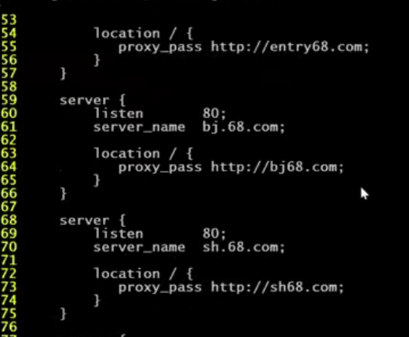

## Nginx

#### nginx 概述

1. 代理服务器

   正向代理（架设在客户端的，比如：翻墙）和反向代理（架设在的服务端）

2. Nginx 的 特点

   - 高并发

     并发：同一时间端内运行程序的个数

     tomcat 默认的并发量（ QPS） 为 150， nginx 默认为 1000， 如果配置一下的话为 5-10万

   - 低消耗

   - 热部署

     修改配置文件之后，若重新启动，会平滑重启，服务不会间断	

   - 高扩展

   - 高可用

3. Nginx 的 web 请求处理机制

   并行请求处理方式：多进程方式，多线程方式，异步非阻塞方式

   


#### 下载、源码安装、命令

1. 官网（nginx.org）下载 

2. 安装 yum install -y  gcc-c++  gcc

3. 安装依赖  pcre-devel  openssl-devel

4. 解压  tar -zxvf  nginx.tar

5. 进入 nginx 目录

   注意：./configure  --help 可以查看有哪些模块可以选择安装，体现了高扩展特点

   执行(设定安装目录和安装 https 模块)

   ```
   ./configure  --prefix=/usr/local/nginx  --with-http_ssl_module
   ```

   

6. 执行编译和安装
    `make && make install  `

7. echo $PATH

   添加一个软链接到 /usr/local/sbin

   ```
   ln -n /usr/local/nginx/sbin/nginx /usr/local/sbin
   ```

8. 启动

   nginx

9. 查看端口号

   netstat  -tunlp

10. 输入 nginx -h 查看可以使用的命令

11. 在浏览器访问， 输入IP 或 域名测试 nginx 的安装


#### nginx 核心功能

1. 请求定位

   > 注意：如下 location 表示的是请求 myhtml 目录下的 h 目录下的文件
   > root 可以是相对目录和绝对目录
   >
   > 访问结果是：root + 地址栏请求的路径 = 最终文件所在路径

   ```perl
   location /h {
       root   myhtml;
       index  default.html index.htm;
   }
   ```

2. 静态代理

   nginx 对静态资源的处理比 Tomcat 性能更好，效率更高吗，且为了减少对 Tomcat 服务器的压力，使用 Nginx 作为静态代理服务器。

   

   扩展名拦截：

   > ~ ：开始
   >
   > $ ：结束
   >
   > .：任意字符
   >
   > *：任意个数
   >
   > \\ .： .
   >
   > (jpg|js|css|html)：匹配其中任意一个

   ```perl
   location  ~.*\.(jpg|js|css|html)$ {
   	root   static;
   }
   ```

   

   目录名拦截：

   > 只要访问路径中包含 jpg|js|css|html 任意一个都会被拦截
   >
   > .+：表示一个或多个字符
   >
   > 所以下面的定位肯定是目录，不会是扩展包

   ```perl
   location  ~.*(jpg|js|css|html).+ {
   	root   static;
   }
   ```

   注意：当请求能匹配到多个 location 的时候会报错，访问不到

3. 负载均衡

   

   搭建一个 web 应用，分别部署到不同的 tomcat 服务器，设置 nginx 的负载均衡比例

   

   设定 upstream（和 server 同一层级）

   ```perl
   # 名称可以任意给定	
   upstream tomcat.kaikeba.com {
       server 192.168.131.17:8080 weight=1;
       server 192.168.131.18:8080 weight=1;
   }
   ```

   在 location 添加  proxy_pass 属性（转发）

   ```perl
   location / {
   	proxy_pass http://tomcat.kaikeba.com;
   }
   ```

4. 动静分离

   > 搭建如下的服务端架构一共需要 5 台服务器

   

   负载均衡服务器相关配置

   ```perl
   upstream tomcat.kaikeba.com {
   	server 192.168.131.17:8080 weight=1;
   	server 192.168.131.18:8080 weight=1;
   }
   
   upstream static.kaikeba.com {
   	server 192.168.131.21 weight=1;
   	server 192.168.131.22 weight=1;
   }
   
   server {
       listen       80;
   	location / {
   	    proxy_pass http://tomcat.kaikeba.com;
       }
   
   	location ~.*(jpg|js|css|html)$ {
   	    proxy_pass http://static.kaikeba.com;
      }
   }
   ```

   静态代理服务器相关配置（两个服务器一样）

   ```
   server {
       listen       80;
   
   	location ~.*(jpg|js|css|html)$ {
   	    root   images;
      }
   }
   ```

5. 虚拟主机

   

   

   

   

   ​		

   ​		配置 3 个Server,端口一致，主机名不一致

   ​		

6. Nginx 性能调优

    <https://blog.csdn.net/lamp_yang_3533/article/details/80383039>

