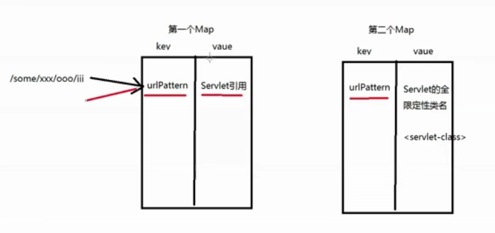

# Servlet

## servlet 的两个 map

> 当用户发请求过来的时候，tomcat 容器去掉了 域名、端口、上下文，发送到指定的应用，在应用里边有两个 Map(在项目启动的时候生成)，通过 urlpattern（正则匹配）查询第一个 Map 的 Servlet ，在开始的时候是空的，然后通过 urlpattern（正则匹配） 查询第二 Map,构建实例（单例），实例的引用放入Map,下次访问的时候就直接访问第一个Map
>
> 在 Sprin MVC 中配置的 load-on-startup 表示的就是一次加载所有的 Servlet



## Servlet3.0  实现异步请求处理

默认 servlet 由 servlet container 进行生命周期管理

1. container 启动时构造 servlet 对象并调用 servlet 的 init 方法，进行初始化

2. container 运行时接受请求，并为每个请求分配一个线程（一般从线程池中获取空闲线程）然后调用

3. container 关闭时调用 servlet 的 destory 销毁 servlet


**Servlet3.0 之前**， 在第二步中，每来一个请求就会分配一个线程，且等线程执行完（**没执行完之前 Servlet 会一直阻塞**）之后再归还线程池，因为单个 Servlet 生成线程的数量是一定的或 web 容器线程池产生的线程数量是有上限的，这样在高并发的情况下会出现线程不够用的情况


**Servlet3.0** 增加了异步模式，接收到请求之后，可能首先需要对请求携带的数据进行一些预处理；接着，Servlet 线程将请求转交给一个异步线程来执行业务处理，线程本身返回至容器，此时 Servlet 还没有生成响应数据，异步线程处理完业务以后，可以直接生成响应数据（异步线程拥有 ServletRequest 和 ServletResponse 对象的引用）或者将请求继续转发给其它 Servlet。如此一来， Servlet 线程不再是一直处于阻塞状态以等待业务逻辑的处理，而是启动异步线程之后可以立即返回。提高了系统的吞吐量。

代码

```javascript
@WebServlet(value = "/asyncServlet", asyncSupported = true)
public class AsyncServlet extends HttpServlet {
    protected void doGet(HttpServletRequest request, HttpServletResponse response) throws ServletException, IOException {
        long start = System.currentTimeMillis();

        // 获取异步上下文，开启异步操作（完成异步线程间的通讯）
        AsyncContext asyncContext = request.startAsync();
        
        // 获取 NIO 的异步请求与响应
        ServletRequest servletRequest = asyncContext.getRequest();
        ServletResponse servletResponse = asyncContext.getResponse();
        
        // 异步执行代码
		CompletableFuture.runAsync(() -> doSome(servletResponse, asyncContext));

        long end = System.currentTimeMillis();

        System.out.print("耗时：" + (end - start));
    }

    private void doSome(ServletResponse servletResponse, AsyncContext asyncContext) {
        try {
            TimeUnit.SECONDS.sleep(5);
            servletResponse.getWriter().write("done");
        } catch (Exception e) {
            e.printStackTrace();
        }

        // 耗时操作完成
        asyncContext.complete();
    }
}
```

配置 web.xml

略...\

启动并访问输出：

```
耗时：1
```

可见 servlet 线程很快就执行完了，然后归还线程池，其他的由异步操作线程完成


