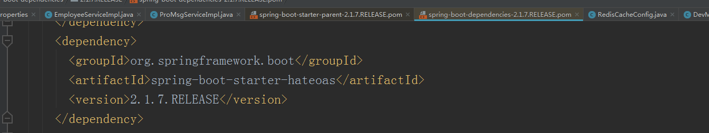
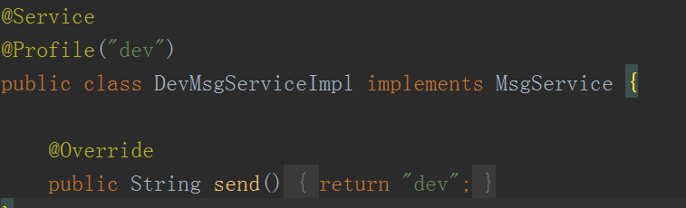
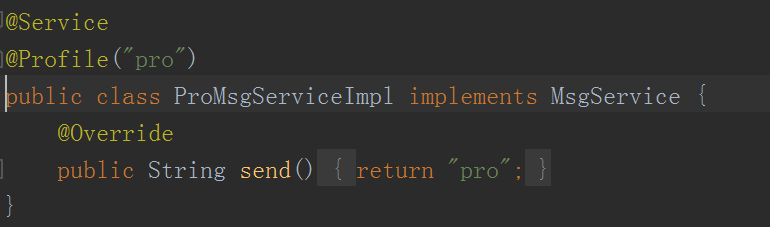

#### Spring Booot

- 创建 Spring Boot 工程

  > 在 IDEA 选用 Ultimate 版本，里边自带了 Spring Initializer，及其他的相关功能
  >
  > 

- spring boot 不用需要 xml 配置文件和 web.xml

- Spring Boot 中 pom 依赖是选择性继承，可以从父文件查看版本，如果没有必要可以不用设置版本

  

- 创建的 jar 包打包的时候内置了 tomcat, 但是创建的 war 包项目没有，需要在 tomcat 下运行

  > war 项目多了下面的配置， score 为 provided 表示在测试和开发环境中需要

  ```xml
  <dependency>
      <groupId>org.springframework.boot</groupId>
      <artifactId>spring-boot-starter-tomcat</artifactId>
      <scope>provided</scope>
  </dependency>
  ```

- 热部署

  1. 添加 devtools 依赖

     ```xml
     <dependency>
         <groupId>org.springframework.boot</groupId>
         <artifactId>spring-boot-devtools</artifactId>
         <scope>runtime</scope>
         <optional>true</optional>
     </dependency>
     ```

  2. 修改启动配置（当窗口离开时自动更新部署）

     

- Acuator

  > 监控作用

  ```xml
  <!--Actuator 监控依赖-->
  <dependency>
      <groupId>org.springframework.boot</groupId>
      <artifactId>spring-boot-starter-actuator</artifactId>
  </dependency>
  ```

  配置文件

  ```properties
  # Actuator 监控端口号和上下文路径
  management.server.port=9999
  management.server.servlet.context-path=/base
  ```

  info  信息：

  ```properties
  # 自定义 info 信息
  info.company.namn = "kaikeba"
  info.company.address = "yibin"
  info.company.url = "www.kaikeba.com"
  
  # 从 pom.xml 文件读取信息
  info.project.groupid = @project.groupId@
  info.project.artifactid = @project.artifactId@
  info.project.name = @project.name@
  ```

- 配置文件错误提示文件

- 多环境选择

  > 开发、测试和生产环境不一样

  

  application-dev.properties 表示开发环境
  application-pro.properties 表示生产环境

  具体选择哪个环境在 application.properties 中进行配置

  ```properties
  spring.profiles.active=dev # 使用 applicatin-dev.properties 文件
  ```

  当然 properties 文件设置别的名称都是可以的，使用 application- 作为前缀就可以了

  可以在类中使用 profile 注解指定环境的名称，这样 Spring 容器会实例化指定环境的类实现， 使用 @Autowired 进行导入

  

  

- 代码读取配置文件

  1. 在主配置文件中读取（不推荐）

  2. 自定义配置文件读取（不能使用 YAML 文件，只能使用 properties 文件）

     ```
     @PropertySource(value="classpath:my.properties", encoding = "UTF-8")
     ```

     读取为对象属性

     读取 list 属性

- 使用  JSP 页面

  1. pom 中 添加 jsp  解析器依赖

     ```xml
     <dependency>
         <groupId>org.apache.tomcat.embed</groupId>
         <artifactId>tomcat-embed-jasper</artifactId>
     </dependency>
     ```

  2. pom 中注册资源目录

     ```xml
     <resources>
         <resource>
             <directory>src/main/webapp</directory>
             <targetPath>META-INF/resources</targetPath>
             <includes>
             <include>**/*.*</include>
             </includes>
         </resource>
     </resources>
     ```

- 使用 mybatis

  pom中添加三个依赖 mybatis整合 spring boot、mysql- connector、 druid

  ```xml
  <dependency>
      <groupId>mysql</groupId>
      <artifactId>mysql-connector-java</artifactId>
      <version>5.1.28</version>
  </dependency>
  
  <dependency>
      <groupId>com.alibaba</groupId>
      <artifactId>druid</artifactId>
      <version>1.1.19</version>
  </dependency>
  
  <dependency>
      <groupId>org.mybatis.spring.boot</groupId>
      <artifactId>mybatis-spring-boot-starter</artifactId>
      <version>1.3.2</version>
  </dependency>
  ```

  在 Spring 配置文件中需要注册三类信息

  ```properties
  # 映射文件、实体类别名、数据源
  mybatis.mapper-locations=classpath:
  
  mybatis.type-aliases-package=
  
  spring.datasource.type=com.alibaba.druid.pool.DruidDataSource
  spring.datasource.driver-class-name=com.mysql.jdbc.Driver
  spring.datasource.url=jsbc:mysql://localhost:3306/kaikeba
  spring.datasource.username=root
  spring.datasource.password=123456
  ```

  使用事务

  1. 在 Spring Boot 主类上添加 @EnableTransactionManagement
2. 在 Service方法 添加 @Transactional
  
- 使用日志

  Spring Boot 使用 logbacj， 与 log4j 出自同一人，但比log4j 更加高级

  需要 添加 logback 依赖， 但是 spring-boot-stater-web 已间接依赖 logback， 所以不用再在pom.xml 中添加 logback 依赖

  有两种使用方式：

  1. 在主配置文件中配置

     ```properties
     # 控制日志显示格式、默认日志显示级别、指定包的显示级别
     logging.pattern.console=%level %msg
     
     logging.level.root=warn
     logging.level.com.kaikeba.dao=debug
     ```

  2. 在 resource 下添加 logback.xml

- 使用 Redis

  >两种类型数据可以考虑进行缓存
  >
  >1. 数据更新从缓存中删除
  >2. 数据的准确性要求不是很高，设置过期时间，到期自动删除

1. 在 pom 配置文件中添加 redis 相关依赖

   ```xml
   <!--redis 相关依赖-->
       <dependency>
       <groupId>org.springframework.boot</groupId>
       <artifactId>spring-boot-starter-data-redis</artifactId>
   </dependency>
   ```

2. 在主配置文件添加连接信息

   ```python
   # 连接 redis 单机
   spring.redis.host=127.0.0.1
   spring.redis.port=6379
   # spring.redis.password=123456
   
   # 指定缓存类型
   spring.cache.type=redis
   
   # 设置缓存名称
   spring.cache.cache-names=realTimeCache
   
   # 连接 redis 集群
   #spring.redis.sentinel.master=mymaster
   #spring.redis.sentinel.nodes=sentinel:26379,sentine2:26379,sentine3:26379
   ```

3. 对缓存对象序列化

- 使用注解方式：

1. 在在主配置文件中注册缓存空间名称

   ```properties
   spring.cache.cache-names=realTimeCache
   ```

2. 在主配置类文件添加 ` @EnableCaching` 注解

3. 在 service 查询方法上添加 `@Caheable` 注解，在增/删/除改方法上添加 `@CacheEvict` 注解

   ```java
   // 删除缓存
   @CacheEvict(value = "realTimeCache", allEntries = true)
   @Override
   public void saveEmployee(Employee employee) {
       employeeMapper.insertEmployee(employee);
   }
   
   // 查询缓存
   @Override
   @Cacheable(value = "realTimeCache", key = "'employee_'+#id")
   public Employee findEmployeeById(Integer id) {
       return employeeMapper.selectEmployeeById(id);
   }
   ```

- 使用 API 的方式需要的步骤：

1. Service  注入 RedisTemplate，其泛型类型 key 与 value 要求类型相同，要么都是 String，要么都是 Objec。

   使用 Object 的通用性更好，建议使用。  

   ```java
    @Autowired
    public RedisTemplate<Object, Object> redisTemplate;
   ```

2. 在 Service 的查询方法中通过 RedisTemplate 对象获取到 Redis 的操作对象，然后对 Redis 进行读写操作。

   > 下面代码使用了: 双重检测同步锁

   ```java
   @Override
   public Integer findEmployeeCount() {
       /**
       * 有时候如果网站并发访问高，一个缓存如果失效，可能出现多个进程同时查询DB，
       * 造成DB压力过大，解决该问题的办法是使用 ：双重检测同步锁
       */
       BoundValueOperations<Object, Object> ops = redisTemplate.boundValueOps("count");
       Object count = ops.get();
       if (count == null) {
           synchronized (this) {
               count = ops.get();
               if (count == null) {
                   count = employeeMapper.selectEmployeeCount();
                   ops.set(count, 10, TimeUnit.SECONDS);
               }
           }
       }
       return (Integer) count;
   }
   ```

   3. 附： 自定义 keygenerator

       添加配置类

      ```java
      @Configuration
      public class RedisCacheConfig extends CachingConfigurerSupport {
          @Override
          // 使用 类名 + 函数名 + 参数 作为 key
          public KeyGenerator keyGenerator() {
              return (target, method, params)->{
                  String className = target.getClass().getName();
                  String methodName = method.getName();
                  return className + "_" + methodName + params[0].toString();
              };
          }
      }
      ```

      查询缓存的时候可以不指定参数 key 了

      ```java
      @Cacheable(value = "realTimeCache")
      public Employee findEmployeeById(Integer id) {
          return employeeMapper.selectEmployeeById(id);
      }
      ```

      结果

      

- 使用拦截器

  在 Spring MVC 中使配置文件，在 Spring Boot 中使用类，具体实现方式为：

  1. 类继承 `WebMvcConfigurationSupport` 类

  2. 添加  `@Configuration` 注解 

     ```java
     @Configuration // 表示当前类为 CodeConfig 类，充当了 Spring 容器
     public class SomeWebMvcConfig extends WebMvcConfigurationSupport {
         
         @Override
         protected void addInterceptors(InterceptorRegistry registry) {
             SomeInterceptor someInterceptor = new SomeInterceptor();
             registry.addInterceptor(someInterceptor)
                     .addPathPatterns("/first/**") // 拦截 first 开头的请求
                     .excludePathPatterns("/second/**"); // 不拦截 second 开头的请求
         }
     }
     ```

     SomeInterceptor：

     ```java
     public class SomeInterceptor implements HandlerInterceptor {
         @Override
         public boolean preHandle(HttpServletRequest request, HttpServletResponse response, Object handler) {
             System.out.print("执行拦截器");
             return true;
         }
     }
     ```

- 使用 Servlet

  > 两种方式：注解和配置类的方式（麻烦），下面是注解方式

  1. 在主启动类上添加  `@ServletComponentScan` 注解

     ```java
     @ServletComponentScan("com.kaikeba.servlet") // 开启 Servlet 扫描，指定扫描的包路径
     public class DemoApplication {
     
         public static void main(String[] args) {
             SpringApplication.run(DemoApplication.class, args);
         }
     }
     ```

  2. 编写 Setvlet

     ```java
     @WebServlet(name = "/some")
     public class SomeServlet extends HttpServlet {
     
         protected void doGet(HttpServletRequest request, HttpServletResponse response) throws ServletException, IOException {
             response.getWriter().print("hello Servlet");
         }
     }
     ```

     附： Servlet 的两个 Map

    1. 当用户发请求过来的时候，tomcat 容器去掉了 域名、端口、上下文

    2. 发送到指定的应用，在应用里边有xz两个 Map(在项目启动的时候生成)

    3. 通过 urlpattern（正则匹配）查询第一个 Map 的 Servlet 在开始的时候是空的，然后通过 urlpattern（正则匹配） 查询第二 Map,构建实例（单例），并放入Map,下次访问的时候就直接访问第一个Map

       > 在 Sprin MVC 中配置的 load-on-startup 表示的就是一次加载所有的 Servlet

  ​	   

- Thymeleaf

  > Thymeleaf 是 Spring Boot 推荐使用的模板引擎
  >
  > 1. 在新建项目的时候， templates 选择 thymeleaf
  >
  > 2. resources 目录下会有一个 tempaltes 目录，就是存放 thymeleaf 文件的地方
  >
  > 3. 在 controller 返回的时候不用写 thymeleaf 文件后缀名，且不用加 templates 前缀
  >
  > 4. 新建 thymeleaf  文件就是新建 html 文件，只是在 html 标签内，多加个命名空间属性xmlns:th
  >
  >    ```html
  >    <html lang="en" xmlns:th="www.thymeleaf.org">
  >    ```
  >
  > 5. 开发阶段在主配置文件中关掉 thymeleaf，不然写的东西可能会得不到更新
  >
  >    ```properties
  >    spring.thymeleaf.cache=false
  >    ```

  语法

  th 属性

  1. th:text：设置当前元素的文本内容，相同功能的还有th:utext，两者的区别在于前者不会转义 html 标签，后者会

  2. th:value：设置当前元素的 value 值，类似修改指定属性的还有th:src，th:href

  3. th:each：遍历循环元素，和th:text或th:value一起使用

  4. th:if：条件判断，类似的还有th:unless，th:switch，th:case

  5. th:object：对象，一般和 *{} 一起配合使用，达到偷懒的效果

     ```html
     <!--th:text 标签的文本内容 th:value 标签的 value 属性-->
     <input th:value="${hello}"></span>
     <span th:text="${hello}"></span>
     
     <!--查看对象属性-->
     <div th:object="${student}">
         姓名：<span th:text="*{name}"></span>
         年龄：<span th:text="*{age}"></span>
     </div>
     <!--下面的也可以-->
     姓名：<span th:text="${student.name}"></span>
     年龄：<span th:text="${student.age}"></span>
     
     <!--遍历列表， 索引值 index 可写可不写-->
     <div th:each="student, index:${students}">
         <!--查看 index 的内容-->
         <p th:text="${index.index}"></p><!--
     <p th:text="${index.first}"></p><!--第一个元素-->
         <p th:text="${index.last}"></p><!--最后一个元素-->
         <p th:text="${index}"></p>
     
         姓名：<span th:text="${student.name}"></span>
         年龄：<span th:text="${student.age}"></span>
     </div>
     
     <!--遍历 map-->
     <div th:each="item:${map}">
         key：<span th:text="${item.key}"></span>
         value：<span th:text="${item.value.name}"></span>
     </div>
     
     <!--if 判断-->
     <div th:if="${a > 10}">
         <p>a>10</p>
     </div>
     <div th:if="${a <= 10}">
         <p>a<=10</p>
     </div>
     
     <!--switch case-->
     <div th:switch="${a}">
         <p th:case="10">a 等于 10</p>
         <p th:case="12">a 等于 12</p>
         <!--* 代表 otherwise-->
         <p th:case="*">a 不等于 10</p>
     </div>
     ```

     常用的内置方法

     一、**strings**：字符串格式化方法，常用的Java方法它都有。比如：equals，equalsIgnoreCase，length，trim，toUpperCase，toLowerCase，indexOf，substring，replace，startsWith，endsWith，contains，containsIgnoreCase等

     二、**numbers**：数值格式化方法，常用的方法有：formatDecimal等

     三、**bools**：布尔方法，常用的方法有：isTrue，isFalse等

     四、**arrays**：数组方法，常用的方法有：toArray，length，isEmpty，contains，containsAll等

     五、**lists**，**sets**：集合方法，常用的方法有：toList，size，isEmpty，contains，containsAll，sort等

     六、**maps**：对象方法，常用的方法有：size，isEmpty，containsKey，containsValue等

     七、**dates**：日期方法，常用的方法有：format，year，month，hour，createNow等

     ```html
     <!DOCTYPE html>
     <html lang="en" xmlns:th="http://www.thymeleaf.org">
     <head>
         <meta charset="UTF-8">
         <title>ITDragon Thymeleaf 内置方法</title>
     </head>
     <body>
         <h2>ITDragon Thymeleaf 内置方法</h2>
         <h3>#strings </h3>
         <div th:if="${not #strings.isEmpty(itdragonStr)}" >
             <p>Old Str : <span th:text="${itdragonStr}"/></p>
             <p>toUpperCase : <span th:text="${#strings.toUpperCase(itdragonStr)}"/></p>
             <p>toLowerCase : <span th:text="${#strings.toLowerCase(itdragonStr)}"/></p>
             <p>equals : <span th:text="${#strings.equals(itdragonStr, 'itdragonblog')}"/></p>
             <p>equalsIgnoreCase : <span th:text="${#strings.equalsIgnoreCase(itdragonStr, 'itdragonblog')}"/></p>
             <p>indexOf : <span th:text="${#strings.indexOf(itdragonStr, 'r')}"/></p>
             <p>substring : <span th:text="${#strings.substring(itdragonStr, 2, 8)}"/></p>
             <p>replace : <span th:text="${#strings.replace(itdragonStr, 'it', 'IT')}"/></p>
             <p>startsWith : <span th:text="${#strings.startsWith(itdragonStr, 'it')}"/></p>
             <p>contains : <span th:text="${#strings.contains(itdragonStr, 'IT')}"/></p>
         </div>
     
         <h3>#numbers </h3>
         <div>
             <p>formatDecimal 整数部分随意，小数点后保留两位，四舍五入: <span th:text="${#numbers.formatDecimal(itdragonNum, 0, 2)}"/></p>
             <p>formatDecimal 整数部分保留五位数，小数点后保留两位，四舍五入: <span th:text="${#numbers.formatDecimal(itdragonNum, 5, 2)}"/></p>
         </div>
     
         <h3>#bools </h3>
         <div th:if="${#bools.isTrue(itdragonBool)}">
             <p th:text="${itdragonBool}"></p>
         </div>
     
         <h3>#arrays </h3>
         <div th:if="${not #arrays.isEmpty(itdragonArray)}">
             <p>length : <span th:text="${#arrays.length(itdragonArray)}"/></p>
             <p>contains : <span th:text="${#arrays.contains(itdragonArray, 5)}"/></p>
             <p>containsAll : <span th:text="${#arrays.containsAll(itdragonArray, itdragonArray)}"/></p>
         </div>
         <h3>#lists </h3>
         <div th:if="${not #lists.isEmpty(itdragonList)}">
             <p>size : <span th:text="${#lists.size(itdragonList)}"/></p>
             <p>contains : <span th:text="${#lists.contains(itdragonList, 0)}"/></p>
             <p>sort : <span th:text="${#lists.sort(itdragonList)}"/></p>
         </div>
         <h3>#maps </h3>
         <div th:if="${not #maps.isEmpty(itdragonMap)}">
             <p>size : <span th:text="${#maps.size(itdragonMap)}"/></p>
             <p>containsKey : <span th:text="${#maps.containsKey(itdragonMap, 'thName')}"/></p>
             <p>containsValue : <span th:text="${#maps.containsValue(itdragonMap, '#maps')}"/></p>
         </div>
         <h3>#dates </h3>
         <div>
             <p>format : <span th:text="${#dates.format(itdragonDate)}"/></p>
             <p>custom format : <span th:text="${#dates.format(itdragonDate, 'yyyy-MM-dd HH:mm:ss')}"/></p>
             <p>day : <span th:text="${#dates.day(itdragonDate)}"/></p>
             <p>month : <span th:text="${#dates.month(itdragonDate)}"/></p>
             <p>monthName : <span th:text="${#dates.monthName(itdragonDate)}"/></p>
             <p>year : <span th:text="${#dates.year(itdragonDate)}"/></p>
             <p>dayOfWeekName : <span th:text="${#dates.dayOfWeekName(itdragonDate)}"/></p>
             <p>hour : <span th:text="${#dates.hour(itdragonDate)}"/></p>
             <p>minute : <span th:text="${#dates.minute(itdragonDate)}"/></p>
             <p>second : <span th:text="${#dates.second(itdragonDate)}"/></p>
             <p>createNow : <span th:text="${#dates.createNow()}"/></p>
         </div>
     </body>
     </html>
     ```

     

  

  

  

  


