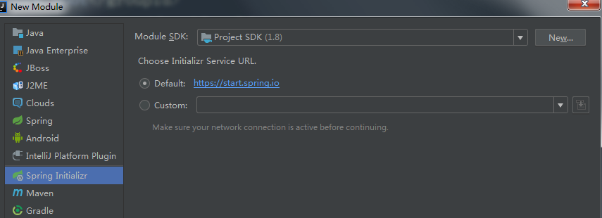
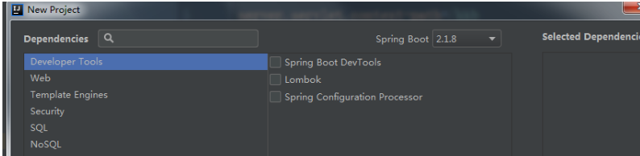
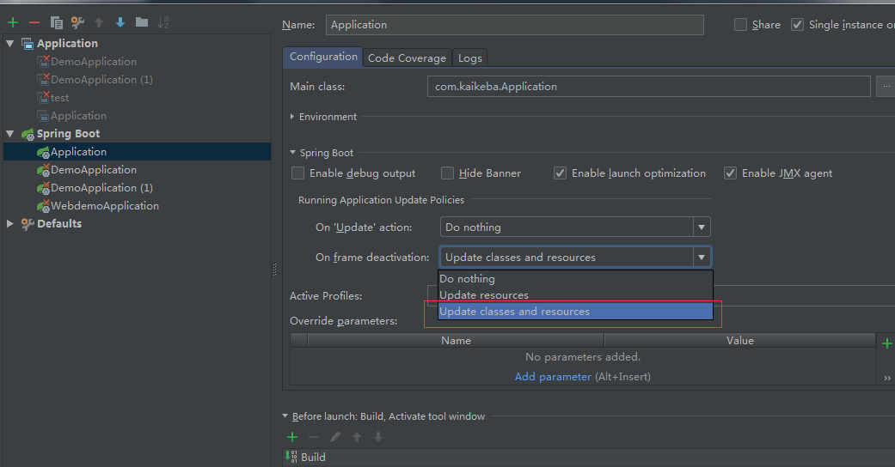
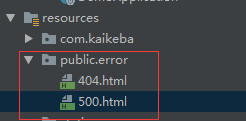
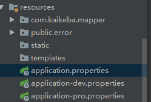
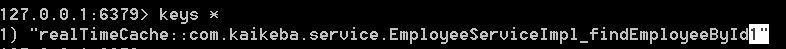

## Spring Booot

#### spring boot 优点

不用需要 xml 配置文件和 web.xml 且内置了 tomcat 等

Spring Boot 中 pom 依赖是选择性继承，可以从父文件查看版本，如果没有必要可以不用设置版本

注意：创建的 jar 包内置了 tomcat 可以在命令行直接使用 java -jar  xxx.jar 的方式运行 ,  但是创建的 war 包项目没有，需要在指定的 tomcat 下运行

> war 项目多了下面的配置， score 为 provided 表示在测试和开发环境中需要

#### 创建 Spring Boot 工程

在 IDEA 选用 Ultimate 版本（破解），里边自带了 Spring Initializer，及其他的相关功能



配置依赖



创建 controller

```java
@RestController
@RequestMapping("some")
public class SomeController {

    @RequestMapping("hello")
    public String someHandler() {
        return " hello springboot";
    }
}
```

修改主配置文件 application.properties

```properties
# 修改端口（默认为 8080）
server.port=8888

# 修改 context-path（默认为 /）
server.servlet.context-path=/kkb
```

在 Application.java 文件中启动项目

在浏览器访问

**注意：所有需要被 Spring 管理的类，需要在 Application.java 文件同级的子目录下才能被扫描到**

#### 使用热部署

1. 添加 devtools 依赖

   ```xml
   <dependency>
       <groupId>org.springframework.boot</groupId>
       <artifactId>spring-boot-devtools</artifactId>
       <scope>runtime</scope>
       <optional>true</optional>
   </dependency>
   ```

2. 修改启动配置（当窗口离开时自动更新部署）

   

####  Acuator

> 它的主要作用是用于监控与管理，对微服务的监控显得尤为重要
>
> 包括服务器的内存使用情况、磁盘使用情况、环境变量、 bean 创建情况、查看 `@RequestMapping`、最近的访问记录等等

```xml
<!--Actuator 监控依赖-->
<dependency>
    <groupId>org.springframework.boot</groupId>
    <artifactId>spring-boot-starter-actuator</artifactId>
</dependency>
```

配置文件

```properties
# 配置 Actuator 监控端口号
management.server.port=9999

# 配置上下文路径，默认为 /
# management.server.servlet.context-path=/base
```

访问：http://localhost:9999/actuator

可以得到如下的输出：

> 访问具体的某个地址可以获取具体的监控信息

```json
{
  "_links": {
    "self": {
      "href": "http://localhost:9999/actuator",
      "templated": false
    },
    "health": {
      "href": "http://localhost:9999/actuator/health",
      "templated": false
    },
    "health-component": {
      "href": "http://localhost:9999/actuator/health/{component}",
      "templated": true
    },
    "health-component-instance": {
      "href": "http://localhost:9999/actuator/health/{component}/{instance}",
      "templated": true
    },
    "info": {
      "href": "http://localhost:9999/actuator/info",
      "templated": false
    }
  }
}
```

默认只暴露了上面几个接口，访问所有的接口需要在配置文件中添加如下

```properties
management.endpoints.web.exposure.include=*
```

再次访问 http://localhost:9999/actuator 输出为

```json
{
  "_links": {
    "self": {
      "href": "http://localhost:9999/actuator",
      "templated": false
    },
    "auditevents": {
      "href": "http://localhost:9999/actuator/auditevents",
      "templated": false
    },
    // 查看所有的 bean
    "beans": {
      "href": "http://localhost:9999/actuator/beans",
      "templated": false
    },
    "caches-cache": {
      "href": "http://localhost:9999/actuator/caches/{cache}",
      "templated": true
    },
     // 查看缓存信息 
    "caches": {
      "href": "http://localhost:9999/actuator/caches",
      "templated": false
    },
    "health-component-instance": {
      "href": "http://localhost:9999/actuator/health/{component}/{instance}",
      "templated": true
    },
    "health": {
      "href": "http://localhost:9999/actuator/health",
      "templated": false
    },
    "health-component": {
      "href": "http://localhost:9999/actuator/health/{component}",
      "templated": true
    },
    // 查看自动化配置报告
    "conditions": {
      "href": "http://localhost:9999/actuator/conditions",
      "templated": false
    },
    // 查看系统配置文件的信息，例如：mysql 和 redis 的连接信息都是可以查看的
    "configprops": {
      "href": "http://localhost:9999/actuator/configprops",
      "templated": false
    },
    // 环境变量、JVM属性、应用的配置配置、命令行中的参数
    // 包括 JAVA_HOME 等信息都是可以查看的
    "env": {
      "href": "http://localhost:9999/actuator/env",
      "templated": false
    },
    "env-toMatch": {
      "href": "http://localhost:9999/actuator/env/{toMatch}",
      "templated": true
    },
    // 返回一些应用自定义的信息，默认是空的，在配置文件中定义（如下面的配置）
    "info": {
      "href": "http://localhost:9999/actuator/info",
      "templated": false
    },
     // 查看日志（具体到每一个方法上）
    "loggers": {
      "href": "http://localhost:9999/actuator/loggers",
      "templated": false
    },
    "loggers-name": {
      "href": "http://localhost:9999/actuator/loggers/{name}",
      "templated": true
    },
    "heapdump": {
      "href": "http://localhost:9999/actuator/heapdump",
      "templated": false
    },
    "threaddump": {
      "href": "http://localhost:9999/actuator/threaddump",
      "templated": false
    },
    "metrics-requiredMetricName": {
      "href": "http://localhost:9999/actuator/metrics/{requiredMetricName}",
      "templated": true
    },
    // 查看服务器内存信息、线程信息、垃圾回收信息等
    "metrics": {
      "href": "http://localhost:9999/actuator/metrics",
      "templated": false
    },
    "scheduledtasks": {
      "href": "http://localhost:9999/actuator/scheduledtasks",
      "templated": false
    },
    // 查看 http 访问情况， 保留最近的100条请求记录
    "httptrace": {
      "href": "http://localhost:9999/actuator/httptrace",
      "templated": false
    },
    //用来返回所有 Spring MVC 的控制器映射关系报告
    // uri 和指定 handler 的映射关系
    "mappings": {
      "href": "http://localhost:9999/actuator/mappings",
      "templated": false
    }
  }
}
```

自定义配置信息，info 开头（可以使用如上url：  http://localhost:9999/actuator/info  进行访问）

```properties
# 自定义 info 信息
info.company.namn = "kaikeba"
info.company.address = "yibin"
# @...@ 表示引用 pom 中的配置信息 
info.company.url = @project.url@
```

其他一些配置

```properties
# 如果设置已公布所有的端点，可以设置指定的端点除外
management.endpoints.web.exposure.exclude=env

# 设置管理端点的基本路径，默认值为：actuator（如上面的访问地址）
management.endpoints.web.base-path=/

# 配置远程关闭（前提暴露所有的端口），且不进行安全验证（危险）
management.endpoint.shutdown.enabled=true
management.endpoints.shutdown.sensitive=false
```

使用 post 访问 http://localhost:9999/actuator/shutdown 进行远程关闭服务器

配置安全的远程关闭服务器

> 1. 添加依赖
>
>    ```xml
>    <dependency>
>      <groupId>org.springframework.boot</groupId>
>      <artifactId>spring-boot-starter-security</artifactId>
>    </dependency>
>    ```
>
> 2. 修改配置文件
>
>    ```properties
>    spring.security.user.name=admin
>    spring.security.user.password=123456
>    spring.security.user.roles=ACTUATOR
>    ```
>
> 3. 添加验证类
>
>    ```java
>    @Configuration
>    public class ActuatorWebSecurityConfigurationAdapter extends WebSecurityConfigurerAdapter {
>    
>        @Override
>        protected void configure(HttpSecurity http) throws Exception {
>            http.csrf().disable().authorizeRequests().antMatchers("/").permitAll()
>                    .requestMatchers(EndpointRequest.toAnyEndpoint()).hasRole("ACTUATOR")
>                    .anyRequest().authenticated().and()
>                    //开启basic认证，若不添加此项，将不能通过curl的basic方式传递用户信息
>                    .httpBasic();
>        }
>    }
>    ```
>
> 4. 关闭服务
>
>    ```bash
>    curl -X POST -u admin:123456 http://localhost:9999/actuator/shutdown
>    ```

#### 配置访问出错提示文件

在 resources 目录下新建 public/error 文件夹，创建指定错误的文件




#### 配置多环境选择

> 因为在开发、测试和生产环境中数据库配置等信息可能不一样，所以需要在不同的环境之间进行切换
>
> 这点在 spring boot 中使很方便的



application-dev.properties 表示开发环境
application-pro.properties 表示生产环境

......

具体选择哪个环境在 application.properties 中进行配置

```properties
# 使用 applicatin-dev.properties 文件
spring.profiles.active=dev
```

#### 代码中读取配置文件内容

> **主配置文件中的可以直接读取，自定义配置文件中的需要使用如下注解导入**
>
> `@PropertySource(value = "classpath:my.properties", encoding = "UTF-8")` 

2. 自定义配置文件读取（不能使用 YAML 文件，只能使用 properties 文件）

   ```properties
   # 表示对象
   student.name="xxq"
   student.age=28
   
   # 表示对象中的 list
   student.cities[0]="beijing"
   student.cities[1]="shanghai"
   student.cities[2]="广州"
   ```
   
   对象接收数据，并实例化，整个对象就是一个 bean，可以直接被注入到其他的对象中
   
   ```java
   @Component
   @Data
   @PropertySource(value = "student.properties", encoding = "UTF-8") // 自定义配置才需要
   @ConfigurationProperties("student") // 读取配置属性并自动封装成实体类
   public class StudentDto {
       private String name;
       private Integer age;
       private List<String> cities;
   }
   ```
   
   使用
   
   ```java
   @RestController
   @RequestMapping("/some")
   public class SomeController {
   
       // 单个属性
       @Value("${student.name}")
       private String studentName;
   
       // 实体对象
       @Autowired
       private StudentDto studentDto;
   
       @RequestMapping("/hello")
       public String someHandler() {
           System.out.println(studentName);
           return studentDto.toString();
       }
   }
   ```

#### 集成 mybatis

添加依赖

```xml
<dependency>
    <groupId>mysql</groupId>
    <artifactId>mysql-connector-java</artifactId>
    <version>5.1.28</version>
</dependency>

<dependency>
    <groupId>com.alibaba</groupId>
    <artifactId>druid</artifactId>
    <version>1.1.19</version>
</dependency>

<dependency>
    <groupId>org.mybatis.spring.boot</groupId>
    <artifactId>mybatis-spring-boot-starter</artifactId>
    <version>1.3.2</version>
</dependency>
```

在 Spring 配置文件中需要注册三类信息

```properties
# 映射文件，可以修改为指定位置，非必须和接口文件一直
mybatis.mapper-locations=classpath:mapper/*Mapper.xml

# 配置指定包类的别名
mybatis.type-aliases-package=com.kkb.spring.springboot.bean

# 配置数据源
spring.datasource.type=com.alibaba.druid.pool.DruidDataSource
spring.datasource.driver-class-name=com.mysql.jdbc.Driver
spring.datasource.url=jdbc:mysql:///kaikeba?useUnicode=true&characterEncoding=UTF8
spring.datasource.username=root
spring.datasource.password=123456
```

添加 Mapper 接口

```java
// 需加上 Mapper 注解
@Mapper
public interface StudentMapper {
    List<Student> listAllStudents();
    void insertStudent(Student student);
}
```

添加 Mapper 配置文件

```xml
<mapper namespace="com.kkb.spring.springboot.mapper.StudentMapper">
    <select id="listAllStudents" resultType="Student">
		SELECT * FROM student
	</select>

    <insert id="insertStudent">
		insert into student(name, age) values (#{name}, #{age})
	</insert>
</mapper>
```

添加事务

1. 在 Spring Boot 主类上添加 `@EnableTransactionManagement` 注解
2. 在 Service方法 添加 `@Transactional` 注解

#### 集成日志

> Spring Boot 使用 logback
>
> 注意：spring-boot-stater-web 已间接依赖 logback， 所以不用再在 pom.xml 中添加 logback 依赖

有两种使用方式：

1. 在主配置文件中配置

   ```properties
   # 控制日志显示格式、默认日志显示级别、指定包的显示级别
   logging.pattern.console=[%thread] %level %logger %msg%n
   logging.level.root=debug
   logging.file=D:/logs/my.log
   logging.pattern.file=D:/logs/my_%d{yyyy-MM-dd-HH}%i.log
   logging.file.max-size=20MB
   
   # 指定具体的包下的日志记录方式
   # logging.level.com.kaikeba.dao=info
   ```

2. 在 resource 下添加 logback.xml 文件

   参考：[logback](logback.md)

#### 集成 Redis

1. 在 pom 配置文件中添加 redis 相关依赖

   ```xml
   <!--redis 相关依赖-->
   <dependency>
       <groupId>org.springframework.boot</groupId>
       <artifactId>spring-boot-starter-data-redis</artifactId>
   </dependency>
   ```

2. 在主配置文件添加连接信息

   ```properties
   # 指定缓存类型
   spring.cache.type=redis
   
   # 连接 redis 单机
   spring.redis.host=127.0.0.1
   spring.redis.port=6379
   # spring.redis.password=123456
   
   # 连接 redis 集群（哨兵）
   #spring.redis.sentinel.master=mymaster
   #spring.redis.sentinel.nodes=sentinel:26379,sentine2:26379,sentine3:26379
   ```
   
3. **对缓存对象序列化**

4. 访问 redis 两种方式

   - 使用注解方式：

     1. 在在主配置文件中注册缓存空间名称

        ```properties
        spring.cache.cache-names=realTimeCache
        ```

     2. 在主配置类文件添加 ` @EnableCaching` 注解

     3. 在 service 查询方法上添加 `@Caheable` 注解，在增/删/除改方法上添加 `@CacheEvict` 注解

        > `@Caheable`  注解可以定义在类上或方法上，参数说明：
        >
        > ​	value：可以理解为前缀，必须
        >
        > ​	key ：表示在指定 cache 的唯一表示，不填使用默认，也可以自定义，非必须（默认有规则）
        >
        > ​	condition：返回缓存的条件，true 缓存，false 不缓存，使用 SpEL 编写，非必须
        >
        > 
        >
        > `@CacheEvict`  注解，主要针对方法配置，能够根据一定的条件对缓存进行**清空**
        >
        > ​	value、key、condition 同上
        >
        > ​	allEntries：是否清空所有缓存内容，缺省为 false
        > ​	beforeInvocation：是否在方法执行前清空，默认方法执行后清空
        >
        > 
        >
        > `@CachePut` 注解和 `@Caheable` 注解类似（参数一致），只是每次都会查询数据库，把结果放入缓存，而不会从缓存里边取

        ```java
        // 查询或添加缓存
        @Cacheable(value="realTimeCache", key = "'employee_'+#id")
        public Employee findEmployeeById(Integer id) {
            return employeeMapper.selectEmployeeById(id);
        }
        
        // 删除 realTimeCache 下的所有缓存（也可以指定 key 删除指定名称的缓存）
        @CacheEvict(value="realTimeCache", allEntries = true)
        public void saveEmployee(Employee employee) {
            employeeMapper.insertEmployee(employee);
        }
        ```

   - 使用 API 的方式需要的步骤：

     1. Service  注入 RedisTemplate，其泛型类型 key 与 value 要求类型相同，要么都是 String，要么都是 Object（使用 Object 的通用性更好，建议使用）

        ```java
        @Autowired
        public RedisTemplate<Object, Object> redisTemplate;
        ```

     2. 在 Service 的查询方法中通过 RedisTemplate 对象获取到 Redis 的操作对象，然后对 Redis 进行读写操作。

        > 下面代码使用了:  双重检测同步锁，避免缓存穿透（高并发的时候大家都访问数据库）
        >
        > 或在 方法上添加 synchronized（效率低）

        ```java
        public Student findStudentById(Integer studentId) {
            /**
             * 有时候如果网站并发访问高，一个缓存如果失效，可能出现多个进程同时查询 DB
             * 造成DB压力过大，解决该问题的办法是使用 ：双重检测同步锁
            */
            BoundValueOperations<Object, Object> ops = redisTemplate.boundValueOps("findStudentById");
        
            RedisSerializer redisSerializer = new StringRedisSerializer();
            redisTemplate.setStringSerializer(redisSerializer);
        
            Object student = ops.get();
            if (student == null) {
                synchronized (this) {
                    student = ops.get();
                    System.out.println(student);
                    if (student == null) {
                        student = studentMapper.findStudentById(studentId);
                        ops.set(student, 20, TimeUnit.SECONDS);
                    }
                }
            }
            return (Student) student;
        }
        ```

5. 附： 自定义 keygenerator

   添加配置类

   ```java
   @Configuration
   public class RedisCacheConfig extends CachingConfigurerSupport {
       @Override
       // 使用 类名 + 函数名 + 参数 作为 key
       public KeyGenerator keyGenerator() {
           return (target, method, params) -> {
               String className = target.getClass().getName();
               String methodName = method.getName();
               String paramName = Arrays.stream(params).reduce("_", (a1, a2) -> a1 + "_" + a2).toString();
               return className + "_" + methodName + paramName;
           };
       }
   }
   ```

   查询缓存的时候默认替换为自己定义的 key

   ```java
   @Cacheable(value = "realTimeCache")
   public Employee findEmployeeById(Integer id) {
   	return employeeMapper.selectEmployeeById(id);、
   }
   ```

   

#### 使用拦截器

在 Spring MVC 中使配置文件，在 Spring Boot 中使用类，具体实现方式为：

1. 添加拦截器 ，实现 HandlerInterceptor 接口

   ```java
   public class SomeInterceptor implements HandlerInterceptor {
       @Override
       public boolean preHandle(HttpServletRequest request, HttpServletResponse response, Object handler) {
           System.out.print("执行拦截器");
           return true;
       }
   }
   ```

2. 配置拦截器 ，类继承 `WebMvcConfigurationSupport` 类， 添加  `@Configuration` 注解 

   ```java
   @Configuration // 表示当前类为 CodeConfig 类，充当了 Spring 容器
   public class SomeWebMvcConfig extends WebMvcConfigurationSupport {
       
       @Override
       protected void addInterceptors(InterceptorRegistry registry) {
           // 可以可以配置多个拦截器
           SomeInterceptor someInterceptor = new SomeInterceptor();
           registry.addInterceptor(someInterceptor)
                   .addPathPatterns("/first/**") // 拦截 first 开头的请求
                   .excludePathPatterns("/second/**"); // 不拦截 second 开头的请求
       }
   }
   ```


#### 集成 Servlet

> 两种方式：注解和配置类的方式（麻烦），下面是注解方式

1. 在主启动类上添加  `@ServletComponentScan` 注解

   ```java
   @ServletComponentScan("com.kaikeba.servlet") // 开启 Servlet 扫描，指定扫描的包路径
   public class DemoApplication {
   
       public static void main(String[] args) {
           SpringApplication.run(DemoApplication.class, args);
       }
   }
   ```

2. 编写 Setvlet

   ```java
   @WebServlet(name = "/some")
   public class SomeServlet extends HttpServlet {
   
       protected void doGet(HttpServletRequest request, HttpServletResponse response) throws ServletException, IOException {
           response.getWriter().print("hello Servlet");
       }
   }
   ```


#### 集成  JSP

1. pom 中 添加 jsp  解析器依赖

   ```xml
   <dependency>
       <groupId>org.apache.tomcat.embed</groupId>
       <artifactId>tomcat-embed-jasper</artifactId>
   </dependency>
   ```

2. 添加 webapp目录，添加 jsp 页面

3. pom 中注册资源目录

   ```xml
   <resources>
       <resource>
           <directory>src/main/webapp</directory>
           <targetPath>META-INF/resources</targetPath>
           <includes>
           <include>**/*.*</include>
           </includes>
       </resource>
   </resources>
   ```

#### Thymeleaf

> Thymeleaf 是 Spring Boot 推荐使用的模板引擎
>
> 1. 在新建项目的时候， templates 选择 thymeleaf
>
> 2. resources 目录下会有一个 tempaltes 目录，就是存放 thymeleaf 文件的地方
>
> 3. 在 controller 返回的时候不用写 thymeleaf 文件后缀名，且不用加 templates 前缀
>
> 4. 新建 thymeleaf  文件就是新建 html 文件，只是在 html 标签内，多加个命名空间属性 xmlns:th
>
>    ```html
>    <html lang="en" xmlns:th="www.thymeleaf.org">
>    ```
>
> 5. 开发阶段在主配置文件中关掉 thymeleaf，不然写的东西可能会得不到更新
>
>    ```properties
>    spring.thymeleaf.cache=false
>    ```

语法

th 属性

1. th:text：设置当前元素的文本内容，相同功能的还有th:utext，两者的区别在于前者不会转义 html 标签，后者会

2. th:value：设置当前元素的 value 值，类似修改指定属性的还有th:src，th:href

3. th:each：遍历循环元素，和th:text或th:value一起使用

4. th:if：条件判断，类似的还有th:unless，th:switch，th:case

5. th:object：对象，一般和 *{} 一起配合使用，达到偷懒的效果

   ```html
   <!--th:text 标签的文本内容 th:value 标签的 value 属性-->
   <input th:value="${hello}"></span>
   <span th:text="${hello}"></span>
   
   <!--查看对象属性-->
   <div th:object="${student}">
       姓名：<span th:text="*{name}"></span>
       年龄：<span th:text="*{age}"></span>
   </div>
   <!--下面的也可以-->
   姓名：<span th:text="${student.name}"></span>
   年龄：<span th:text="${student.age}"></span>
   
   <!--遍历列表， 索引值 index 可写可不写-->
   <div th:each="student, index:${students}">
       <!--查看 index 的内容-->
       <p th:text="${index.index}"></p><!--
   <p th:text="${index.first}"></p><!--第一个元素-->
       <p th:text="${index.last}"></p><!--最后一个元素-->
       <p th:text="${index}"></p>
   
       姓名：<span th:text="${student.name}"></span>
       年龄：<span th:text="${student.age}"></span>
   </div>
   
   <!--遍历 map-->
   <div th:each="item:${map}">
       key：<span th:text="${item.key}"></span>
       value：<span th:text="${item.value.name}"></span>
   </div>
   
   <!--if 判断-->
   <div th:if="${a > 10}">
       <p>a>10</p>
   </div>
   <div th:if="${a <= 10}">
       <p>a<=10</p>
   </div>
   
   <!--switch case-->
   <div th:switch="${a}">
       <p th:case="10">a 等于 10</p>
       <p th:case="12">a 等于 12</p>
       <!--* 代表 otherwise-->
       <p th:case="*">a 不等于 10</p>
   </div>
   ```

   常用的内置方法

   一、**strings**：字符串格式化方法，常用的Java方法它都有。比如：equals，equalsIgnoreCase，length，trim，toUpperCase，toLowerCase，indexOf，substring，replace，startsWith，endsWith，contains，containsIgnoreCase等

   二、**numbers**：数值格式化方法，常用的方法有：formatDecimal等

   三、**bools**：布尔方法，常用的方法有：isTrue，isFalse等

   四、**arrays**：数组方法，常用的方法有：toArray，length，isEmpty，contains，containsAll等

   五、**lists**，**sets**：集合方法，常用的方法有：toList，size，isEmpty，contains，containsAll，sort等

   六、**maps**：对象方法，常用的方法有：size，isEmpty，containsKey，containsValue等

   七、**dates**：日期方法，常用的方法有：format，year，month，hour，createNow等

   ```html
   <!DOCTYPE html>
   <html lang="en" xmlns:th="http://www.thymeleaf.org">
   <head>
       <meta charset="UTF-8">
       <title>ITDragon Thymeleaf 内置方法</title>
   </head>
   <body>
       <h2>ITDragon Thymeleaf 内置方法</h2>
       <h3>#strings </h3>
       <div th:if="${not #strings.isEmpty(itdragonStr)}" >
           <p>Old Str : <span th:text="${itdragonStr}"/></p>
           <p>toUpperCase : <span th:text="${#strings.toUpperCase(itdragonStr)}"/></p>
           <p>toLowerCase : <span th:text="${#strings.toLowerCase(itdragonStr)}"/></p>
           <p>equals : <span th:text="${#strings.equals(itdragonStr, 'itdragonblog')}"/></p>
           <p>equalsIgnoreCase : <span th:text="${#strings.equalsIgnoreCase(itdragonStr, 'itdragonblog')}"/></p>
           <p>indexOf : <span th:text="${#strings.indexOf(itdragonStr, 'r')}"/></p>
           <p>substring : <span th:text="${#strings.substring(itdragonStr, 2, 8)}"/></p>
           <p>replace : <span th:text="${#strings.replace(itdragonStr, 'it', 'IT')}"/></p>
           <p>startsWith : <span th:text="${#strings.startsWith(itdragonStr, 'it')}"/></p>
           <p>contains : <span th:text="${#strings.contains(itdragonStr, 'IT')}"/></p>
       </div>
   
       <h3>#numbers </h3>
       <div>
           <p>formatDecimal 整数部分随意，小数点后保留两位，四舍五入: <span th:text="${#numbers.formatDecimal(itdragonNum, 0, 2)}"/></p>
           <p>formatDecimal 整数部分保留五位数，小数点后保留两位，四舍五入: <span th:text="${#numbers.formatDecimal(itdragonNum, 5, 2)}"/></p>
       </div>
   
       <h3>#bools </h3>
       <div th:if="${#bools.isTrue(itdragonBool)}">
           <p th:text="${itdragonBool}"></p>
       </div>
   
       <h3>#arrays </h3>
       <div th:if="${not #arrays.isEmpty(itdragonArray)}">
           <p>length : <span th:text="${#arrays.length(itdragonArray)}"/></p>
           <p>contains : <span th:text="${#arrays.contains(itdragonArray, 5)}"/></p>
           <p>containsAll : <span th:text="${#arrays.containsAll(itdragonArray, itdragonArray)}"/></p>
       </div>
       <h3>#lists </h3>
       <div th:if="${not #lists.isEmpty(itdragonList)}">
           <p>size : <span th:text="${#lists.size(itdragonList)}"/></p>
           <p>contains : <span th:text="${#lists.contains(itdragonList, 0)}"/></p>
           <p>sort : <span th:text="${#lists.sort(itdragonList)}"/></p>
       </div>
       <h3>#maps </h3>
       <div th:if="${not #maps.isEmpty(itdragonMap)}">
           <p>size : <span th:text="${#maps.size(itdragonMap)}"/></p>
           <p>containsKey : <span th:text="${#maps.containsKey(itdragonMap, 'thName')}"/></p>
           <p>containsValue : <span th:text="${#maps.containsValue(itdragonMap, '#maps')}"/></p>
       </div>
       <h3>#dates </h3>
       <div>
           <p>format : <span th:text="${#dates.format(itdragonDate)}"/></p>
           <p>custom format : <span th:text="${#dates.format(itdragonDate, 'yyyy-MM-dd HH:mm:ss')}"/></p>
           <p>day : <span th:text="${#dates.day(itdragonDate)}"/></p>
           <p>month : <span th:text="${#dates.month(itdragonDate)}"/></p>
           <p>monthName : <span th:text="${#dates.monthName(itdragonDate)}"/></p>
           <p>year : <span th:text="${#dates.year(itdragonDate)}"/></p>
           <p>dayOfWeekName : <span th:text="${#dates.dayOfWeekName(itdragonDate)}"/></p>
           <p>hour : <span th:text="${#dates.hour(itdragonDate)}"/></p>
           <p>minute : <span th:text="${#dates.minute(itdragonDate)}"/></p>
           <p>second : <span th:text="${#dates.second(itdragonDate)}"/></p>
           <p>createNow : <span th:text="${#dates.createNow()}"/></p>
       </div>
   </body>
   </html>
   ```

   


