## Spring Cloud

#### Spring Cloud 入门

1. 微服务与微服务架构

   例如：前公司 E 平台子系统提供的就是微服务，整个架构就属于微服务架构，但是之前没有提供服务注册中心的功能

2. Spring Clound 简介

3. 在线资源

   spring cloud 官网 <https://spring.io/projects/spring-cloud>

   spring cloud 中文网  www.springclound.cc

4. Dubble 和 Spring Clound 技术选型

   - Dubble 架构的完整度不够，本身仅仅提供了服务注册中心与服务治理两个模块。而 SpringCloud 已经提供了服务治理、服务注册中心等24个模块，并且还在不断增加中
   - 相比 SpringCloud， Dubble 的社区活跃度不够，遇见问题不好解决
   - Dubble 通讯采用的是 PRC（需要依赖于业务接口），而 Spring Cloud 采用的是 HTTP 的 REST，不存在代码的强依赖
   - Dubble 的优点是因为是国内人员开发的提供了比较高质量的官方文档

   **总结：目前来说对于小型业务可选择使用 Dubbo， 总体上 Spring Cloud 要比 Dubbo 更好**

5. 实现一个简单的 provider 和 consumer（restful 格式)

   - provider 实现简单的对数据库的增、删、改、查接口，并暴露 REST 的外界访问

   - consumer

     > 使用添加 RestTemplate 进行数据访问

     ```java
     @Configuration
     public class DepartCodeConfig {
     
         @Bean
         @LoadBalanced //  开启消费端的负载均衡，默认使用轮询
         public RestTemplate restTemplate(){
             return new RestTemplate();
         }
     }
     ```
     
     > handler 注入 RestTemplate， 调用 provider 接口
   >
     > 可以看到 RestTemplate 有局限，返回值可能不是我们想要的结果，比如 delete 和 put 返回都是 void

     ```java
     @RestController
     @RequestMapping("/consumer/depart")
     public class DepartController {
     
         @Autowired
         private RestTemplate restTemplate;
     
         private String url_prefix = "http://localhost:8081/provider/depart";
     
         @PostMapping("/save")
         public boolean saveHandle(Depart depart) {
             String url = url_prefix + "/save";
             return restTemplate.postForObject(url, depart, Boolean.class);
         }
     
         @DeleteMapping("/del/{id}")
         public void deleteHandle(@PathVariable("id") Integer id) {
             String url = url_prefix + "/del/" + id;
             restTemplate.delete(url);
         }
     
         @PutMapping("/update")
         public void modifyHandle(Depart depart) {
             String url = url_prefix + "/update";
             restTemplate.put(url, depart);
         }
     
         @GetMapping("/get/{id}")
         public Depart getDepart(@PathVariable("id") int id) {
             String url = url_prefix + "/get/" + id;
             return restTemplate.getForObject(url, Depart.class);
         }
     
         @GetMapping("/list")
         public List<Depart> listAllDeparts() {
             String url = url_prefix + "/list";
             return restTemplate.getForObject(url, List.class);
         }
     }
     ```


 #### 微服务中心 Eureka

> 如果使用如上的简单示例，当 provider 只有一台的时候，如果出现宕机，则别人就不能访问，所以把服务做成机群，使用 Eureka 做为服务注册中心

1. 概述

   Eureka 包含两个组件：Eureka Server 和 Eureka Client，

   ​		 Eureka Server 提供服务注册功能。提供者节点启动后，会在 Eureka Server  中进行注册，这样 Eureka Server 的服务注册表中将会存储所有可用服务节点的信息。然后各提供者回会向 Eureka Server 发送心跳，以告知自己的健康状态，默认周期是 30 秒。如果多个周期内（默认 3 个周期，90 秒）没有接收到某个提供者的心跳，Eureka Server 将会认为其无法提供服务，会将该服务提供者节点从服务注册表中移除。Eureka Server 之间通过复制的方式完成数据同步。

   ​		 Eureka Client 是一个 java 客户端，用于简化消费者与 Eureka Server 的交互。同时，Eureka Client 还内置了负载均衡器，为消费者从 Eureka Server 的服务注册表选择合适的提供者。Eureka Client 会缓存 Eureka Server 中的信息，即使所有的 Eureka Server 都挂掉，客户端依然可以进行访问，只是不能再进行服务注册。体现了 AP 原则。

   ​		总之，Eureka 通过心跳检查，客户端缓存、负载均衡等机制，确保了系统的高可用性、灵活性和可伸缩性

   

   Spring Cloud 已经把 Eureka 集成在其子项目 Spring Cloud Netflix 里面

   github地址： https://github.com/Netflix/eureka

   架构图：
   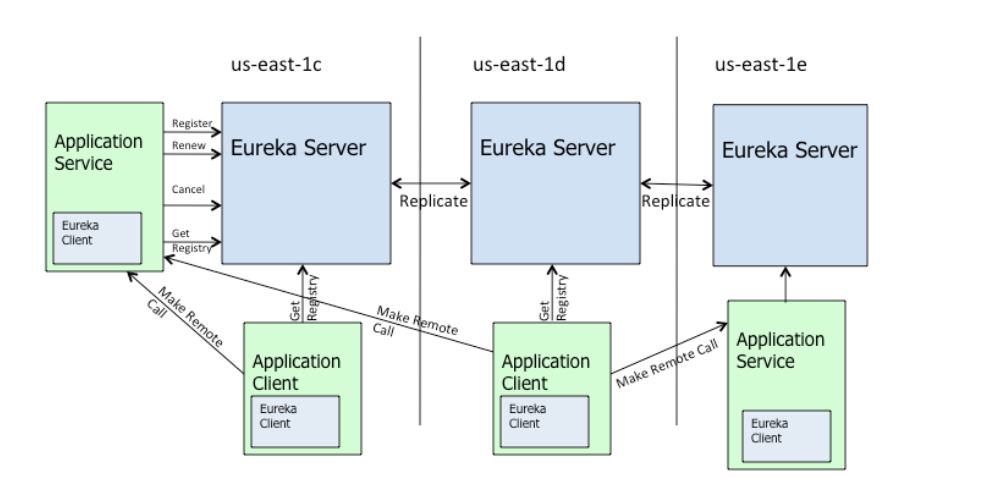

​		**注意： 不管是 Application Server 还是 Application  Client 都是使用的 Eureka Client**

2. 创建 Eureka 服务中心

   - 创建 Spring Boot 工程（Spring Cloud 依赖 Spring Boot），选择 EurekaServer 依赖

     >  **注意： 除了 EurekaServer 依赖之外，若 JDK 大于 8，还需导入 JAXB 依赖**
     >
     >  因为在 JDK9 之前 JAXB API 包含在 JDK 中， JDK9 之后被踢出掉，所以 JDK9 及其以上版本需要加入 JAXB 依赖
     >
     >  JAXB 是一项可以根据 XML Schema 产生 java 类的技术

     ```xml
     <dependencies>
         <!--eureka-server 依赖-->
         <dependency>
             <groupId>org.springframework.cloud</groupId>
             <artifactId>spring-cloud-starter-netflix-eureka-server</artifactId>
         </dependency>
     
         <dependency>
             <groupId>org.springframework.boot</groupId>
             <artifactId>spring-boot-starter-test</artifactId>
             <scope>test</scope>
         </dependency>
     
         <!--导入 jaxb 依赖-->
         <dependency>
             <groupId>javax.xml.bind</groupId>
             <artifactId>jaxb-api</artifactId>
             <version>2.3.0</version>
         </dependency>
         <dependency>
             <groupId>com.sun.xml.bind</groupId>
             <artifactId>jaxb-impl</artifactId>
             <version>2.3.0</version>
         </dependency>
         <dependency>
             <groupId>com.sun.xml.bind</groupId>
             <artifactId>jaxb-core</artifactId>
             <version>2.3.0</version>
         </dependency>
         <dependency>
             <groupId>org.glassfish.jaxb</groupId>
             <artifactId>jaxb-runtime</artifactId>
             <version>2.2.11</version>
         </dependency>
         <dependency>
             <groupId>javax.activation</groupId>
             <artifactId>activation</artifactId>
             <version>1.1.1</version>
         </dependency>
     </dependencies>
     
     <dependencyManagement>
         <dependencies>
             <dependency>
                 <groupId>org.springframework.cloud</groupId>
                 <artifactId>spring-cloud-dependencies</artifactId>
                 <version>${spring-cloud.version}</version>
                 <type>pom</type>
                 <scope>import</scope>
             </dependency>
         </dependencies>
     </dependencyManagement>
     ```

   - 配置文件中配置 EurekaServer

     ```yml
     server:
       port: 8000
     
     eureka:
       instance:
         hostname: localhost # 指定 eureka 主机
       client:
         register-with-eureka: false # 当前主机是否需要向注册中心注册（不需要，当前已经为主机）
         fetch-registry: false # 当前主机是否需要获取注册信息（不需要，当前已经为主机）
         service-url: # 暴露服务中心地址
           defaultZone: http://${eureka.instance.hostname}:${server.port}/eureka
     ```

   - 在启动类中添加  `@EnableEurekaServer` 注解


   - 启动并访问：http://localhost:8000/

     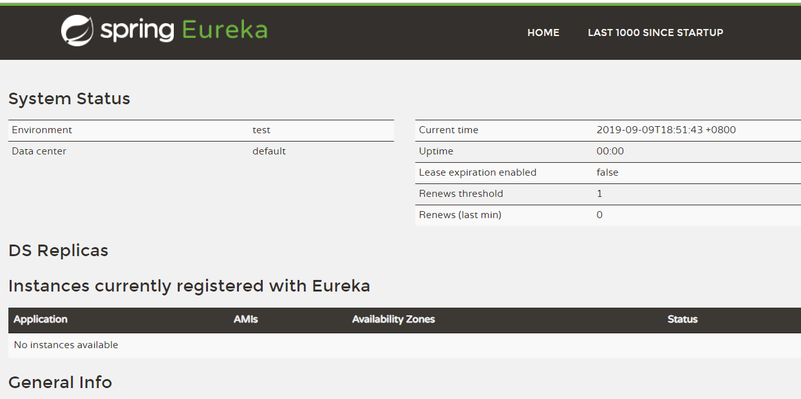

   - Eureka Server 的 self Perservation 机制（自我保护机制）

     在短时间内若 EurekaServer 丢失较多微服务（收到的心跳数量小于阈值），会开启自我保护模式，微服务列表只能读取和写入，不能执行删除操作，当心跳数量到达阈值数量以上时间，会自动退出自我保护模式。

     也可以如下设置关闭自我保护模式（不建议）

     ```yaml
     eureka:
       server:
         enable-self-preservation: false
     ```

3. 创建提供者

   - 添加 Eureka  客户端依赖

     ```xml
     <!--添加 eureka 客户端依赖-->
     <dependency>
     	<groupId>org.springframework.cloud</groupId>
     	<artifactId>spring-cloud-starter-netflix-eureka-client</artifactId>
     </dependency>
     
   mysql 等依赖省略......
     ```
     
   - 在配置文件中执行要注册的 Eureka 注册中心

     ```yml
     server:
       port: 8081
     
     spring:
       jpa:
         # 应用初次启动时是否创建表，默认 false
         generate-ddl: true
         show-sql: true
         # 设置应用启动时，不重新建表
         hibernate:
           ddl-auto: none
       datasource:
         type: com.alibaba.druid.pool.DruidDataSource
         # 下面的多一个 / 表示 localhost:3306 的简写
         url: jdbc:mysql:///test?useUnicode=true&amp;characterEncoding=utf8
         username: root
         password: 123456
         driver-class-name: com.mysql.jdbc.Driver
     
       # 指定当前微服务对象（提供者）暴露的名称
       application:
         name: kkbmsc-provider-depart
     
     logging:
       pattern:
         console: level-%level %msg%n
       level:
         root: info # Spring Boot 启动时的日志级别
         org.hibernate: info # hibernate 运行日志级别
         org.hibernate.type.descriptor.sql.BasicBinder: trace # 显示查询参数
         org.hibernate.type.descriptor.sql.BasicExtractor: trace # 显示查询结果
         com.kaikeba.provier: debug
     
     # 配置 eureka 注册中心
     eureka:
       client:
         service-url:
           defaultZone: http://localhost:8000/eureka
       # instance: xxx 可以修改服务名称，默认为主机名 + 微服务名 + 端口号  
     ```

   - 在启动类上添加 `@EnableEurekaClient` 注解

   - 启动访问：http://localhost:8000

     可以看到在注册中心注册的微服务提供者信息

     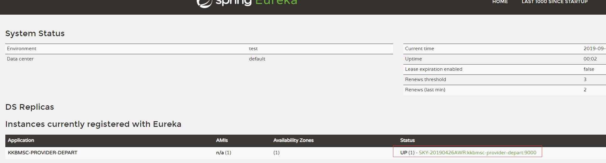

     当点击微服务名称，出现错误页面，因为没有启用 acturator，默认会使用 acturator/info 接口下的数据

4. 创建消费者

   - 添加 Eureka 客户端依赖

     ```xml
     <!--添加 eureka 客户端依赖-->
     <dependency>
     	<groupId>org.springframework.cloud</groupId>
     	<artifactId>spring-cloud-starter-netflix-eureka-client</artifactId>
     </dependency>
     
     ......
     ```

   - 配置文件中指定 Eureka 注册中心

     ```yml
     spring:
       application:
         name: kkbmsc-consumer-depart
     
     # 配置 eureka 注册中心
     eureka:
       client:
         service-url:
           defaultZone: http://localhost:8000/eureka
     ```
     
   - 装配 ResTemplate 实例对象

     ```java
     @Configuration
     public class DepartCodeConfig {
     
         @Bean
         @LoadBalanced //  开启消费端的负载均衡，默认使用轮询
         public RestTemplate restTemplate(){
             return new RestTemplate();
         }
     }
     ```
     
   - 在启动类上添加 `@EnableEurekaClient` 注解

   - 调用 provider

5. 服务发现

   - 入口类添加注解 `@EnableDiscoveryClient` ，开启服务发现

   - 注入  `DiscoveryClient`

   - 获取微服务和微服务主机端口等信息

     ```java
     @GetMapping("/discovery")
     public Object discoveryHandle() {
         // 获取服务注册列表中所有微服务
         List<String> springApplicationNamse = discoveryClient.getServices();
         for (String name : springApplicationNamse) {
             // 获取提供指定微服务名称的所有提供者主机
             List<ServiceInstance> instances = discoveryClient.getInstances(name);
             for (ServiceInstance instance : instances) {
                 String host = instance.getHost();
                 int port = instance.getPort();
                 System.out.println(host + "：" + port);
             }
         }
         return springApplicationNamse;
     }
     ```

6. Eureka 集群

   在** Eureka 的每个服务端和客户端**的主配置文件上修改 defaultZone 为多个：

   ```yml
   defaultZone: http://eureka1.com:8100/eureka,http://eureka2.com:8200/eureka,http://eureka3.com:8300/eureka
   ```

7. Eureka 与 ZooKeeper 对比

   Eureka: AP 原则，保证可靠性，丢掉了一致性

   zooKeeper：CP 原则，保证一致性，丢掉了可靠性

#### 声明式 REST 客户端 OpenFeign

 1. 概述

    > RestTemplate：删、改没有返回值，而且和服务的关系不是很紧密（使用的 url，一般喜欢使用接口），    所以引入了 OpenFeign

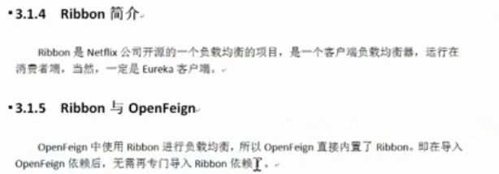

2. 使用 OpenFeign：

   - 添加 OpenFeign 依赖

     ```xml
     <dependency>
         <groupId>org.springframework.cloud</groupId>
         <artifactId>spring-cloud-starter-openfeign</artifactId>
     </dependency>
     ```

   - 添加 service 接口，并制定其所绑定的微服务

     > 接口就是 provider 的 service 接口
     >
     > url 注解就是和 providr controller 一致

     ```java
     @Service // 只是为了让 idea 不报错
     @FeignClient("kkbmsc-providerr-depart") // 指定微服务的名称
     @RequestMapping("/provider/depart")
     public interface DepartService {
         @PostMapping("/save")
         boolean saveDepart(Depart depart);
     
         @DeleteMapping("/del/{id}")
         boolean removeDepartById(@PathVariable("id") int id);
     
         @PutMapping("/update")
         boolean modifyDepart(Depart depart);
     
         @GetMapping("/get/{id}")
         Depart getDepartById(@PathVariable Integer id);
     
         @GetMapping("/list")
         List<Depart> listAllDeparts();
     }
     ```

   - 修改处理器，通过 service 接口消费微服务，替换之前的 `RestTemplate`

     ```java
     @RestController
     @RequestMapping("/consumer/depart")
     public class DepartController {
     
         @Autowired
         DepartService departService;
     
         @PostMapping("/save")
         public boolean saveHandle(Depart depart) {
             return departService.saveDepart(depart);
         }
     
         @DeleteMapping("/del/{id}")
         public boolean deleteHandle(@PathVariable("id") Integer id) {
             return departService.removeDepartById(id);
         }
     
         @PutMapping("/update")
         public boolean modifyHandle(Depart depart) {
             return departService.modifyDepart(depart);
         }
     
         @GetMapping("/get/{id}")
         public Depart getDepart(@PathVariable("id") int id) {
             return departService.getDepartById(id);
         }
     
         @GetMapping("/list")
         public List<Depart> listAllDeparts() {
             return departService.listAllDeparts();
         }
     }
     ```

   - 在启动类上添加 `@EnableFeignClients` 注解

     ```java
     @SpringBootApplication
     @EnableEurekaClient
     // 指定 service 接口所在的包，启动 feign 客户端
     @EnableFeignClients(basePackages = "com.kaikeba.consumer.service")
     public class Application {
     
         public static void main(String[] args) {
             SpringApplication.run(Application.class, args);
         }
     }
     ```

3. Ribbon 负载均衡展示

   > 创建 3 个provider，启动之后可以查看到可以查看到有三台主机提供相同的服务

   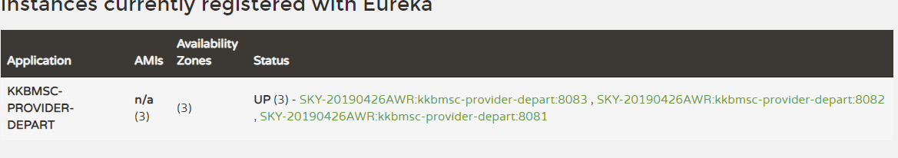

4. Ribbon 负载均衡算法 IRule

   RIbbon 自带的负载均衡算法， 都是 IRule 接口的实现类

   - RoundRobinRule

     轮询策略（**默认**）

   - BestAvailableRule

     选择并发量最小的 provider，即连接的消费者数量最少的 provider。其会遍历服务列表中的每一个 provider，选择当前连接数量 minimalConcurrentConnections 最小的 provider.

   - AvailabilityFilteringRule

     过滤掉由于连续连接故障处于断路跳闸状态的 provider，或已经超过连接极限的 provider，对剩余 provider 采用**轮询**策略

   - ZoneAvoidanceRule

     复合判断 provider 所在区域的性能及 provider 的可用性选择服务器

   - RandomRule

     随机找一个

   - RetryRule

     先按照**轮询**策略获取 provider，若失败，则在指定的时间内重试，默认的时限为 500 毫秒

   - WeightedResponseTimeRule

     权重响应时间策略，根据每个 provider 的平均响应时间计算其权重，响应时间越快权重越大，被选中的几率越高

5. 自定义负载均衡策略

   - 使用已有的算法

     在 codeconfig 类中加上如下的方法

     ```java
      // 设置负载均衡算法为 “随机算法”
      @Bean
      public IRule loadBalanceRule(){
      	return new RandomRule();
      }
     ```

   - 自定义负载均衡算法

     从 所有 provider 中排除指定端口的 provider, 在剩余的 provider 中进行随机选择

     - 实现负载均衡算法

       ```java
       public class CustomRule implements IRule {
           private ILoadBalancer lb;
           private List<Integer> excludePorts;
       
           public CustomRule() {
           }
       
           public CustomRule(List<Integer> excludePorts) {
               this.excludePorts = excludePorts;
           }
       
           @Override
           public Server choose(Object key) {
               // 所有的 server
               List<Server> servers = lb.getReachableServers();
       
               // 获取所有排除指定端口的 server
               List<Server> avibalServers = this.getAvailableServers(servers);
       
               // 随机选择一个 server
               return this.getAvailableRandomServers(avibalServers);
           }
       
           @Override
           public void setLoadBalancer(ILoadBalancer lb) {
               this.lb = lb;
           }
       
           private Server getAvailableRandomServers(List<Server> availableServers) {
               int index = new Random().nextInt(availableServers.size());
               return availableServers.get(index);
           }
       
           private List<Server> getAvailableServers(List<Server> servers) {
               // 若不存在排除的 server，直接返回
               if (excludePorts == null || excludePorts.size() == 0) {
                   return servers;
               }
       
               // 过滤掉不可用的 server
               List<Server> availableServers = servers
                       .stream()
                       .filter(s -> !excludePorts.contains(s.getPort()))
                       .collect(Collectors.toList());
               return availableServers;
           }
       
           @Override
           public ILoadBalancer getLoadBalancer() {
               return this.lb;
           }
       }
       ```

     - 在 codeConfig 添加 bean

       ```java
       @Bean
       public IRule loadBalanceRule() {
           List<Integer> ports = new ArrayList<>();
           ports.add(8082);
           return new CustomRule(ports);
       }
       ```


#### Hystrix 熔断机制与服务降级

先了解雪崩效应和服务雪崩

- 雪崩效应：服务 A 依赖 服务 B 和 C，同时服务 B 和 C 又依赖别的服务....

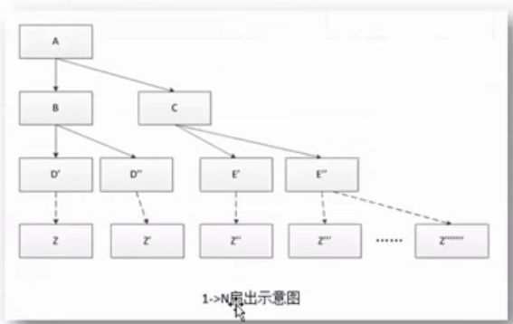


​					最终导致所有生产陷入瘫痪，这就是雪崩效应

- 雪崩效应发生在 SOA 服务系统中，称为服务雪崩

  

- 熔断机制

  

- Hystrix 

  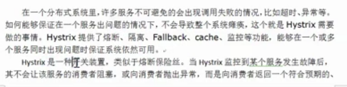

  ​						可处理的备选响应，就避免了服务雪崩。

- 服务降级

  提供者端的服务熔断，消费者端的本地服务，共同构成服务降级（降级指的是，本应该由提供者提供，但由消费者提供默认数据了）

  

- Hystrix服务降级代码（ 方法级别）

  > Hystrix 和提供者没有关系只在消费者端添加
  >
  > Hystrix 和 Feign 是没有任何关系的

  1. 添加 hystrix 依赖

     ```xml
     <dependency>
         <groupId>org.springframework.cloud</groupId>
         <artifactId>spring-cloud-starter-netflix-hystrix</artifactId>
     </dependency>
     ```

  2. 修改处理器，在处理器**方法**上添加 @HystrixCommond 注解 ，并添加处理方法

     ```java
     // 服务降级，若当前处理器方法发生异常，则执行 fallbackMethod 属性方法
     @GetMapping("/get/{id}")
     @HystrixCommand(fallbackMethod = "getDepartHandle")
     public Depart getDepart(@PathVariable("id") int id) {
         String url = url_prefix + "/get/" + id;
         Depart depart = restTemplate.getForObject(url, Depart.class);
         if (depart == null) {
             throw new RuntimeException();
         }
         return depart;
     }
     
     public Depart getDepartHandle(@PathVariable("id") int id) {
         Depart depart = new Depart();
         depart.setId(id);
         depart.setName("no this depart");
         depart.setName("no this depart");
         depart.setDbase("no this db");
         return depart;
     }
     ```

  3. 在启动类上添加 `@EnableCircuitBreaker` 注解， 开启服务降级

- Hystrix  + Feign 服务降级（类级别）

  > 注意：方法级别高于类级别的服务降级处理

  1. 添加 hystrix 依赖

     ```xml
     <dependency>
         <groupId>org.springframework.cloud</groupId>
         <artifactId>spring-cloud-starter-netflix-hystrix</artifactId>
     </dependency>
     ```

  2. 在 Feign 接口所在包下定义降级处理类

     ```java
     @Component
     public class DepartFallbackFactory implements FallbackFactory<DepartService> {
     
         @Override
         public DepartService create(Throwable throwable) {
             // 返回 Feign 接口的匿名内部类
             return new DepartService() {
                 @Override
                 public boolean saveDepart(Depart depart) {
                     System.out.println("执行服务降级 saveDepart 方法");
                     return false;
                 }
     
                 @Override
                 public boolean removeDepartById(int id) {
                     System.out.println("执行服务降级 removeDepartById 方法");
                     return false;
                 }
     
                 @Override
                 public boolean modifyDepart(Depart depart) {
                     System.out.println("执行服务降级 modifyDepart 方法");
                     return false;
                 }
     
                 @Override
                 public Depart getDepartById(Integer id) {
                     System.out.println("执行服务降级 getDepartById 方法");
                     Depart depart = new Depart();
                     depart.setId(id);
                     depart.setName("no this depart");
                     depart.setDbase("no this db");
                     return depart;
                 }
     
                 @Override
                 public List<Depart> listAllDeparts() {
                     System.out.println("执行服务降级 listAllDeparts 方法");
                     return null;
                 }
             };
         }
     }
     ```

  3. 在 Feign 接口中指定要使用的降级处理类

     ```java
     @Service // 只是为了让 idea 不报错
     @FeignClient(value = "kkbmsc-provider-depart", fallbackFactory=DepartFallbackFactory.class) // 指定微服务的名称和降级处理类
     @RequestMapping("/provider/depart")
     public interface DepartService {
         @PostMapping("/save")
         boolean saveDepart(Depart depart);
     
         @DeleteMapping("/del/{id}")
         boolean removeDepartById(@PathVariable("id") int id);
     
         @PutMapping("/update")
         boolean modifyDepart(Depart depart);
     
         @GetMapping("/get/{id}")
         Depart getDepartById(@PathVariable("id") Integer id);
     
         @GetMapping("/list")
         List<Depart> listAllDeparts();
     }
     ```

  4. 在配置文件中开启 Feign 对 Hystrix 的支持

     ```yml
     # 开启 Feign 对 hystrix 的支持
     feign:
       hystrix:
         enabled: true
     
     # 设置服务熔断时间，默认为 5000 毫秒
     hytrix:
       command:
         default:
           execution:
             isolation:
               thread:
                 timeoutInMilliseconds: 5000
     ```

  5. 在启动类上添加 `@EnableCircuitBreaker` 注解， 开启服务降级

- 网关服务 Zuul

  Zuul 里边有负载均衡

  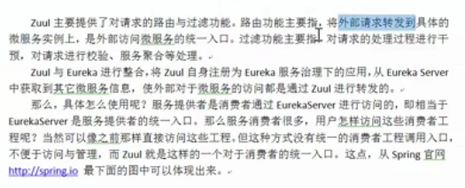

  ​	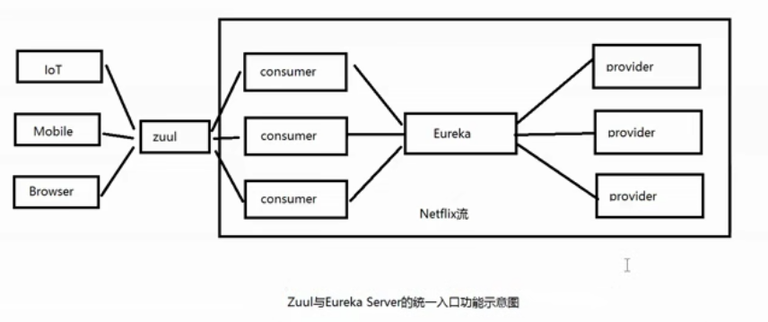

  1. 添加 eureka 和 zuul 依赖

     ```xml
     <dependency>
     	<groupId>org.springframework.cloud</groupId>
     	<artifactId>spring-cloud-starter-netflix-eureka-client</artifactId>
     </dependency>
     
     <dependency>
     	<groupId>org.springframework.cloud</groupId>
     	<artifactId>spring-cloud-starter-netflix-zuul</artifactId>
     </dependency>
     
     <dependency>
     	<groupId>org.springframework.boot</groupId>
     	<artifactId>spring-boot-starter-actuator</artifactId>
     </dependency>
     ```

  2. 修改主配置文件

     > 注册为 eureka 服务客户端，并指定微服务名称

     ```yml
     server:
       port: 9000
     
     eureka:
       client:
         service-url:
           defaultZone: http://localhost:8000/eureka
     
     spring:
       application:
         name: kkbmsc-zuul-depart
     ```

  3. 在主类上添加 `@EnableZuulProxy` 注解

     ```java
     @SpringBootApplication
     @EnableZuulProxy // 开启 Zuul 代理模式
     public class ZuulApplication {
     
         public static void main(String[] args) {
             SpringApplication.run(ZuulApplication.class, args);
         }
     }
     ```

  4. 启动 eureka 服务端，消费端，服务端 和 zuul，查看到已经启动的微服务

     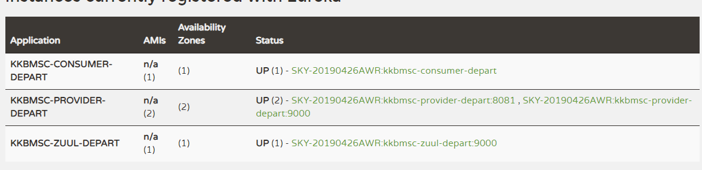

  5. 浏览器访问消费端

     原始方式：

     <http://localhost:8080/consumer/depart/get/1>

     zuul 方式（zuul 地址 + consumer 微服务名称 + 数据访问地址）：

     <http://localhost:9000/kkbmsc-consumer-depart/consumer/depart/get/1>

     但是这样暴露了微服务名称，对系统来说不安全

     解决办法：对微服务进行映射

     在主配置文件中添加：

     ```yml
     # 设置 zuul 路由规则
     zuul:
       # 设定微服务名称的替换规则
       routes:
         # 指定替换的微服务名称，someDepart 可以任意指定，后面的不能任意指定
         someDepart.serviceId: kkbmsc-consumer-depart
         # 指定替换的路径
         someDepart.path: /condep/**
       
       # 忽略指定的微服务，这样就只能使用替换后的路径，不能使用之前的微服务名称访问了
       # 忽略所有使用 “*” 代替
       ignored-services:  kkbmsc-consumer-depart
       # ignored-services:  "*"
       
       # 为映射路径统一添加前缀
       prefix: /depart
     ```

     启动再次访问：

     <http://localhost:9000/depart/condep/consumer/depart/get/1>

####  Spring Cloud Config 分布式配置中心

1. 简介

   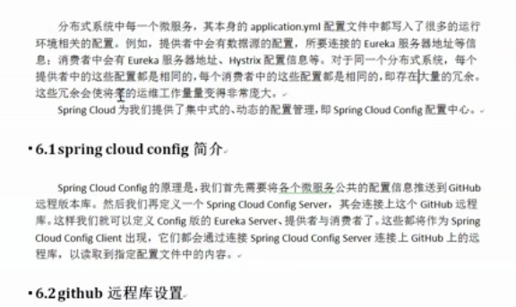

附：github ssh 免密登录过程（非对称加密）

> 公钥加密，私钥解密；github 加密，本地解密

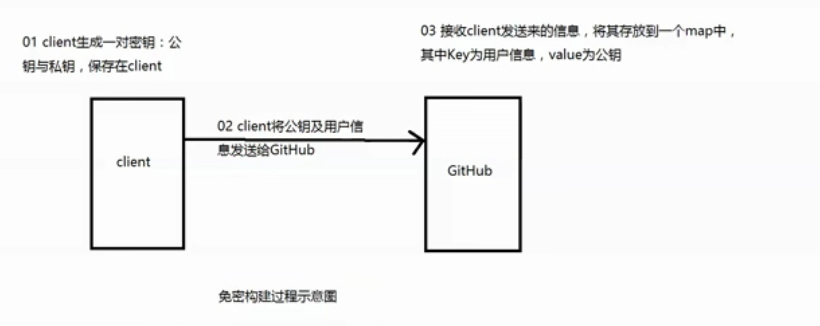

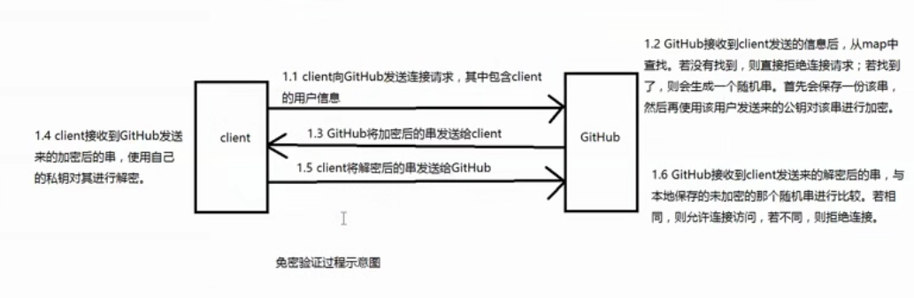

2. 创建远程仓库，并克隆到本地

   

   创建配置工程

   - 切换到不同环境

   - 切换到指定环境

   - 切换到指定分支的环境

   - 读取指定分支上 master 的配置信息

     localhost:9999/application/dev/master

     

     

   创建 eureka 服务工程

   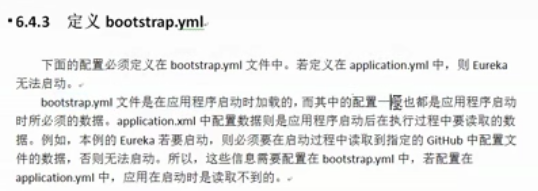

   添加依赖

   

   配置文件

   ```yml
   spring:
     cloud:
       config:
         # 指定 configServer 地址
         uri: http://localhost:9999
         # 指定远程仓库的分支
         label: master
         # 指定要从远程库中读取的文件名，无需扩展名，只能是 yml 结尾
         name: application-eureka-config
         # 指定选择的环境
         profile: dev
   ```

   多环境设置 ---

   

   访问默认是 dev

   

   

   

   

   


