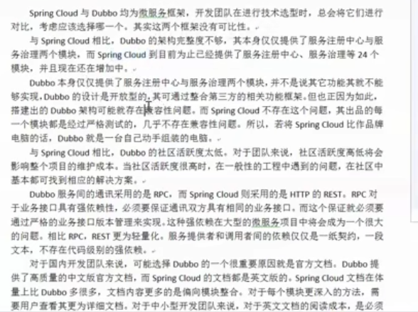
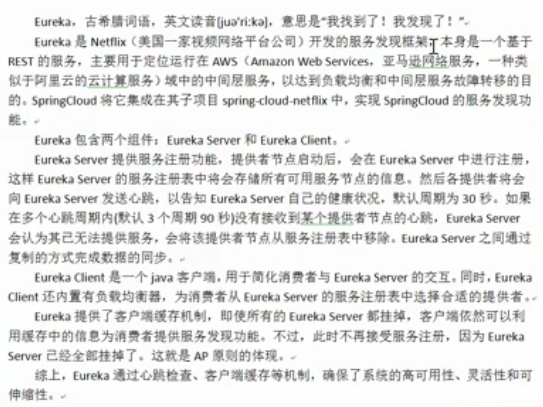
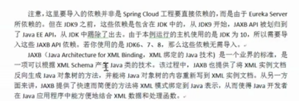

## Spring Cloud

#### Spring Cloud 入门

1. 微服务与微服务架构

2. Spring Clound 简介

3. 在线资源

   spring cloud 官网 <https://spring.io/projects/spring-cloud>

   spring cloud 中文网  www.springclound.cc

4. Dubble 和 Spring Clound 技术选型



​							要考虑的

​	总结：对于小型业务可选择使用 Dubbo， 总体上 Spring Cloud 要比 Dubbo 更好。

5. 实现一个简单的 provider 和 consumer（restful 格式)

   - provider 实现简单的对数据库的增、删、改、查接口

   - consumer

     添加 RestTemplate bean

     ```java
     @Configuration
     public class DepartCodeConfig {
     
         // 好比是 Spring 容器中的 bean， name 为方法名
     
         @Bean
         @LoadBalanced //  开启消费端的负载均衡，默认使用轮询
         public RestTemplate restTemplate(){
             return new RestTemplate();
         }
     }
     ```

     handler 注入 RestTemplate， 调用 provider 接口

     ```java
     @RestController
     @RequestMapping("/consumer/depart")
     public class DepartController {
     
         @Autowired
         private RestTemplate restTemplate;
     
         private String url_prefix = "http://localhost:8081/provider/depart";
     
         @PostMapping("/save")
         public boolean saveHandle(Depart depart) {
             String url = url_prefix + "/save";
             return restTemplate.postForObject(url, depart, Boolean.class);
         }
     
         @DeleteMapping("/del/{id}")
         public void deleteHandle(@PathVariable("id") Integer id) {
             String url = url_prefix + "/del/" + id;
             restTemplate.delete(url);
         }
     
         @PutMapping("/update")
         public void modifyHandle(Depart depart) {
             String url = url_prefix + "/update";
             restTemplate.put(url, depart);
         }
     
         @GetMapping("/get/{id}")
         public Depart getDepart(@PathVariable("id") int id) {
             String url = url_prefix + "/get/" + id;
             return restTemplate.getForObject(url, Depart.class);
         }
     
         @GetMapping("/list")
         public List<Depart> listAllDeparts() {
             String url = url_prefix + "/list";
             return restTemplate.getForObject(url, List.class);
         }
     }
     ```

     

 #### 微服务中心 Eureka

> 如果使用如上的简单示例，当 provider 只有一台的时候，如果出现宕机，则别人就不能访问，所以把服务做成机群，使用 Eureka 做为服务注册中心。

1. 概述



github地址： https://github.com/Netflix/eureka

附录：

​	死锁：两个进程之间都有对象需要的资源，都不放手，

​	活锁： 一个进程需要别的进程释放资源i


​		**注意： 不管是 Application Server 还是 Application  Client 都是使用的 Eureka Client**

2. 创建 Eureka 服务中心

   分为三步

   - 创建 Spring Boot 工程，选择导入 EurekaServer 依赖

     >  注意： 除了 EurekaServer 依赖之外，若 JDK 大于 8，还需导入 jaxb 依赖

     

     ```xml
     <dependencies>
         <dependency>
             <groupId>org.springframework.cloud</groupId>
             <artifactId>spring-cloud-starter-netflix-eureka-server</artifactId>
         </dependency>
     
         <dependency>
             <groupId>org.springframework.boot</groupId>
             <artifactId>spring-boot-starter-test</artifactId>
             <scope>test</scope>
         </dependency>
     
         <!--导入 jaxb 依赖-->
         <dependency>
             <groupId>javax.xml.bind</groupId>
             <artifactId>jaxb-api</artifactId>
             <version>2.3.0</version>
         </dependency>
         <dependency>
             <groupId>com.sun.xml.bind</groupId>
             <artifactId>jaxb-impl</artifactId>
             <version>2.3.0</version>
         </dependency>
         <dependency>
             <groupId>com.sun.xml.bind</groupId>
             <artifactId>jaxb-core</artifactId>
             <version>2.3.0</version>
         </dependency>
         <dependency>
             <groupId>org.glassfish.jaxb</groupId>
             <artifactId>jaxb-runtime</artifactId>
             <version>2.2.11</version>
         </dependency>
         <dependency>
             <groupId>javax.activation</groupId>
             <artifactId>activation</artifactId>
             <version>1.1.1</version>
         </dependency>
     </dependencies>
     
     <dependencyManagement>
         <dependencies>
             <dependency>
                 <groupId>org.springframework.cloud</groupId>
                 <artifactId>spring-cloud-dependencies</artifactId>
                 <version>${spring-cloud.version}</version>
                 <type>pom</type>
                 <scope>import</scope>
             </dependency>
         </dependencies>
     </dependencyManagement>
     ```

   - 配置文件中配置 EurekaServer

     ```yml
     server:
       port: 8000
     
     eureka:
       instance:
         hostname: localhost # 指定 eureka 主机
       client:
         register-with-eureka: false # 当前主机是否需要向注册中心注册（不需要，当前已经为主机）
         fetch-registry: false # 当前主机是否需要获取注册信息（不需要，当前已经为主机）
         service-url: # 暴露服务中心地址
           defaultZone: http://${eureka.instance.hostname}:${server.port}/eureka
     ```

     启动访问：<http://localhost:8000/>

   - 在启动类中添加注解，开启 EurekaServer

     ```java
     @SpringBootApplication
     @EnableEurekaServer
     public class EurekaServerApplication {
     
         public static void main(String[] args) {
             SpringApplication.run(EurekaServerApplication.class, args);
         }
     
     }
     ```

3. 创建提供者

   - 添加 Eureka  客户端依赖

     ```xml
     <!--添加 eureka 客户端依赖-->
     <dependency>
     	<groupId>org.springframework.cloud</groupId>
     	<artifactId>spring-cloud-starter-netflix-eureka-client</artifactId>
     </dependency>
     ```

     ```xml
     <dependencyManagement>
             <dependencies>
                 <dependency>
                     <groupId>org.springframework.cloud</groupId>
                     <artifactId>spring-cloud-dependencies</artifactId>
                     <version>Finchley.SR1</version>
                     <type>pom</type>
                     <scope>import</scope>
                 </dependency>
             </dependencies>
         </dependencyManagement>
     ```

   - 在配置文件中执行要注册的 Eureka 注册中心

     ```yml
     server:
       port: 8081
     
     spring:
       jpa:
         # 应用初次启动时是否创建表，默认 false
         generate-ddl: true
         show-sql: true
         # 设置应用启动时，不重新建表
         hibernate:
           ddl-auto: none
       datasource:
         type: com.alibaba.druid.pool.DruidDataSource
         # 下面的多一个 / 表示 localhost:3306 的简写
         url: jdbc:mysql:///test?useUnicode=true&amp;characterEncoding=utf8
         username: root
         password: 123456
         driver-class-name: com.mysql.jdbc.Driver
     
       # 指定当前微服务对象（提供者）暴露的名称
       application:
         name: kkbmsc-provider-depart
     
     logging:
       pattern:
         console: level-%level %msg%n
       level:
         root: info # Spring Boot 启动时的日志级别
         org.hibernate: info # hibernate 运行日志级别
         org.hibernate.type.descriptor.sql.BasicBinder: trace # 显示查询参数
         org.hibernate.type.descriptor.sql.BasicExtractor: trace # 显示查询结果
         com.kaikeba.provier: debug
     
     # 配置 eureka 注册中心
     eureka:
       client:
         service-url:
           defaultZone: http://localhost:8000/eureka
       # instance: xxx 可以修改服务名称，默认为主机名 + 微服务名 + 端口号  
     ```

   - 在启动类上添加 `@EnableEurekaClient` 注解

   - 启动访问：<http://localhost:8000/，可以看到在注册中心注册的微服务提供者信息

     点击微服务提供者打不开，使用 actuator 完善微服务 info

     为提供者添加依赖：

     ```xml
     <!--actuator 依赖-->
     <dependency>
        <groupId>org.springframework.boot</groupId>
        <artifactId>spring-boot-starter-actuator</artifactId>
     </dependency>
     ```

     修改主配置文件,添加如下内容（info 内部的内容可以自定义）：

     ```yml
     info:
       company.name: www.bkaikeba.com
       address: 北京
       company.tel: 1234567
       app.name: kaikeba-msc
       app.desc: mic-service-cloud
       author: kaikeba
     ```

     在页面上再次点击微服务的名称可以看到如下：

     ```
     {"company":{"name":"www.bkaikeba.com","tel":1234567},"address":"北京","app":{"name":"kaikeba-msc","desc":"mic-service-cloud"},"author":"kaikeba"}
     ```

6. Eureka 的 self Perservation 机制

   

   可以设置关闭自我保护模式（不建议）

   ```yml
   eureka:
     server:
       enable-self-preservation: false
   ```

7. 创建消费者

   - 添加 Eureka 客户端依赖

   - 配置文件中指定 Eureka 注册中心

     ```yml
     spring:
       application:
         name: kkbmsc-consumer-depart
     
     # 配置 eureka 注册中心
     eureka:
       client:
         service-url:
           defaultZone: http://localhost:8000/eureka
     
     ```

   - 在 CodeConfig 类中添加 ResTemplate 添加 `@LoadBalanced` 注解

     ```java
     @Configuration
     public class DepartCodeConfig {
     
         // 好比是 Spring 容器中的 bean， name 为方法名
     
         @Bean
         @LoadBalanced //  开启消费端的负载均衡，默认使用轮询
         public RestTemplate restTemplate(){
             return new RestTemplate();
         }
     }
     
     ```

   - 在启动类上添加 `@EnableEurekaClient` 注解

8. 服务发现

   - 入口类添加注解 `@EnableDiscoveryClient` ，开启服务发现

   - 注入  `DiscoveryClient`

   - 获取微服务和微服务主机端口等信息

     ```java
     @GetMapping("/discovery")
     public Object discoveryHandle() {
         // 获取服务注册列表中所有微服务
         List<String> springApplicationNamse = discoveryClient.getServices();
         for (String name : springApplicationNamse) {
             // 获取提供指定微服务名称的所有提供者主机
             List<ServiceInstance> instances = discoveryClient.getInstances(name);
             for (ServiceInstance instance : instances) {
                 String host = instance.getHost();
                 int port = instance.getPort();
                 System.out.println(host + "：" + port);
             }
         }
         return springApplicationNamse;
     }
     ```

9. Eureka 集群

   在**Eureka 的每个服务端和客户端**的主配置文件上修改defaultZone为多个：

   ```yml
   defaultZone: http://eureka1.com:8100/eureka,http://eureka2.com:8200/eureka,http://eureka3.com:8300/eureka
   ```

10. Eureka 与 ZooKeeper 对比

    Eureka: AP 原则，保证可靠性，丢掉了一致性

    zooKeeper：CP 原则，保证一致性，丢掉了可靠性

#### 声明式 REST 客户端 OpenFeign

 1. 概述

    > RestTemplate：删、改没有返回值，而且和服务的关系不是很紧密（使用的 url，一般喜欢使用接口），    所以引入了 OpenFeign


2. 使用 OpenFeign：

   - 添加 OpenFeign 依赖

     ```xml
     <dependency>
         <groupId>org.springframework.cloud</groupId>
         <artifactId>spring-cloud-starter-openfeign</artifactId>
     </dependency>
     ```

   - 添加 service 接口，并制定其所绑定的微服务

     > 接口就是 provider 的 service 接口
     >
     > url 注解就是和 providr controller 一致

     ```java
     @Service // 只是为了让 idea 不报错
     @FeignClient("kkbmsc-providerr-depart") // 指定微服务的名称
     @RequestMapping("/provider/depart")
     public interface DepartService {
         @PostMapping("/save")
         boolean saveDepart(Depart depart);
     
         @DeleteMapping("/del/{id}")
         boolean removeDepartById(@PathVariable("id") int id);
     
         @PutMapping("/update")
         boolean modifyDepart(Depart depart);
     
         @GetMapping("/get/{id}")
         Depart getDepartById(@PathVariable Integer id);
     
         @GetMapping("/list")
         List<Depart> listAllDeparts();
     }
     ```

   - 修改处理器，通过 service 接口消费微服务，替换之前的 `RestTemplate`

     ```java
     @RestController
     @RequestMapping("/consumer/depart")
     public class DepartController {
     
         @Autowired
         DepartService departService;
     
         @PostMapping("/save")
         public boolean saveHandle(Depart depart) {
             return departService.saveDepart(depart);
         }
     
         @DeleteMapping("/del/{id}")
         public boolean deleteHandle(@PathVariable("id") Integer id) {
             return departService.removeDepartById(id);
         }
     
         @PutMapping("/update")
         public boolean modifyHandle(Depart depart) {
             return departService.modifyDepart(depart);
         }
     
         @GetMapping("/get/{id}")
         public Depart getDepart(@PathVariable("id") int id) {
             return departService.getDepartById(id);
         }
     
         @GetMapping("/list")
         public List<Depart> listAllDeparts() {
             return departService.listAllDeparts();
         }
     }
     ```

   - 在启动类上添加 `@EnableFeignClients` 注解

     ```java
     @SpringBootApplication
     @EnableEurekaClient
     // 指定 service 接口所在的包，启动 feign 客户端
     @EnableFeignClients(basePackages = "com.kaikeba.consumer.service")
     public class Application {
     
         public static void main(String[] args) {
             SpringApplication.run(Application.class, args);
         }
     }
     ```

3. Ribbon 负载均衡展示

   > 创建 3 个provider，启动之后可以查看到可以查看到有三台主机提供相同的服务

   

4. Ribbon 负载均衡算法 IRule

   RIbbon 自带的负载均衡算法， 都是 IRule 接口的实现类

   - RoundRobinRule

     轮询策略（**默认**）

   - BestAvailableRule

     选择并发量最小的 provider，即连接的消费者数量最少的 provider。其会遍历服务列表中的每一个 provider，选择当前连接数量 minimalConcurrentConnections 最小的 provider.

   - AvailabilityFilteringRule

     过滤掉由于连续连接故障处于断路跳闸状态的 provider，或已经超过连接极限的 provider，对剩余 provider 采用**轮询**策略

   - ZoneAvoidanceRule

     复合判断 provider 所在区域的性能及 provider 的可用性选择服务器

   - RandomRule

     随机找一个

   - RetryRule

     先按照**轮询**策略获取 provider，若失败，则在指定的时间内重试，默认的时限为 500 毫秒

   - WeightedResponseTimeRule

     权重响应时间策略，根据每个 provider 的平均响应时间计算其权重，响应时间越快权重越大，被选中的几率越高

5. 自定义负载均衡策略

   - 使用已有的算法

     在 codeconfig 类中加上如下的方法

     ```java
      // 设置负载均衡算法为 “随机算法”
      @Bean
      public IRule loadBalanceRule(){
      	return new RandomRule();
      }
     ```

   - 自定义负载均衡算法

     从 所有 provider 中排除指定端口的 provider, 在剩余的 provider 中进行随机选择

     - 实现负载均衡算法

       ```java
       public class CustomRule implements IRule {
           private ILoadBalancer lb;
           private List<Integer> excludePorts;
       
           public CustomRule() {
           }
       
           public CustomRule(List<Integer> excludePorts) {
               this.excludePorts = excludePorts;
           }
       
           @Override
           public Server choose(Object key) {
               // 所有的 server
               List<Server> servers = lb.getReachableServers();
       
               // 获取所有排除指定端口的 server
               List<Server> avibalServers = this.getAvailableServers(servers);
       
               // 随机选择一个 server
               return this.getAvailableRandomServers(avibalServers);
           }
       
           @Override
           public void setLoadBalancer(ILoadBalancer lb) {
               this.lb = lb;
           }
       
           private Server getAvailableRandomServers(List<Server> availableServers) {
               int index = new Random().nextInt(availableServers.size());
               return availableServers.get(index);
           }
       
           private List<Server> getAvailableServers(List<Server> servers) {
               // 若不存在排除的 server，直接返回
               if (excludePorts == null || excludePorts.size() == 0) {
                   return servers;
               }
       
               // 过滤掉不可用的 server
               List<Server> availableServers = servers
                       .stream()
                       .filter(s -> !excludePorts.contains(s.getPort()))
                       .collect(Collectors.toList());
               return availableServers;
           }
       
           @Override
           public ILoadBalancer getLoadBalancer() {
               return this.lb;
           }
       }
       ```

     - 在 codeConfig 添加 bean

       ```java
       @Bean
       public IRule loadBalanceRule() {
           List<Integer> ports = new ArrayList<>();
           ports.add(8082);
           return new CustomRule(ports);
       }
       ```

       

   


