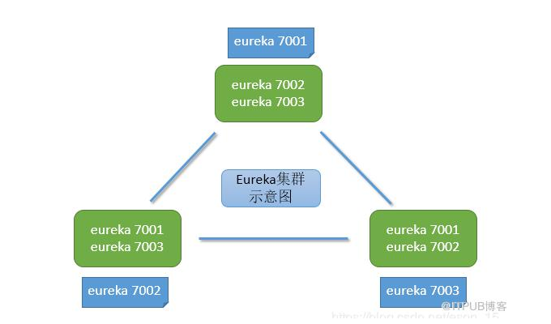
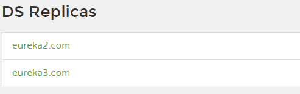

## Spring Cloud

#### Spring Cloud 入门

1. 微服务与微服务架构

   例如：前公司 E 平台子系统提供的就是微服务，整个架构就属于微服务架构，但是之前没有提供服务注册中心的功能

2. Spring Clound 简介

3. 在线资源

   spring cloud 官网 <https://spring.io/projects/spring-cloud>

   spring cloud 中文网  www.springclound.cc

4. Dubble 和 Spring Clound 技术选型

   - Dubble 架构的完整度不够，本身仅仅提供了服务注册中心与服务治理两个模块。而 SpringCloud 已经提供了服务治理、服务注册中心等24个模块，并且还在不断增加中
   - 相比 SpringCloud， Dubble 的社区活跃度不够，遇见问题不好解决
   - Dubble 通讯采用的是 PRC（需要依赖于业务接口），而 Spring Cloud 采用的是 HTTP 的 REST，不存在代码的强依赖
   - Dubble 的优点是因为是国内人员开发的提供了比较高质量的官方文档

   **总结：目前来说对于小型业务可选择使用 Dubbo， 总体上 Spring Cloud 要比 Dubbo 更好**

5. 实现一个简单的 provider 和 consumer

   - provider 实现简单的对数据库的增、删、改、查接口，并暴露 REST 的外界访问

   - consumer

     > 使用添加 RestTemplate 进行数据访问
     >
     > RestTemplate  属于在 `spring-web` 包下，`spring-boot-starter-web` 依赖 `spring-web` 所以不用再导入依赖
     
      ```java
     @Configuration
     public class DepartCodeConfig {
     
         @Bean
         public RestTemplate restTemplate(){
             return new RestTemplate();
         }
     }
      ```
     
     > handler 注入 RestTemplate， 调用 provider 接口
     >
     > 可以看到 RestTemplate 有局限，返回值可能不是我们想要的结果，比如 delete 和 put 返回都是 void
     
     ```java
     @RestController
     @RequestMapping("/consumer/depart")
     public class DepartController {
     
         @Autowired
         private RestTemplate restTemplate;
     
         private String url_prefix = "http://localhost:8081/provider/depart";
     
         @PostMapping("/save")
         public boolean saveHandle(Depart depart) {
             String url = url_prefix + "/save";
             return restTemplate.postForObject(url, depart, Boolean.class);
         }
     
         @DeleteMapping("/del/{id}")
         public void deleteHandle(@PathVariable("id") Integer id) {
             String url = url_prefix + "/del/" + id;
             restTemplate.delete(url);
         }
     
         @PutMapping("/update")
         public void modifyHandle(Depart depart) {
             String url = url_prefix + "/update";
             restTemplate.put(url, depart);
         }
     
         @GetMapping("/get/{id}")
         public Depart getDepart(@PathVariable("id") int id) {
             String url = url_prefix + "/get/" + id;
             return restTemplate.getForObject(url, Depart.class);
         }
     
         @GetMapping("/list")
         public List<Depart> listAllDeparts() {
             String url = url_prefix + "/list";
             return restTemplate.getForObject(url, List.class);
         }
     }
     ```


 #### 微服务中心 Eureka

> 如果使用如上的简单示例，当 provider 只有一台的时候，如果出现宕机，则别人就不能访问，所以把服务做成机群，使用 Eureka 做为服务注册中心

1. 概述

   Eureka 包含两个组件：Eureka Server 和 Eureka Client

   ​		 Eureka Server 提供服务注册功能。提供者节点启动后，会在 Eureka Server 中进行注册，这样 Eureka Server 的服务注册表中将会存储所有可用服务节点的信息。然后各提供者会向 Eureka Server 发送心跳，以告知自己的健康状态，默认周期是 30 秒。如果多个周期内（默认 3 个周期，90 秒）没有接收到某个提供者的心跳，Eureka Server 将会认为其无法提供服务，会将该服务提供者节点从服务注册表中移除。Eureka Server 之间通过复制的方式完成数据同步。

   ​		 Eureka Client 是一个 java 客户端，用于简化消费者与 Eureka Server 的交互。同时，Eureka Client 还内置了负载均衡器，为消费者从 Eureka Server 的服务注册表选择合适的提供者。Eureka Client 会缓存 Eureka Server 中的信息，即使所有的 Eureka Server 都挂掉，客户端依然可以进行访问，只是不能再进行服务注册。体现了 AP 原则。

   ​		总之，Eureka 通过心跳检查，客户端缓存、负载均衡等机制，确保了系统的高可用性、灵活性和可伸缩性

   

   Spring Cloud 已经把 Eureka 集成在其子项目 Spring Cloud Netflix 里面

   github地址： https://github.com/Netflix/eureka

   架构图：
   

​		**注意： 不管是 Application Server 还是 Application  Client 都是使用的 Eureka Client**

2. 创建 Eureka 服务中心

   - 创建 Spring Boot 工程（Spring Cloud 依赖 Spring Boot），选择 EurekaServer 依赖

     >  **注意： 除了 EurekaServer 依赖之外，若 JDK 大于 8，还需导入 JAXB 依赖**
     >
     >  因为在 JDK9 之前 JAXB API 包含在 JDK 中， JDK9 之后被踢出掉，所以 JDK9 及其以上版本需要加入 JAXB 依赖
     >
     >  JAXB 是一项可以根据 XML Schema 产生 java 类的技术

     ```xml
     <dependencies>
         <!--eureka-server 依赖-->
         <dependency>
             <groupId>org.springframework.cloud</groupId>
             <artifactId>spring-cloud-starter-netflix-eureka-server</artifactId>
         </dependency>
     
         <dependency>
             <groupId>org.springframework.boot</groupId>
             <artifactId>spring-boot-starter-test</artifactId>
             <scope>test</scope>
         </dependency>
     
         <!--导入 jaxb 依赖-->
         <dependency>
             <groupId>javax.xml.bind</groupId>
             <artifactId>jaxb-api</artifactId>
             <version>2.3.0</version>
         </dependency>
         <dependency>
             <groupId>com.sun.xml.bind</groupId>
             <artifactId>jaxb-impl</artifactId>
             <version>2.3.0</version>
         </dependency>
         <dependency>
             <groupId>com.sun.xml.bind</groupId>
             <artifactId>jaxb-core</artifactId>
             <version>2.3.0</version>
         </dependency>
         <dependency>
             <groupId>org.glassfish.jaxb</groupId>
             <artifactId>jaxb-runtime</artifactId>
             <version>2.2.11</version>
         </dependency>
         <dependency>
             <groupId>javax.activation</groupId>
             <artifactId>activation</artifactId>
             <version>1.1.1</version>
         </dependency>
     </dependencies>
     
     <dependencyManagement>
         <dependencies>
             <dependency>
                 <groupId>org.springframework.cloud</groupId>
                 <artifactId>spring-cloud-dependencies</artifactId>
                 <version>${spring-cloud.version}</version>
                 <type>pom</type>
                 <scope>import</scope>
             </dependency>
         </dependencies>
     </dependencyManagement>
     ```

   - 配置文件中配置 EurekaServer

     ```yml
     server:
       port: 8000
     
     eureka:
       instance:
         hostname: localhost # 指定 eureka 主机
       client:
         register-with-eureka: false # 当前主机是否需要向注册中心注册（不需要，当前已经为主机）
         fetch-registry: false # 当前主机是否需要获取注册信息（不需要，当前已经为主机）
         service-url: # 暴露服务中心地址
           defaultZone: http://${eureka.instance.hostname}:${server.port}/eureka
     ```

   - 在启动类中添加  `@EnableEurekaServer` 注解


   - 启动并访问：http://localhost:8000/

     

   - Eureka Server 的 self Perservation 机制（自我保护机制）

     在短时间内若 EurekaServer 丢失较多微服务（收到的心跳数量小于阈值），会开启自我保护模式，微服务列表只能读取和写入，不能执行删除操作，当心跳数量到达阈值数量以上时间，会自动退出自我保护模式。

     也可以如下设置关闭自我保护模式（不建议）

     ```yaml
     eureka:
       server:
         enable-self-preservation: false
     ```

3. 创建   Eureka   客户端

   > 因为消费者和服务者在 Eureka Server 看来都是作为 Eureka Client 存在的，因为消费者可以作为服务者，服务者也可作为消费者，所以**他们的eureka 客户端创建流程是一样的**

   - 添加 Eureka  client 依赖

     ```xml
     <dependency>
     	<groupId>org.springframework.cloud</groupId>
     	<artifactId>spring-cloud-starter-netflix-eureka-client</artifactId>
     </dependency>
     
     其他需要的依赖自行再配置....
     ```

   - 在配置文件中执行要注册的 Eureka 注册中心

     ```yml
     server:
         port: 8081
     
     # 暴露服务名称
     spring:
       application:
          name: kkbmsc-provider-depart
     
     eureka:
       client:
         service-url:
         defaultZone: http://localhost:8000/eureka  # eureka 注册中心
       instance:
       	prefer-ip-address: true
     	hostname: localhost
     ```
     
- 在启动类上添加 `@EnableEurekaClient` 注解
   
- 启动访问：http://localhost:8000
   
  可以看到在注册中心注册的微服务提供者信息
   
  
   
  当点击微服务名称，出现错误页面，因为没有启用 acturator，默认会使用 acturator/info 接口下的数据
   
- 调用微服务（使用 RestTemplate 或后面介绍的 OpenFeign）
   
  > 下面使用的是 RestTemplate
     >
     > 同时因为可能有多台服务器提供相同的服务，所以需要使用负载均衡器去选择指定的微服务服务器，使用位于`spring-cloud-commons`包`LoadBalancerClient实例`，在 `spring-cloud-commons` 包下还有 `DiscoveryClient` 和 `ServiceRegistry` 实例
     >
     > 使用如上实例需在启动类上添加 `@EnableDiscoveryClient` 注解
   
  开启服务发现
   
  - 入口类添加注解 `@EnableDiscoveryClient`，开启服务发现
   
  - 实例化配置  RestTemplate bean 对象
   
    ```java
       @Configuration
       public class DepartCodeConfig {
       
           @Bean
           // 开启消费端的负载均衡（默认使用轮询），访问的时候自动进行负载均衡（使用微服务名）
           // 如果这里不开启也可以在 Controller 方法中使用 loadBalancerClient 进行自己选择
           @LoadBalanced 
           public RestTemplate restTemplate(){
               return new RestTemplate();
           }
       }
       ```
   
  - 访问微服务
   
    ```java
       @GetMapping("/depart/{id}")
       public Dept getDeprt(@PathVariable Integer id){
       
           // 访问的微服务名
           String serviceId = "KKBMSC-PROVIDER-DEPART";
           
           // 如果 RestTemplate 配置类开启了 @LoadBalanced，使用微服务名进行直接访问
           // String url = "http://"+  serviceId+ "/provider/depart/" + id;
           // Dept dept = restTemplate.getForObject(url, Dept.class);
       
           // 如果没有，使用 loadBalancerClient
           ServiceInstance instance = loadBalancerClient.choose(serviceId);
           String url = "http://" + instance.getHost() + ":" + instance.getPort() + "/provider/depart/" + id;
           Dept dept = restTemplate.getForObject(url, Dept.class);
       
           return dept;
       }
       ```
   
  - 服务发现，获取提供的微服务
   
    ```java
       @RestController
       @RequestMapping("consumer")
       public class DeprtController {
       
           @Autowired
           private DiscoveryClient discoveryClient;
       
           @GetMapping("/discovery")
           public Object discoveryHandle() {
               // 获取服务注册列表中所有微服务
               List<String> springApplicationNames = discoveryClient.getServices();
               for (String name : springApplicationNames) {
                   // 获取提供指定微服务名称的所有提供者主机
                   List<ServiceInstance> instances = discoveryClient.getInstances(name);
                   for (ServiceInstance instance : instances) {
                       String host = instance.getHost();
                       int port = instance.getPort();
                       System.out.println(host + "：" + port);
                   }
               }
               return springApplicationNames;
           }
       }
       ```
   
4. 搭建 Eureka Server 集群

   > 为了体现集群之间的关系
   >
   > eureka7001 中应该挂上 eureka7002 和 eureka7003
   >
   > eureka7002 中应该挂上 eureka7001 和 eureka7003
   >
   > eureka7003 中应该挂上 eureka7001 和 eureka7002

   

   - Eureka Server 修改配置文件并启动

     例如：eureka1 配置文件修改为（注意： hostname 不要指定为 localhost 了，因为多台服务器没法区分），如果在本地把 host 映射到 127.0.0.1

     ```yml
     server:
       port: 8001
     
     eureka:
       instance:
         hostname: eureka1.com
       client:
         register-with-eureka: false
         fetch-registry: false
         service-url:
           defaultZone: http://eureka2.com:8002/eureka/,http://eureka3.com:8003/eureka/
     ```

   ​		其他的机器的配置文件类似修改.....

   ​		启动每台服务器并访问 http://eureka1.com:8001 可以看到如下

   ​		

   ​		这样 Eureka Server 集群服务器之间通过复制完成数据的同步

   - Eureka Client  配置文件修改

     > 只需多添加几个注册中心就可以了

     ```properties
     eureka.client.service-url.defaultZone: http://eureka1.com:8001/eureka,http://eureka2.com:8002/eureka,http://eureka3.com:8003/eureka
     ```

     这样当其中一部分 Eureka Server  挂掉，也不会让系统瘫痪，并且 Eureka Server 有缓存机制，即使所有的 Eureka Server  全部挂掉也不会影响其访问。体现了高可用

5. Eureka 与 ZooKeeper 设计原则对比

   Eureka: AP 原则，保证可靠性，丢掉了一致性

   zooKeeper：CP 原则，保证一致性，丢掉了可靠性

#### Ribbon

1. 概述：

   Ribbon 简介：Ribbon 是 Netflix 公司开源的一个负载均衡项目，是一个负载均衡器，运行在消费者端

   上面的负载均衡算法的，上面负载均衡的底层都是 Ribbon 支持

2. RIbbon 自带的负载均衡算法

   下面的类都是实现的 IRule 接口的实现类

   - RoundRobinRule

     轮询策略（**默认**）

   - BestAvailableRule

     选择并发量最小的 provider，即连接的消费者数量最少的 provider。其会遍历服务列表中的每一个 provider，选择当前连接数量 minimalConcurrentConnections 最小的 provider.

   - AvailabilityFilteringRule

     过滤掉由于连续连接故障处于断路跳闸状态的 provider，或已经超过连接极限的 provider，对剩余 provider 采用**轮询**策略

   - ZoneAvoidanceRule

     复合判断 provider 所在区域的性能及 provider 的可用性选择服务器

   - RandomRule

     随机找一个

   - RetryRule

     先按照**轮询**策略获取 provider，若失败，则在指定的时间内重试，默认的时限为 500 毫秒

   - WeightedResponseTimeRule

     权重响应时间策略，根据每个 provider 的平均响应时间计算其权重，响应时间越快权重越大，被选中的几率越高

3. 自定义负载均衡算法

   > 从所有 provider 中排除指定端口的 provider, 在剩余的 provider 中进行随机选择

   - 实现负载均衡算法

     ```java
     public class CustomRule implements IRule {
         private ILoadBalancer lb;
         private List<Integer> excludePorts;
     
         public CustomRule() {
         }
     
         public CustomRule(List<Integer> excludePorts) {
             this.excludePorts = excludePorts;
         }
     
         @Override
         public Server choose(Object key) {
             // 所有的 server
             List<Server> servers = lb.getReachableServers();
     
             // 获取所有排除指定端口的 server
             List<Server> avibalServers = this.getAvailableServers(servers);
     
             // 随机选择一个 server
             return this.getAvailableRandomServers(avibalServers);
         }
     
         @Override
         public void setLoadBalancer(ILoadBalancer lb) {
             this.lb = lb;
         }
     
         private Server getAvailableRandomServers(List<Server> availableServers) {
             int index = new Random().nextInt(availableServers.size());
             return availableServers.get(index);
         }
     
         private List<Server> getAvailableServers(List<Server> servers) {
             // 若不存在排除的 server，直接返回
             if (excludePorts == null || excludePorts.size() == 0) {
                 return servers;
             }
     
             // 过滤掉不可用的 server
             List<Server> availableServers = servers
                     .stream()
                     .filter(s -> !excludePorts.contains(s.getPort()))
                     .collect(Collectors.toList());
             return availableServers;
         }
     
         @Override
         public ILoadBalancer getLoadBalancer() {
             return this.lb;
         }
     }
     ```

   - 配置 bean

     > 下次访问的时候默认就使用如下配置的负载均衡算法

     ```java
     // 设置负载均衡算法为 “随机算法”
     // public IRule loadBalanceRule() {
     //	public IRule loadBalanceRule(){
     //	return new RandomRule();
     //}
     
     // 设置负载均衡算法为 “自定义算法”    
     @Bean
     public IRule loadBalanceRule() {
         List<Integer> ports = new ArrayList<>();
         ports.add(8082);
         return new CustomRule(ports);
     }
     ```

#### OpenFeign

 1. 概述

    OpenFeign 比 RestTemplate 更加的简洁，只需要设置微服务的名称，不需设置在访问的时候设置 IP、端口，是面向接口开发的，更符合我们的开发习惯

2. 使用 OpenFeign：

   - 添加 OpenFeign 依赖

     ```xml
     <dependency>
         <groupId>org.springframework.cloud</groupId>
         <artifactId>spring-cloud-starter-openfeign</artifactId>
     </dependency>
     ```

   - 添加 service 接口，并绑定微服务

     > 接口需要指定 REST 访问地址， 参数和返回类型
     >
     > 类上添加微服务 FeignClient 注解并指定服务名称

     ```java
     @Service // 只是为了让 idea 不报错
     @FeignClient("kkbmsc-provider-depart") // 指定微服务的名称
     @RequestMapping("/provider/depart")
     public interface DepartService {
         @PostMapping("/save")
         boolean saveDepart(Depart depart);
     
         @DeleteMapping("/del/{id}")
         boolean removeDepartById(@PathVariable("id") int id);
     
         @PutMapping("/update")
         boolean modifyDepart(Depart depart);
     
         @GetMapping("/get/{id}")
         Depart getDepartById(@PathVariable Integer id);
     
         @GetMapping("/list")
         List<Depart> listAllDeparts();
     }
     ```

   - 修改处理器，通过 service 接口消费微服务

     ```java
     @RestController
     @RequestMapping("/consumer/depart")
     public class DepartController {
     
         @Autowired
         DepartService departService;
     
         @PostMapping("/save")
         public boolean saveHandle(Depart depart) {
             return departService.saveDepart(depart);
         }
     
         @DeleteMapping("/del/{id}")
         public boolean deleteHandle(@PathVariable("id") Integer id) {
             return departService.removeDepartById(id);
         }
     
         @PutMapping("/update")
         public boolean modifyHandle(Depart depart) {
             return departService.modifyDepart(depart);
         }
     
         @GetMapping("/get/{id}")
         public Depart getDepart(@PathVariable("id") int id) {
             return departService.getDepartById(id);
         }
     
         @GetMapping("/list")
         public List<Depart> listAllDeparts() {
             return departService.listAllDeparts();
         }
     }
     ```

   - 在启动类上添加 `@EnableFeignClients` 注解

     ```java
     @SpringBootApplication
     @EnableEurekaClient
     // 指定 service 接口所在的包，启动 feign 客户端
     @EnableFeignClients(basePackages = "com.kaikeba.consumer.service")
     public class Application {
     
         public static void main(String[] args) {
             SpringApplication.run(Application.class, args);
         }
     }
     ```

   - 启动并访问

#### Hystrix 熔断机制与服务降级

- 雪崩效应：服务 A 依赖 服务 B 和 C，同时服务 B 和 C 又依赖别的服务.....

  如果链路上的某个子服务的延迟较高，则会导致前面的服务请求等待被阻塞，占用系统的资源，当请求数量越来越多，会导致系统的瓶颈出现，最终导致系统瘫痪，这就是雪崩效应

- 雪崩效应发生在 SOA 服务系统中，称为服务雪崩

- 熔断机制

  熔断机制是服务雪崩的一种有效的解决方案。当服务消费者所请求的提供者暂时不能提供服务时，消费者会被阻塞，且长时间占用请求链路，为了防止这种情况发生，当在设定阈值时间到达，仍未获得提供者的服务，则系统将通过熔断机制将请求断开。这用像熔断 ”保险丝“ 一样的解决方案称为熔断机制。

- Hystrix 

  在一个分布式系统里，许多服务不可避免的会出现调用失败的情况，比如超时，异常等。如何能保证在一个服务出问题的情况下，不会导致整个系统的瘫痪。这个就是 Hystrix 需要做的事情。Hytrix 提供了熔断、隔离、Fallback、cache、监控等功能，能够在一个或多个服务同时出现问题时保证系统依然可用，Hytrix 是种开关装置，类似于熔断保险丝，当 Hytrix 监控到某个服务发生故障后，其不会让该服务阻塞或向后抛出异常，而是返回一个符合预期的、可处理的备选响应，就避免了雪崩。

- 服务降级

  当服务提供者无法提供服务时（响应超时或提供者关闭服务），为了增加用户体验，保证整个系统能正常运行，由消费则端调用本地操作，暂时给用户响应结果情况。

  提供者端的服务熔断，消费者端的本地服务，共同构成服务降级（降级指的是，本应该由提供者提供，但由消费者提供默认数据了）

  例如：淘宝在双 11 关闭修改收件地址的功能

- Hystrix服务降级代码（方法级别）

  > Hystrix 和提供者没有关系只在消费者端添加，且和 OpenFeign 没有关系
  >

  1. 添加 hystrix 依赖

     ```xml
     <dependency>
         <groupId>org.springframework.cloud</groupId>
         <artifactId>spring-cloud-starter-netflix-hystrix</artifactId>
     </dependency>
     ```

  2. 修改处理器，在处理器**方法**上添加 @HystrixCommond 注解 ，并添加处理方法

     ```java
     // 服务降级，若当前处理器方法发生异常，则执行 fallbackMethod 属性方法
     @GetMapping("/get/{id}")
     @HystrixCommand(fallbackMethod = "getDepartHandle")
     public Depart getDepart(@PathVariable("id") int id) {
         String url = url_prefix + "/get/" + id;
         Depart depart = restTemplate.getForObject(url, Depart.class);
         if (depart == null) {
             throw new RuntimeException();
         }
         return depart;
     }
     
     public Depart getDepartHandle(@PathVariable("id") int id) {
         Depart depart = new Depart();
         depart.setId(id);
         depart.setName("no this depart");
         depart.setName("no this depart");
         depart.setDbase("no this db");
         return depart;
     }
     ```

  3. 在启动类上添加 `@EnableCircuitBreaker` 注解， 开启服务降级

- Hystrix  + Feign 服务降级（类级别）

  > 注意：方法级别高于类级别的服务降级处理

  1. 添加 hystrix 依赖

     ```xml
     <dependency>
         <groupId>org.springframework.cloud</groupId>
         <artifactId>spring-cloud-starter-netflix-hystrix</artifactId>
     </dependency>
     ```

  2. 在 Feign 接口所在包下定义降级处理类

     ```java
     @Component
     public class DepartFallbackFactory implements FallbackFactory<DepartService> {
     
         @Override
         public DepartService create(Throwable throwable) {
             // 返回 Feign 接口的匿名内部类
             return new DepartService() {
                 @Override
                 public boolean saveDepart(Depart depart) {
                     System.out.println("执行服务降级 saveDepart 方法");
                     return false;
                 }
     
                 @Override
                 public boolean removeDepartById(int id) {
                     System.out.println("执行服务降级 removeDepartById 方法");
                     return false;
                 }
     
                 @Override
                 public boolean modifyDepart(Depart depart) {
                     System.out.println("执行服务降级 modifyDepart 方法");
                     return false;
                 }
     
                 @Override
                 public Depart getDepartById(Integer id) {
                     System.out.println("执行服务降级 getDepartById 方法");
                     Depart depart = new Depart();
                     depart.setId(id);
                     depart.setName("no this depart");
                     depart.setDbase("no this db");
                     return depart;
                 }
     
                 @Override
                 public List<Depart> listAllDeparts() {
                     System.out.println("执行服务降级 listAllDeparts 方法");
                     return null;
                 }
             };
         }
     }
     ```

  3. 在 Feign 接口中指定要使用的降级处理类

     ```java
     @Service // 只是为了让 idea 不报错
     @FeignClient(value = "kkbmsc-provider-depart", fallbackFactory=DepartFallbackFactory.class) // 指定微服务的名称和降级处理类
     @RequestMapping("/provider/depart")
     public interface DepartService {
         @PostMapping("/save")
         boolean saveDepart(Depart depart);
     
         @DeleteMapping("/del/{id}")
         boolean removeDepartById(@PathVariable("id") int id);
     
         @PutMapping("/update")
         boolean modifyDepart(Depart depart);
     
         @GetMapping("/get/{id}")
         Depart getDepartById(@PathVariable("id") Integer id);
     
         @GetMapping("/list")
         List<Depart> listAllDeparts();
     }
     ```

  4. 在配置文件中开启 Feign 对 Hystrix 的支持

     ```yml
     # 开启 Feign 对 hystrix 的支持
     feign:
       hystrix:
         enabled: true
     
     # 设置服务熔断时间，默认为 5000 毫秒
     hytrix:
       command:
         default:
           execution:
             isolation:
               thread:
                 timeoutInMilliseconds: 5000
     ```

  5. 在启动类上添加 `@EnableCircuitBreaker` 注解， 开启服务降级

- 网关服务 Zuul

  Zuul 主要提供了对请求的路由与过滤功能

  路由功能：外部请求都转发到具体的为服务器实例上，是外部访问微服务的**统一入口**

  过滤功能：对请求的处理过程进行干预，对请求进行校验、服务聚合等处理

  

  Zull  与 Eureka Server 进行整合，将 Zull 自身注册为 Eureka 服务治理下的应用（client），从 Eureka Server 中获取到其他微服务信息，使外部对于微服务的访问都是通过 Zuul 进行**转发**的
  
  
  
  用户访问 Zuul 带上微服务名称和 URI，Zuul 因为是 Eureka Server 下的一个客户端，具有其他微服务的相关配置信息，根据微服务名读取出对应的微服提供者列表，使用负载均衡算法选取其中的一个服务提供者，把路径转发给它
  
  结构图：
  
  
  
  1. 添加 eureka 和 zuul 依赖
  
     ```xml
     <dependency>
         <groupId>org.springframework.cloud</groupId>
         <artifactId>spring-cloud-starter-netflix-eureka-client</artifactId>
  </dependency>
     <dependency>
         <groupId>org.springframework.cloud</groupId>
         <artifactId>spring-cloud-starter-netflix-zuul</artifactId>
     </dependency>
     
     <dependency>
         <groupId>org.springframework.boot</groupId>
         <artifactId>spring-boot-starter-actuator</artifactId>
     </dependency>
     ```
  
  2. 修改主配置文件
  
     > 注册为 eureka 客户端，并指定微服务名称
  
     ```yml
     server:
       port: 9000
     
     eureka:
       client:
           service-url:
             defaultZone: http://localhost:8000/eureka
        
     spring:
       application:
         name: kkbmsc-zuul-depart
     ```
3. 在主类上添加 `@EnableZuulProxy` 注解
  
   ```java
     @SpringBootApplication
   @EnableZuulProxy // 开启 Zuul 代理模式
     public class ZuulApplication {
   
         public static void main(String[] args) {
           SpringApplication.run(ZuulApplication.class, args);
         }
   }
   ```

  4. 启动 eureka 服务端，消费端，服务端 和 zuul，查看到已经启动的微服务

     

  5. 浏览器访问消费端

     原始方式：

     <http://localhost:8080/consumer/depart/get/1>
  
     zuul 方式（zuul 地址 + consumer 微服务名称 + 数据访问地址（uri））：
  
     http://localhost:9000/kkbmsc-consumer-depart/consumer/depart/get/1
  
     但是这样暴露了微服务名称，对系统来说不安全
  
     解决办法：对微服务进行映射
  
     在主配置文件中添加：
  
     ```yml
     # 设置 zuul 路由规则
     zuul:
       # 设定微服务名称的替换规则
       routes:
         # 指定替换的微服务名称，someDepart 可以任意指定，后面的不能任意指定
       someDepart.serviceId: kkbmsc-consumer-depart
         # 指定替换的路径
       someDepart.path: /condep/**
       
       # 忽略指定的微服务，这样就只能使用替换后的路径，不能使用之前的微服务名称访问了
       # 忽略所有使用 “*” 代替
       ignored-services:  kkbmsc-consumer-depart
       # ignored-services:  "*"
       
       # 为映射路径统一添加前缀
       prefix: /depart
     ```
  
     启动再次访问：
  
     <http://localhost:9000/depart/condep/consumer/depart/get/1>

####  Spring Cloud Config 分布式配置中心

1. 简介

   

附：github ssh 免密登录过程（非对称加密）

> 公钥加密，私钥解密；github 加密，本地解密


2. 创建远程仓库，并克隆到本地

   

   创建配置工程

   - 切换到不同环境

   - 切换到指定环境

   - 切换到指定分支的环境

   - 读取指定分支上 master 的配置信息

     localhost:9999/application/dev/master

     

     

   创建 eureka 服务工程

   

   添加依赖

   

   配置文件

   ```yml
   spring:
     cloud:
       config:
         # 指定 configServer 地址
         uri: http://localhost:9999
         # 指定远程仓库的分支
         label: master
         # 指定要从远程库中读取的文件名，无需扩展名，只能是 yml 结尾
         name: application-eureka-config
         # 指定选择的环境
         profile: dev
   ```

   多环境设置 ---

   

   访问默认是 dev

   

   

   

   

   


