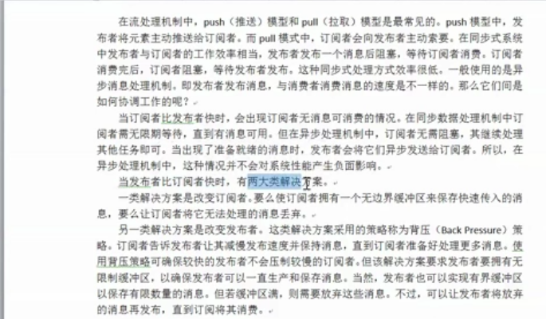
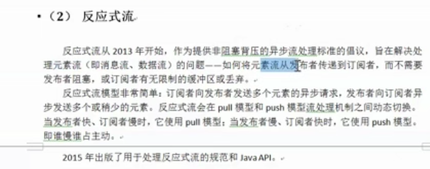
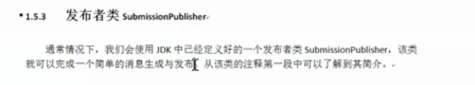
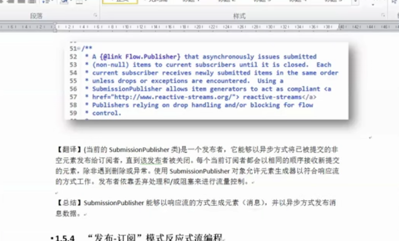
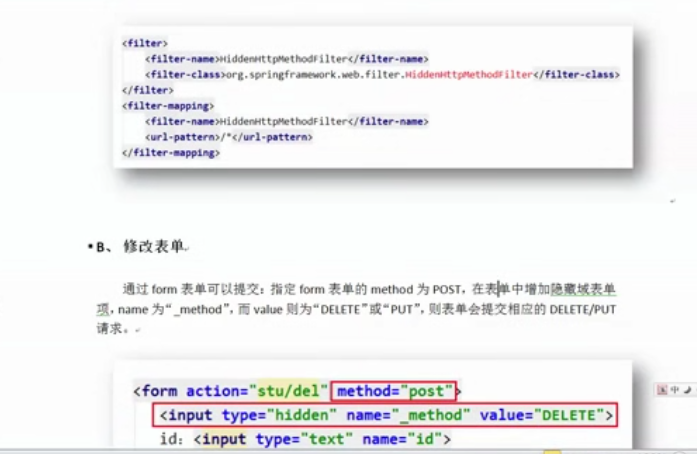

#### WebFlux 基础

webflux 不能操作关系型数据库

要求 Spring Boot2.0 以上，和 JDK9 以上

创建 webflux 项目 时 ，选 ReactiveWeb，其他和 Spring Boot 一致 


Mono 可以表示 0 或 1个元素的异步序列

Flux可以表示 0 或 n 个元素的异步序列

 TimeUnit.SECOND.seleep(), TimeUnit


```java
package com.kaikeba.controller;

import lombok.extern.slf4j.Slf4j;
import org.springframework.web.bind.annotation.RequestMapping;
import org.springframework.web.bind.annotation.RequestParam;
import org.springframework.web.bind.annotation.RestController;
import reactor.core.publisher.Flux;
import reactor.core.publisher.Mono;

import java.util.List;
import java.util.concurrent.TimeUnit;

@RestController
@Slf4j
public class SomeController {

    @RequestMapping("/some")
    public String someHandle() {
        return "hello";
    }

    @RequestMapping("/mono")
    public Mono<String> monoHandle() {

        log.info("start");
        Mono.fromSupplier(() -> someStr("Hello WbFlux"));
        log.info("end");

        return Mono.just("hello WebFlux");
    }

    @RequestMapping("/flux")
    public Flux<String> fluxHandle(@RequestParam String[] cities) {
        // return Flux.just("beijing", "shanghai", "guangzhou");
        return Flux.fromArray(cities);
    }

    @RequestMapping("/list")
    public Flux<String> listHandle(@RequestParam List<String> cities) {
        return Flux.fromStream(cities.stream());
    }

    // 返回 sse 格式
    @RequestMapping(value = "/sse", produces = "text/event-stream")
    public Flux<String> sseHandle(@RequestParam List<String> cities) {
        return Flux.just("beijing", "shanghai", "guangzhou");
    }

    private String someStr(String str) {
        try {
            TimeUnit.SECONDS.sleep(5);
        } catch (InterruptedException e) {
            e.printStackTrace();
        }
        return str;
    }
}
```


@sl4j  日志在学习一下


可以增加并发量（服务器的吞吐量）：因为 servlet 是单例的，且单个 Servlet 生成线程的数量是一定的或 web 容器线程池产生的线程数量是有上限的，如果使用同步的线程的方式，当阻塞的线程达到线程池的上限就意味着别的请求将进不来（没用可用的线程）；如果使用异步模式，把耗时比较长的进行异步操作（另外的线程），servlet 线程执行完就归还给线程池，其他的由异步线程完成，这样就增加了服务器的吞吐量。

Servlet 实现异步

```java
@WebServlet(value = "/asyncServlet", asyncSupported = true)
public class AsyncServlet extends HttpServlet {
    protected void doGet(javax.servlet.http.HttpServletRequest request, javax.servlet.http.HttpServletResponse response) throws javax.servlet.ServletException, IOException {
        long start = System.currentTimeMillis();

        // 获取异步上下文，开启异步操作（完成异步线程间的通讯）
        AsyncContext asyncContext = request.startAsync();
        
        // 获取 NIO 的异步请求与响应
        ServletRequest servletRequest = asyncContext.getRequest();
        ServletResponse servletResponse = asyncContext.getResponse();
        
        // 异步执行代码
		CompletableFuture.runAsync(() -> doSome(servletResponse, asyncContext));

        long end = System.currentTimeMillis();

        System.out.print("耗时：" + (end - start));
    }

    private void doSome(ServletResponse servletResponse, AsyncContext asyncContext) {
        try {
            TimeUnit.SECONDS.sleep(5);
            servletResponse.getWriter().write("done");
        } catch (Exception e) {
            e.printStackTrace();
        }

        // 耗时操作完成
        asyncContext.complete();
    }
}
```

输出：

```
耗时：1
```

可见 servlet 线程很快就执行完了，然后归还线程池，其他的由异步操作线程完成


H5 标准中新增 SSE,可以方便的得到实时消息推送（火狐浏览器不支持）

SSE 和 WebScoket的区别 

SSE：只能是服务端向客户端发送消息

WebSocket：相互通信


SSE(Server Send Event)  可以进行一个请求多次响应


text/event-stream, 事件流仅仅支持 utf-8

SSE 技术规范：

1. 文本规范，数据使用空行分割， 每个属性都要换行


​	data：表示数据

​	event：表示浏览器响应的事件名称

​	id：标识符（浏览器会记录，当浏览器断开之后续联会使用它）

​	retry：浏览器断开之后的重连时间


2. 浏览器 js 使用 EvenSource 对象进行处理，包括三个事件
   1. open：连接成功 onopen
   2. message：收到消息 onmessage   addEventListener()
   3. error：发生错误 onerror


Reactive Stream概述

Reactor 是完全基于反应式流规范的、全新的反应式编程库，更是 Spring5 反应式编程的基础


 lambda 惰性求值


推拉模型与背压

1. 推来模型

2. 拉：迭代模型 next 

   推：发布订阅模式




2. 反应式流




3.  反应式流接口

Flow.class 四个接口

1. 消费和发布时异步的

2. 背压

> 订阅令牌相当于管道


Reactive Stream 是 WebFlux 的底层








- 发布订阅反应式流编程
- 发布、处理、订阅反应式流编程

#### WebFlux 开发

- 使用传统的处理器

  创建的时候 添加 Reactive Web 和 reactive MongoDB 依赖

  添加主类注解和实体类注解。。
  
   
  
  附：表单模拟提交
  
  


附：Dispater Servlet 建议使用.do 或 .action 后缀 ,拦截  / .do 或  /.action,静态资源无需处理

如果使用 restful 结构因为没有使用 .do 和.action 作为后缀名，所以全部 /,静态资源需特殊处理


​		基本结构

​	   CRUD 的搭建


Spring  Data JPA


mongodb 几个命令：

```
mongo
show dbs;
use test;
db;
show tables;
t_student;
db.t_student.find();
db.t_student.find({age:{$gte:21, $lt:25}}); # 大于等于 21 小于 25
```


-  参数校验

  使用 Hibernate validator

  1. 在实体类字段加注解
  2. 添加校验切面（不然提示不友好）
  3. 在 Controller 处理器函数的参数实体前加 @valid 注解

  

  自定义校验逻辑

  1. 定义异常类
  2. 添加校验方法，校验报错排除异常
  3. 添加指定类型异常的切面方法
  4. 在 Controller 处理器方法中进行校验

  

- 使用 Router Functions 开发

   泛型方法
  
  1. 基本结构搭建
  
  2. CRUD 的实现
  
  3. 参数校验
  
     参数校验，因为只有一个 ServerRequest 参数，所以不能使用 Hibernate Validator，可以使用自定义参数校验
  
     


