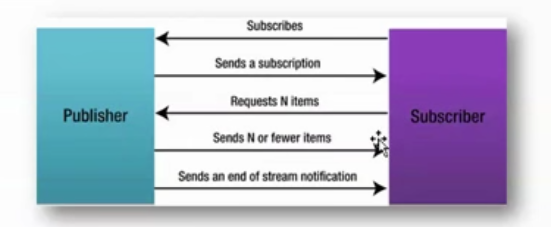

## WebFlux

### 概述

默认 servlet 由 servlet container 进行生命周期管理

1. container 启动时构造 servlet 对象并调用 servlet 的 init 方法，进行初始化

2. container 运行时接受请求，并为每个请求分配一个线程（一般从线程池中获取空闲线程）然后调用

3. container 关闭时调用 servlet 的 destory 销毁 servlet

在第二步中，每来一个请求就会分配一个线程，且等线程执行完（没执行文之前会一直等待）之后再归还线程池，在高并发的情况下会出现线程不够用的情况，spring mvc 模型的核心 DsipatcherServlet ，也是一个 Servlet ，也会出现相同的问题。

Webflux 模式**替换了旧的 Servlet 线程模型**。用少量的线程处理 request 和 response io 操作，这些线程称为Loop 线程，而业务交给响应式编程框架处理，响应式编程是非常灵活的，用户可以将业务中阻塞的操作提交到响应式框架的 work 线程中执行，而不阻塞的操作依然可以在 Loop 线程中进行处理，大大提高了 Loop 线程的利用率，解决高并发问题。

官方结构图：


可以看出 WebFlux 模型是一套和 Spring MVC 模型没有关系的 web 框架

目前 WebFlux 只能处理非关系型数据库数据

要求 Spring Boot2.0 以上和 JDK9 以上

### SSE

H5 标准中新增 SSE，可以方便的得到实时消息推送（火狐浏览器不支持）

SSE 和 WebScoket的区别 

SSE：只能是服务端向客户端发送消息

WebSocket：相互通信

SSE(Server Send Event)  可以进行一个请求多次响应

text/event-stream, 事件流仅仅支持 utf-8

SSE 技术规范：

1. 文本规范，数据使用空行分割， 每个属性都要换行

​	data：表示数据

​	event：表示浏览器响应的事件名称

​	id：标识符（浏览器会记录，当浏览器断开之后续联会使用它）

​	retry：浏览器断开之后的重连时间

2. 浏览器 js 使用 EvenSource 对象进行处理，包括三个事件
   1. open：连接成功 onopen
   2. message：收到消息 onmessage   addEventListener()
   3. error：发生错误 onerror

### Reactive Stream（反应式流）

Reactor 是完全基于反应式流规范的、全新的反应式编程库，更是 Spring5 反应式编程的基础

推拉模型与背压

1. 推拉模型

   传统的的代码执行执行拉模式，会进行阻塞，而观察者模式或 JMS 使用的就是推模式（发布/订阅）

2. 背压

   传统的发布订阅模式，不能控制发布者的发布速度，但是 Reactive Stream 中发布者会在缓冲区满后进行阻塞，直到缓冲区有足够的空间再继续发送，这就是背压模式，会在订阅者慢、发布者快的时候采用  pull 模式，在订阅者快、发布者慢的时候使用 push 模式，即谁慢谁占主动。

3. 关于 Reactive Stream

   Reactive Stream 是一种编程规范，而 Reactor 是 JDK 的一种实现，Spring 5 的 WebFlux 是基于 Reactor  的

   ReactorStream 为什么快：是因为异步的处理方式（发布订/阅），比如：有 10 个方法，他们之间是相互依赖的，后面方法依赖前面的方法执行结果，传统的方式就是后面执行的方法必须等待前面的方法执行完（阻塞），而 Reactive Stream 是在前面执行一部分之后就进行后面的操作，不同的方法间可以同时进行，就好像一条异步处理流一样。

4. Reactor

   流程

   

   结构图

   

   主要的类： Flow.class

   

   实现

   发布、订阅反应式流编程

   ```java
   public class FlowDemo {
   
       public static void main(String[] args) throws InterruptedException {
           // 1. 定义发布者, 发布的数据类型是 Integer
           SubmissionPublisher<String> publiser = new SubmissionPublisher<String>();
   
           // 2. 定义最终订阅者, 消费 String 类型数据
           Flow.Subscriber<String> subscriber = new Flow.Subscriber<>() {
               private Flow.Subscription subscription;
   
               @Override
               public void onSubscribe(Flow.Subscription subscription) {
                   // 保存订阅关系, 需要用它来给发布者响应
                   this.subscription = subscription;
   
                   // 请求一个数据
                   this.subscription.request(1);
               }
   
               @Override
               public void onNext(String item) {
                   // 接受到一个数据, 处理
                   System.out.println("接受到数据: " + item);
   
                   // 处理完调用 request 再请求一个数据，设置每次请求数据的个数
                   this.subscription.request(1);
   
                   // 或者 已经达到了目标, 调用cancel告诉发布者不再接受数据了
                   // this.subscription.cancel();
               }
   
               @Override
               public void onError(Throwable throwable) {
                   // 出现了异常(例如处理数据的时候产生了异常)
                   throwable.printStackTrace();
   
                   // 我们可以告诉发布者, 后面不接受数据了
                   this.subscription.cancel();
               }
   
               @Override
               public void onComplete() {
                   // 全部数据处理完了(发布者关闭了)
                   System.out.println("处理完了!");
               }
           };
   
           // 3. 处理器 和 最终订阅者建立订阅关系
           publiser.subscribe(subscriber);
   
           // 4. 生产数据, 并发布
           publiser.submit("-111");
           publiser.submit("111");
   
           // 5. 结束后 关闭发布者
           publiser.close();
   
           // 6. 主线程延迟停止, 否则数据没有消费就退出
           TimeUnit.SECONDS.sleep(20);
       }
   }
   ```

   发布、处理、订阅反应式流编程

   ```java
   /**
    * Processor  的第一个参数表示接受的参数类型，第二个参数表示发送的参数类型
    */
   public class MyPublisher extends SubmissionPublisher<String> implements Flow.Processor<Integer, String> {
   
       private Flow.Subscription subscription;
   
       @Override
       public void onSubscribe(Flow.Subscription subscription) {
           // 保存发布者传递过来的 subscription 对象
           this.subscription = subscription;
   
           // 向发布者请求一条数据
           this.subscription.request(1);
       }
   
       @Override
       public void onNext(Integer item) {
           // 接收到一个数据处理
           String item_str = item + "";
           System.out.println(Thread.currentThread().getName());
   
           this.submit(item_str);
   
           // 再请求一个数据
           this.subscription.request(1);
       }
   
       @Override
       public void onError(Throwable throwable) {
           throwable.printStackTrace();
           this.subscription.cancel();
       }
   
       @Override
       public void onComplete() {
           this.close();
       }
   }
   
   
   public class FlowDemo {
   
       public static void main(String[] args) throws InterruptedException {
           // 1. 定义发布者, 发布的数据类型是 Integer
           // 直接使用jdk自带的SubmissionPublisher
   
           SubmissionPublisher<Integer> publiser = new SubmissionPublisher<Integer>();
   
           Flow.Processor processor =  new MyPublisher();
   
           publiser.subscribe(processor);
   
           // 2. 定义最终订阅者, 消费 String 类型数据
           Flow.Subscriber<String> subscriber = new Flow.Subscriber<>() {
               private Flow.Subscription subscription;
   
               @Override
               public void onSubscribe(Flow.Subscription subscription) {
                   // 保存订阅关系, 需要用它来给发布者响应
                   this.subscription = subscription;
   
                   // 请求一个数据
                   this.subscription.request(1);
               }
   
               @Override
               public void onNext(String item) {
                   System.out.println(Thread.currentThread().getName());
                   // 接受到一个数据, 处理
                   System.out.println("接受到数据: " + item);
   
                   // 处理完调用 request 再请求一个数据，设置每次请求数据的个数
                   this.subscription.request(1);
   
                   // 或者 已经达到了目标, 调用cancel告诉发布者不再接受数据了
                   // this.subscription.cancel();
               }
   
               @Override
               public void onError(Throwable throwable) {
                   // 出现了异常(例如处理数据的时候产生了异常)
                   throwable.printStackTrace();
   
                   // 我们可以告诉发布者, 后面不接受数据了
                   this.subscription.cancel();
               }
   
               @Override
               public void onComplete() {
                   // 全部数据处理完了(发布者关闭了)
                   System.out.println("处理完了!");
               }
           };
   
           // 3. 处理器 和 最终订阅者建立订阅关系
           processor.subscribe(subscriber);
   
           // 4. 生产数据, 并发布
           publiser.submit(-111);
           publiser.submit(111);
           publiser.close();
           TimeUnit.SECONDS.sleep(20);
       }
   }
   ```

### WebFlux 

注意：WebFlux  其实并没有增加响应的速度，和传统的 Servert 响应方式相比，用户体验没有任何区别，只是 WebFlux 能提高并发访问量，因为使用异步的方式，用户提交请求之后到后台会新建一个线层处理请求，而 request 线层放回线层池，当请求处理完成之后使用回调通知用户，这种方式和 Servlet3.0 的异步请求方式差不多其实。。。。

创建 webflux 项目时，选 ReactiveWeb 依赖

Mono 可以表示 0 或 1个元素的异步序列

Flux可以表示 0 或 n 个元素的异步序列

#### 结合传统的开发方式，示例：

在入口类上添加

```java
@EnableReactiveMongoRepositories // 开启 MongoDB 的 spring-data-jpa
```

设置主配置文件

```properties
spring.data.mongodb.uri=mongodb://localhost:27017/test
```

使用 Hibernate 验证方式，实体类

```java
@Data
// 指定 mongoDB 中的表，没有会自动创建
// collection 默认表名为实体类名称
@Document(collection = "t_student")
public class Student {

    @Id // 会在 mongodb 生成表的时候设置 id 为主键
    private String id; // MongoDB 中的主键一般为 String 类型

    // Hibernate 参数校验
    @NotBlank(message = "姓名不能为空")
    private String name;

    // Hibernate 参数校验
    @Range(min = 10, max = 50, message = "年龄必须在 {min} - {max}")
    private int age;
}
```

controller， @Valid 会进行参数校验，也显示的执行了异常抛出

```java
@RestController
@RequestMapping("/student")
public class StudentController {

    @Autowired
    private StudentRepository repository;

    // 一次性返回数据
    @GetMapping("/all")
    public Flux<Student> getAll() {
        return repository.findAll();
    }

    // 以 sse 形式实时性返回数据
    @GetMapping(value = "/sse/all", produces = MediaType.TEXT_EVENT_STREAM_VALUE)
    public Flux<Student> getSseAll() {
        return repository.findAll();
    }

    // 添加数据
    @PostMapping("/save")
    public Mono<Student> saveStudent(@Valid Student student) {
        // save 即可以更新也可以插入，有 ID 更新；没ID 插入
        NameValidationUtil.verifyName(student.getName());
        return repository.save(student);
    }

    //  json 格式添加数据
    // save 即可以更新也可以插入，ID 不为 NULL 更新；否则插入
    @PostMapping("/save/json")
    public Mono<Student> saveStudentJson(@Valid @RequestBody Student student) {
        NameValidationUtil.verifyName(student.getName());
        return repository.save(student);
    }

    // 无状态删除, 删除对象存不存在响应码都是 200
    @DeleteMapping("/delcommon/{id}")
    public Mono<Void> deleteStudent(@PathVariable("id") String id) {
        return repository.deleteById(id);
    }

    // 有状态删除, 删除对象存在响应码都是 200，否则 404
    // ResponseEntity 可以封装响应体中的数据及响应码
    // Mono 的 map 与 flatMap 的方法均可用于做元素映射，
    // 选择的标准是：一般情况下映射过程中需要再执行一些操作的过程需要 flatMap（异步，不阻塞）；
    // 若仅仅是元素的映射，而无需执行一些操作，则选择 map(同步)
    // 若一个方法没有返回值，但又需要返回值，则可为其添加 then() 方法，
    // 该方法的返回值将作为这个方法的返回值
    // defaultIfEmpty 执行的条件时若其中没有元素，则执行
    @DeleteMapping("/del/{id}")
    public Mono<ResponseEntity<Void>> deleteStatusStudent(@PathVariable("id") String id) {
        return repository.findById(id)
                .flatMap(stu -> repository.delete(stu)
                        .then(Mono.just(new ResponseEntity<Void>(HttpStatus.OK))))
                .defaultIfEmpty(new ResponseEntity<Void>(HttpStatus.NOT_FOUND));
    }

    // 修改操作，修改成功返回修改数据和状态码 200，指定 ID 不存在，返回 404
    @PutMapping("/update/{id}")
    public Mono<ResponseEntity<Student>> updateStudent(@PathVariable("id") String id,
                                                       @Valid @RequestBody Student student) {
        NameValidationUtil.verifyName(student.getName());
        return repository.findById(id)
                .flatMap(stu -> {
                    stu.setName(student.getName());
                    stu.setAge(student.getAge());
                    return repository.save(stu);
                }).map(stu -> new ResponseEntity<Student>(stu, HttpStatus.OK))
                .defaultIfEmpty(new ResponseEntity<Student>(HttpStatus.NOT_FOUND));
    }

    // 根据 ID 查询操作，查询到了返回数据和200，没找到返回 404
    @GetMapping("/find/{id}")
    public Mono<ResponseEntity<Student>> findById(@PathVariable("id") String id) {
        return repository.findById(id)
                .map(stu -> new ResponseEntity<Student>(stu, HttpStatus.OK))
                .defaultIfEmpty(new ResponseEntity<Student>(HttpStatus.NOT_FOUND));
    }

    // MongoDB JPA 根据年龄的上下限进行查询 --- 一次性返回
    @GetMapping("/age/{below}/{top}")
    public Flux<Student> findStudentByAge(@PathVariable("below") int below,
                                          @PathVariable("top") int top) {
        return repository.findByAgeBetween(below, top);
    }

    // 根据年龄的上下限进行查询 --- sse
    @GetMapping(value = "/sse/age/{below}/{top}", produces = MediaType.TEXT_EVENT_STREAM_VALUE)
    public Flux<Student> findSseStudentByAge(@PathVariable("below") int below,
                                             @PathVariable("top") int top) {
        return repository.findByAgeBetween(below, top);
    }

    // 使用 MongoDB 原始查询
    @GetMapping(value = "/query/age/{below}/{top}")
    public Flux<Student> queryStudentByAge(@PathVariable("below") int below,
                                           @PathVariable("top") int top) {
        return repository.queryByAge(below, top);
    }

    @GetMapping(value = "/sse/query/age/{below}/{top}", produces = MediaType.TEXT_EVENT_STREAM_VALUE)
    public Flux<Student> querySseStudentByAge(@PathVariable("below") int below,
                                              @PathVariable("top") int top) {
        return repository.queryByAge(below, top);
    }
}
```

姓名验证工具类

```java
public class NameValidationUtil {

    private static String[] INVALID_NAME = {"admin", "administrator"};


    public static void verifyName(String name){
        Stream.of(INVALID_NAME)
                .filter(invalidName->invalidName.equalsIgnoreCase(name))
                .findAny()
                .ifPresent(invalidName->{
                    throw new StudentException("无效的姓名", "name", name);
                });

    }
}
```

异常类

```java
**
 * 姓名验证异常类
 */
@Setter
@Getter
@NoArgsConstructor
public class StudentException extends RuntimeException {

    private String errField;
    private String errValue;

    public StudentException(String message, String errField, String errValue) {
        super(message);
        this.errField = errField;
        this.errValue = errValue;
    }
}
```

使用接收抛出的异常 @ControllerAdvice

- 结合方法型注解 @ExceptionHandler，用于捕获 Controller 中抛出的指定类型的异常，从而达到不同类型的异常区别处理的目的
- 结合方法型注解 @InitBinder， 用于 request 中自定义参数解析方式进行注册，从而达到自定义指定格式参数的目的
- 结合方法型注解 @ModelAttribute，表示其标注的方法将会在目标Controller方法执行之前执行

```java
// 验证失败则返回失败信息及 400 状态码
// 表示当前类为通知（切面），其连接点为处理器方法
@ControllerAdvice
public class ParameterValidateAdvice {

    @ExceptionHandler
    public ResponseEntity<String> validateHandle(StudentException ex) {
        String msg = ex.getMessage() + "【" + ex.getErrField() + ":" + ex.getErrValue() + "】";
        return new ResponseEntity<>(msg, HttpStatus.BAD_REQUEST);
    }

    @ExceptionHandler
    public ResponseEntity<String> validateHandle(WebExchangeBindException ex) {
        return new ResponseEntity<>(exToStr(ex), HttpStatus.BAD_REQUEST);
    }

    // 将所有的异常信息转换为一个 String
    private String exToStr(WebExchangeBindException ex) {
        return ex.getFieldErrors()
                .stream()
                .map(error -> error.getField() + ":" + error.getDefaultMessage())
                .reduce("", (s1, s2) -> s1 + "\n" + s2);
    }
}
```

#### 使用 WebFlux 方式，示例：

在主类上加上注解

```java
@EnableReactiveMongoRepositories // 开启 MongoDB 的 spring-data-jpa
```

设置主配置文件

```properties
spring.data.mongodb.uri=mongodb://localhost:27017/test
```

bean 实体类

```java
@Data
// 指定 mongoDB 中的表，没有会自动创建
// collection 默认表名为实体类名称
@Document(collection = "t_student")
public class Student {

    @Id // 会在 mongodb 生成表的时候设置 id 为主键
    private String id; // MongoDB 中的主键一般为 String 类型

    private String name;
    private int age;
}
```

handler

```java
@Component
public class StudentHandler {

    @Autowired
    private StudentRepository repository;

    // 定义处理器
    public Mono<ServerResponse> findAllHandle(ServerRequest request) {
        return ServerResponse
                // 指定响应码（返回 BodyBuilder 的方法称为响应体设置中间方法）
                .ok()
                // 指定响应体内容类型
                .contentType(MediaType.APPLICATION_JSON_UTF8)
                // 响应体设置终止方法，构建响应体
                // 终止方法放到最后，前面的顺序无所谓
                .body(repository.findAll(), Student.class);
    }

    // 添加
    public Mono<ServerResponse> saveHandle(ServerRequest request) {
        // 从请求中获取要添加的数据，并将其封装为指定类型的对象， 存放到 Mono 流中
        Mono<Student> studentMono = request.bodyToMono(Student.class);
        return ServerResponse
                .ok()
                .contentType(MediaType.APPLICATION_JSON_UTF8)
                .body(repository.saveAll(studentMono), Student.class);
    }

    // 添加(包括自定义验证)
    public Mono<ServerResponse> saveHandleValide(ServerRequest request) {
        // 从请求中获取要添加的数据，并将其封装为指定类型的对象， 存放到 Mono 流中
        Mono<Student> studentMono = request.bodyToMono(Student.class);

        return studentMono
                .flatMap(stu->{
                    NameValidationUtil.verifyName(stu.getName());
                    return ServerResponse
                            .ok()
                            .contentType(MediaType.APPLICATION_JSON_UTF8)
                            .body(repository.save(stu), Student.class);
                });
    }

    // 删除，删除成功返回 200 ,没有返回 404
    public Mono<ServerResponse> delHandle(ServerRequest request) {
        // 从请求路径中获取 ID
        String id = request.pathVariable("id");
        return repository
                .findById(id)
                .flatMap(stu -> repository.delete(stu)
                        .then(ServerResponse.ok().build()))
                // 注意：switchIfEmpty 和 defaultIfEmpty 的区别是参数类型不一样
                .switchIfEmpty(ServerResponse.notFound().build());
    }

    // 修改，删除成功返回 200 ,没有返回 404
    public Mono<ServerResponse> updateHandle(ServerRequest request) {
        // 从请求路径中获取 ID 和 对象
        String id = request.pathVariable("id");
        Mono<Student> studentMono = request.bodyToMono(Student.class);

        return studentMono
                .flatMap(stu -> {
                    stu.setId(id);
                    return ServerResponse
                            .ok()
                            .contentType(MediaType.APPLICATION_JSON_UTF8)
                            .body(repository.save(stu), Student.class);
                });
    }
}
```

定义路由

```java
@Configuration
public class StudentRouter {

    @Bean
    public RouterFunction<ServerResponse> customRouter(StudentHandler handler){
        return RouterFunctions
                .nest(RequestPredicates.path("/student"), RouterFunctions.route(RequestPredicates.GET("/all"), handler::findAllHandle)
                          .andRoute(RequestPredicates.POST("/save").and(RequestPredicates.accept(MediaType.APPLICATION_JSON_UTF8)), handler::saveHandle)
             .andRoute(RequestPredicates.DELETE("/del/{id}"), handler::delHandle)
             .andRoute(RequestPredicates.PUT("/update/{id}"), handler::updateHandle));

    }
}
```

查询类

```java
// 泛型第一个参数是表示对象类型
// 泛型第二个参数是表示主键类型
public interface StudentRepository extends ReactiveMongoRepository<Student, String> {
    /**
     * 使用 Spring DATA JPA根据年龄上下限查询
     * @param below 年龄下限（不包含此边界点）
     * @param top   年龄上限（不包含此边界点）
     * @return
     */
    // 这个名称不能随便取
    Flux<Student> findByAgeBetween(int below, int top);

    /**
     * 使用 mongoDB 原始查询(一般复杂的查询使用)根据年龄上下限查询
     * @param below 年龄下限（不包含此边界点）
     * @param top   年龄上限（不包含此边界点）
     * @return
     */
    // ?0 代表第一个参数
    // ?1 代表第二个参数
    @Query("{'age':{'$gte': ?0, '$lt': ?1}}")
    Flux<Student> queryByAge(int below, int top);
}
```

姓名验证工具（在 handler 中进行验证，需要显示调用）

```java
public class NameValidationUtil {

    private static String[] INVALID_NAMES = {"admin", "administrator"};


    public static void verifyName(String name){
        Stream.of(INVALID_NAMES)
                .filter(invalidName->invalidName.equalsIgnoreCase(name))
                .findAny()
                .ifPresent(invalidName->{
                    throw new StudentException("无效的姓名", "name", name);
                });
    }
}
```

自定义异常类

```java
/**
 * 姓名验证异常类
 */
@Setter
@Getter
@NoArgsConstructor
public class StudentException extends RuntimeException {

    private String errField;
    private String errValue;

    public StudentException(String message, String errField, String errValue) {
        super(message);
        this.errField = errField;
        this.errValue = errValue;
    }
}
```

自定义异常处理器

```java
/**
 * 自定义异常处理器，当异常发生时返回 400 ，并返回异常信息
 */
@Component
// 默认系统处理器的优先级高于自定义异常处理器，
// 通过 @Order 指定优先级级别，数值越小优先级越高
@Order(-99)
public class CustomExceptionHandler implements WebExceptionHandler {

    // exchange ：可以获取异常的请求和响应内容
    // ex ：可以获取异常信息
    @Override
    public Mono<Void> handle(ServerWebExchange exchange, Throwable ex) {
        // 获取 http 响应对象
        ServerHttpResponse response = exchange.getResponse();

        // 设置响应码
        response.setStatusCode(HttpStatus.BAD_REQUEST);

        // 响应类型（普通文本）
        response.getHeaders().setContentType(MediaType.TEXT_PLAIN);

        // 获取异常信息
        String message = this.formatExceptionMessage(ex);

        // 获取数据缓存对象
        DataBuffer buffer = response.bufferFactory().wrap(message.getBytes());

        return response.writeWith(Mono.just(buffer));
    }

    private String formatExceptionMessage(Throwable ex) {
        String msg = "发生异常：" + ex.getMessage();
        if (ex instanceof StudentException) {
            StudentException e = (StudentException) ex;
            msg += "【" + e.getErrField() + "：" + e.getErrValue();
        }
        return msg;
    }
}
```


