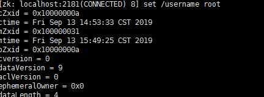

## ZooKeeper

### 简介

在大型分布式集群系统中，Zookeeper 是一个非常重要的分布式协调服务组件；其应用场景非常广泛，如做服务的注册中心、实现分布式锁、统一修改配置文件等等

### ZAB 协议

> 全称  Zookeeper Atomic Broadcast（Zookeeper 原子广播协议）

**广播流程分为三步：**

1. 所有的写请求会转发给 leader , leader将请求封装成事务，并给事务分配一个全局唯一的事务 ID （ZXID），将数据复制到所有的 follwer 中
2. leader 等待 follwer 的应答，应答超过一半表示成功
3. 执行 commit ，同时自己也进行 commit

**崩溃恢复：**

leader 崩溃，会进行重新选举，选举的标准是 ZXID（leader 还没提交过的 ZXID 无效），所以只要把 **proposal** 提交给 follwer 数据就不会丢失（选举），如果：leader 还没有把数据分配给任何一个服务器就挂了，数据会丢失

**数据同步：**

新的 leader 先将自身有而 follower 没有的 proposal 发送给 follower，再将这些 proposal 的 COMMIT 命令发送给 follower，以保证所有的 follower 都保存了所有的 proposal、所有的 follower 都处理了所有的消息。通过以上策略，能保证已经被处理的消息不会丢
参考：<https://blog.csdn.net/u013679744/article/details/79240249>

### Leader 选举过程

<https://blog.csdn.net/wyqwilliam/article/details/83537139>

**节点（ZNode）类型**

持久型节点：PERSISTENT，会话失效后依然保存

临时型节点：EPHEMERAL，会话失效后删除

**目录类型**

持久型节点：PERSISTENT，会话失效后依然保存

临时型节点：EPHEMERAL，会话失效后删除

持久顺序型节点：PERSISTENT_SEQUENTIAL，会话失效后依然保存，且节点名称后会加上序号（递增）

临时顺序型节点：EPHEMERAL_SEQUENTIAL，会话失效后删除，且节点名称后会加上序号（递增，主要用于分布式锁的实现）

**节点状态**

Looking 状态：该状态下表示节点可以进行选举，或正在选举

Following 状态：由 looking 状态转换而来

Leading 状态：由 looking状态转换而来

Observer 状态：该状态下的节点只进行读数据

**事务 ID (zxid)**

ZXID 是一个长度 64 位的数字，其中低 32 位是按照数字递增，即每次客户端发起一个 proposal，低 32 位的数字简单加1，高32位是leader周期的epoch编号，zxid 都是 leader 记性分配的

**三种角色**

1. Leader： 接受所有Follower的提案请求并统一协调发起提案的投票，负责与所有的Follower进行内部的数据交换(同步)
2.  Follower： 直接为客户端服务并参与提案的投票，同时与Leader进行数据交换(同步)
3.  Observer： 直接为客户端服务但并不参与提案的投票，同时也与Leader进行数据交换(同步);observer的作用是为了拓展系统，提高读取速度

**初始化选举过程**

> 这时 Epoch 和 zxId 都是一样的 0，所以只需比较 serverId 就可以了

目前有5台服务器，每台服务器均没有数据，它们的编号分别是 1,2,3,4,5 按编号依次启动，它们的选择举过程如下：

- 服务器 1 启动，给自己投票，然后发投票信息，由于其它机器还没有启动所以它收不到反馈信息，服务器1的状态一直属于Looking(选举状态)
- 服务器 2 启动，给自己投票，同时与之前启动的服务器 1 交换结果，由于服务器 2 的编号大所以服务器 2 胜出，但此时投票数没有大于半数，所以两个服务器的状态依然是 LOOKING
- 服务器 3 启动，给自己投票，同时与之前启动的服务器 1,2 交换信息，由于服务器 3 的编号最大所以服务器3胜出，此时投票数正好大于半数，所以服务器3成为领导者，服务器 1,2 成为小弟
- 服务器4启动，给自己投票，同时与之前启动的服务器1,2,3交换信息，尽管服务器4的编号大，但之前服务器3已经胜出，所以服务器4只能成为小弟
- 服务器5启动，后面的逻辑同服务器 4 成为小弟

当 leader 宕机的之后，集群的服务器之间又会再次选举，选举流程差不多，只是这时候会同时考虑 Epoch（逻辑时钟, 每进行一次投票会加1），zxid（事务ID）和 serverId 的大小关系，优先级 Epoch>zxid> serverId ，值越大优先级越高

**客户端数据读取（用户）**

leader 和 follower 的数据都可以读取

**客户端数据更新（用户）**

zookeeper 集群中数据的更新，是通过 leader 节点保证数据一致性的。当 server1 更新了一个数据后，先是通过与 leader 节点通讯，然后将数据告诉 leader 节点，最后 leader 节点将新的数据下发给其他 follower 节点

### 单机搭建

解压之后，修改 conf/zoo_sample.cfg 为 conf/zoo.cfg

服务启动：./zooServer.sh start

启动客户端：

```bash
./zooCli.sh
create /username tony
set  /username root
get  /username
delete /username
ls /
stat /username true # 设置监视器
```

### 集群搭建

> 在 Zookeeper 集群中，节点数一般都是至少 3 个节点以上的奇数个，因为在选举的时候 **可用节点数量 > 总节点数量/2**（触发选举可能是**脑裂**或集群服务器宕机），并且可以**节省服务器资源**（服务可用的宕机数量）
>
> 参考：https://blog.csdn.net/u010476994/article/details/79806041

安装过程比较简单，在网上比较多的安装教程，每台服务器安装只用一个地方不一样，所以最好一台服务器安装完成之后进行复制，然后修改 data 目录下的 myid

zoo.cfg 文件参数说明：

>**tickTime：**Zookeeper 服务器之间或客户端与服务器之间维持心跳的时间间隔
>**initLimit：**集群中的follower服务器(F)与leader服务器(L)之间的初始连接心跳数（最大次数）
>**syncLimit**： 集群中的follower服务器与leader服务器之间请求和应答之间能容忍的最多心跳数（最大次数）
>**dataDir**：顾名思义就是 Zookeeper 保存数据的目录，默认情况下，Zookeeper 将写数据的日志文件也保存在这个目录里
>**clientPort**：这个端口就是客户端连接 Zookeeper 服务器的端口，Zookeeper 会监听这个端口，接受客户端的访问请求。
>**server.A=B：C：D**：其中 A 是一个数字，表示这个是第几号服务器；B 是这个服务器的 ip 地址；C 表示的是这个服务器与集群中的 Leader 服务器交换信息的端口；D 表示的是万一集群中的 Leader 服务器挂了，需要一个端口来重新进行选举，选出一个新的 Leader，而这个端口就是用来执行选举时服务器相互通信的端口。如果是伪集群的配置方式，由于 B 都是一样，所以不同的 Zookeeper 实例通信端口号不能一样，所以要给它们分配不同的端口号

### 修改配置文件

> 例如：当需要同时修改应用服务器的 mysql 数据库连接配置的时候可以使用 zookeeper 作为配置存储，当有需要修改的时候，应用服务器会自动监听到 zookeeper 的变化，自动同步自己的配置信息

添加依赖

```xml
<dependency>
    <groupId>org.apache.zookeeper</groupId>
    <artifactId>zookeeper</artifactId>
    <version>3.4.5</version>
</dependency>
```

ZkFactory

```java
public class ZkFactory {
    private static ZooKeeper zk = null;

    public synchronized static ZooKeeper getZk() throws IOException {
        if (zk == null) {
            zk = new ZooKeeper("192.168.1.112:2181", 1000, new DefaultWatcher());
        }
        return zk;
    }
}
```

Watcher

```java
public class DefaultWatcher implements Watcher {
    @Override
    public void process(WatchedEvent event) {
        //zk连接成功通知事件
        if (Watcher.Event.KeeperState.SyncConnected == event.getState()) {  		
            //zk目录节点数据变化通知事件
            if (event.getType() == Watcher.Event.EventType.NodeDataChanged) {  
                try {
                    System.out.println("配置已修改，新值为：" + new String(ZkFactory.getZk().getData(event.getPath(), true, new Stat())));
                } catch (Exception e) {
                    e.printStackTrace();
                }
            }
        }
    }
}
```

Main

```java
public class Main {

    public static void main(String[] args) throws Exception {
        // zookeeper 配置数据存放路径
        String path = "/username";

        // 启动连接，获取 path 目录节点的配置数据，并注册默认的监听器
        Stat stat = new Stat();
        byte[] data = ZkFactory.getZk().getData(path, true, stat);
        System.out.println(new String(data));

        // 主线程等待一下
        TimeUnit.SECONDS.sleep(10);
    }
}
```

在 zookeeper 任意一台服务器调用客户端修改



输出为：

```
sddsdsd
配置已修改，新值为：root
```

### 分布式锁

这篇文章对分布式锁进行了图解：https://mp.weixin.qq.com/s/u8QDlrDj3Rl1YjY4TyKMCA

分布式锁主要是对 Znode 目录进行监控（临时顺序型节点目录），当关闭会话自动删除

1. 如果创建的目录最小，获取到锁
2. 否则，监控其前一个节点的删除状态，若前一个被删除，则也获取到锁

下面的代码还需要设置释放锁最大时间

```java
public class ZKLock implements Watcher {
    private ZooKeeper zk;

    // 锁根节点
    private String root_lock = "/root_lock";

    // 资源名称，比如文件的名称的，表示对这个资源进行加锁
    private String lockName = "test";

    // 由于zookeeper监听节点状态会立即返回，所以需要使用CountDownLatch
    private CountDownLatch latch;

    public ZKLock(String url) {
        // 初始化  zk
        try {
            this.zk = new ZooKeeper(url, 1000, null);
        } catch (Exception e) {
            e.printStackTrace();
        }
    }

    public void lock() {
        try {
            // 如果父目录不存在，创建
            if (zk.exists(root_lock, false) == null) {
                zk.create(root_lock, new byte[0], ZooDefs.Ids.OPEN_ACL_UNSAFE, CreateMode.PERSISTENT);
            }

            // 创建临时顺序节点，返回值为创建的节点路径
            String currentLock = zk.create(root_lock + "/" + lockName, new byte[0], ZooDefs.Ids.OPEN_ACL_UNSAFE, CreateMode.EPHEMERAL_SEQUENTIAL);

            // 获取根节点下的所有临时顺序节点，不设置监视器
            List<String> children = zk.getChildren(root_lock, false);

            // 对根节点下的所有临时顺序节点进行从小到大排序
            children.sort(null);

            // 判断当前节点是否为最小节点，如果是则获取锁，若不是，则找到自己的前一个节点，监听其存在状态
            // 获取当前的节点在 children 列表的位置
            int curIndex = children.indexOf(currentLock.substring(currentLock.lastIndexOf("/") + 1));

            // 如果不是第一个，表示还没有获取锁，监听他前一个的删除操作
            if (curIndex != 0) {
                // 获取当前节点前一个节点的路径
                String prev = children.get(curIndex - 1);

                // 监听当前节点的前一个节点的状态，stat = null, 则节点不存在（比如第一个节点，没有上一个节点）
                Stat stat = zk.exists(root_lock + "/" + prev, this);

                // 进入等待锁状态，监听上一个节点被删除，直到执行监听器里边的 latch.countDown
                if (stat != null) {
                    latch = new CountDownLatch(1);
                    latch.await();
                    latch = null;
                }
            } else {
                System.out.println("获取到锁" + Thread.currentThread().getName());
                // 处理逻辑代码
                unlock(); // 释放锁
            }
        } catch (Exception e) {
            e.printStackTrace();
        }
    }

    // 释放锁
    public void unlock() throws InterruptedException {
        if (zk != null) {
            zk.close();
        }
    }

    // 监听
    @Override
    public void process(WatchedEvent event){
        // 获取到锁
        try {
            System.out.println("获取到锁" + Thread.currentThread().getName());
            // 处理逻辑代码
            unlock();
            latch.countDown();
        } catch (Exception e) {
            e.printStackTrace();
        }
    }

    public static void main(String[] args) throws Exception {
        for (int i = 0; i < 7; i++) {
            new Thread(new Runnable() {
                @Override
                public void run() {
                    ZKLock lock = new ZKLock("192.168.1.112:2181");
                    lock.lock();
                }
            }).start();
        }
    }
}
```

使用 Curator 就很简单了，拿一个之前文档转换的分布式锁功能

```java
@Service
public class ZooKeeperService {
    private static Logger logger = LoggerFactory.getLogger(ZooKeeperService.class);

    @Value("${zooKeeper.connectString}")
    private String zooKeeperConnectString;

    @Value("${zooKeeper.retryInterval}")
    private int zooKeeperRetryInterval;

    @Value("${zooKeeper.retryTimes}")
    private int zooKeeperRetryTimes;

    private CuratorFramework zooKeeperClient;

    /**
     * 获取 ZooKeeper 的 client
     *
     * @return 返回 ZooKeeper 的 client
     */
    public CuratorFramework getClient() {
        // 双保险懒加载连接 ZooKeeper
        if (zooKeeperClient == null) {
            synchronized(this) {
                if (zooKeeperClient == null) {
                    logger.info("连接 ZooKeeper");
                    ExponentialBackoffRetry retry = new ExponentialBackoffRetry(zooKeeperRetryInterval, zooKeeperRetryTimes);
                    zooKeeperClient = CuratorFrameworkFactory.newClient(zooKeeperConnectString, retry);
                    zooKeeperClient.start();
                }
            }
        }

        return zooKeeperClient;
    }

    /**
     * 关闭 ZooKeeper 连接
     */
    @PreDestroy
    public void destroy() {
        synchronized(this) {
            if (zooKeeperClient != null) {
                zooKeeperClient.close();
                zooKeeperClient = null;
                logger.info("断开 ZooKeeper 连接");
            }
        }
    }
}
```


```java
public void convert(File file) {
        // 0. 文件不存在就不需要进行转换了
        // 1. 获取分布式锁
        // 2. 如果预览文件存在则返回, 不需要重复转换
        // 3. 如果是 PDF 或者 MP4, 复制到预览目录, 是 MP4 则保存视频的播放时长
        // 4. 如果能转为 PDF, 执行转换
        // 5. 如果能转为 MP4, 执行转换, 并保存视频的播放时长
        // 6. 转换错误时 Redis 里保存转换进度为 -1, 并保存错误信息
        // 7. 释放分布式锁

        // [0] 文件不存在就不需要进行转换了
        if (!file.exists()) {
            logger.debug("文件不存在, 不进行转换: {}", file.getAbsolutePath());
            return;
        }

        String filename  = file.getName();
        File previewFile = filePreviewService.getPreviewFile(file);
        String lockPath  = "/ebag/lock/file_" + filename; // 转换文件的锁, 不同的文件锁不同
        InterProcessMutex lock = new InterProcessMutex(zooKeeperService.getClient(), lockPath);

        try {
            // [1] 获取分布式锁
            if (lock.acquire(10, TimeUnit.SECONDS)) {
                // [2] 如果预览文件存在则返回, 不需要重复转换
                if (filePreviewService.previewFileExists(file)) {
                    return;
                }

                // [3] 如果是 PDF 或者 MP4, 复制到预览目录, 是 MP4 则保存视频的播放时长
                if (Mime.isPdf(filename)) {
                    FileUtils.copyFile(file, previewFile);
                    return;
                } else if (Mime.isMp4(filename)) {
                    FileUtils.copyFile(file, previewFile);
                    saveVideoMeta(previewFile); // 保存视频的播放时长
                    return;
                }

                if (Mime.canConvertToPdf(filename)) {
                    // [4] 如果能转为 PDF, 执行转换
                    filePdfConvertService.convert(file, previewFile);
                } else if (Mime.canConvertToMp4(filename)) {
                    // [5] 如果能转为 MP4, 执行转换, 并保存视频的播放时长
                    fileMp4ConvertService.convert(file, previewFile);
                    saveVideoMeta(previewFile);
                }
            }
        } catch (OfficeException | IOException | RuntimeException e) {
            // [6] 转换错误时 Redis 里保存转换进度为 -1, 并保存错误信息
            String error = String.format("异常 ID: %d, 堆栈: %s", idWorker.nextId(), ExceptionUtils.getStackTrace(e));
            saveConvertError(file, error); // 错误信息
            saveConvertProgress(file, -1); // 进度为 -1 表示转换错误

            logger.warn("转换文件 {} 出错", file.getAbsolutePath());
            logger.warn(error);
        } catch (Exception e) {
            logger.warn(ExceptionUtils.getStackTrace(e));
        } finally {
            // [7] 释放分布式锁
            try {
                lock.release();
            } catch (Exception e) {
                logger.warn(ExceptionUtils.getStackTrace(e));
            }
        }
    }
```

### 服务注册中心

每台机器注册一个服务就会在 zookeeper 上创建一个目录，比如我们的 HelloService 部署到两台机器，那么 zookeeper 上就会创建两条目录：分别为  `/HelloService/1.0.0/100.19.20.01:16888` 和`/HelloService/1.0.0/100.19.20.02:16888` ，该条目存储了该服务的 IP、端口、调用方式(协议、序列化方式)等

服务端启动的时候在注册中心**创建临时目录**，且zookeeper提供了“心跳检测”功能，它会定时向各个服务提供者发送一个请求（实际上建立的是一个 socket 长连接），如果长期没有响应，服务中心就认为该服务提供者已经“挂了”，并将其剔除

消费者在第一个请求的时候会去访问 zookeeper 查看具体的服务，之后服务消费者会去监听相应路径（/HelloWorldService/1.0.0），一旦路径上的数据有任何变化（增加或减少），zookeeper 都会通知服务消费方服务提供者地址列表已经发生改变，从而进行更新，消费者根据提供相同的服务的主机，使用负载均衡去选择服务提供者

### Curator

Curator是Netflix公司开源的一个Zookeeper客户端，后捐献给Apache，Curator框架在zookeeper原生API接口上进行了包装，解决了很多ZooKeeper客户端非常底层的细节开发。