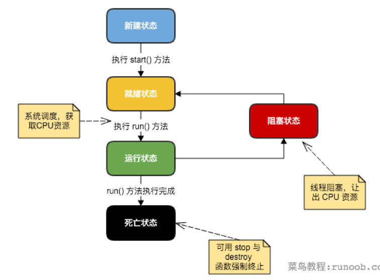
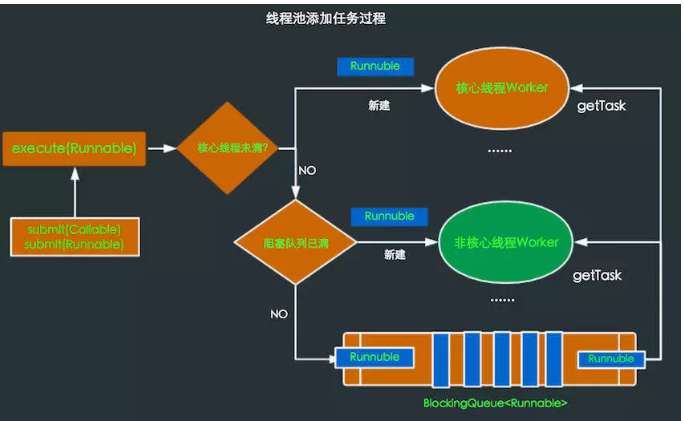

## 多线程

### 状态转换



### 创建线程的三种方式

> Runnable  和 Callable  接口中的  run 和 call 就是线程的执行体（被 jvm 调用），但是他们都必须要作为 Thread 的参数去创建线程，实现 Runnable   接口和 Callable  接口的差别是是否有返回值，如果仅仅继承 Thread，表示线程为空线程，没有执行体

- 通过实现 Runnable 接口

  1. 实现 Runnable  接口
  2. 然后创建该类的实例
  3. 使用该实例作为 Thread 的构造参数，执行 start 方法

  ```java
  public class MultiThread implements Runnable {
  
      // 线程实际执行内容，没有返回值
      public void run() {
          System.out.println(Thread.currentThread().getName());
      }
  
      public static void main(String[] args) throws Exception {
          for (int i = 0; i < 10; i++) {
              MultiThread mt = new MultiThread();
              // 创建 Thread
              Thread thread = new Thread(mt);
              thread.start();
          }
      }
  }
  ```

- 通过继承 Thread 类本身

  直接实例化，然后 start方法就可以了，也可以重写 run 方法

  ```java
  public class MultiThread extends Thread {
  
      // 重写 run 方法（非必须），如果不重写则该线程执行空操作
      public void run() {
          System.out.println(Thread.currentThread().getName());
      }
  
      public static void main(String[] args) throws Exception {
          for (int i = 0; i < 10; i++) {
              MultiThread mt = new MultiThread();
              mt.start();
          }
      }
  }
  ```

- 通过 Callable 和 FutureTask 创建线程

  1. 实现 Callable  接口
  2. 使用该类创建实例，并作为 FutureTask  的构造参数创建 FutureTask  实例
  3. 使用 FutureTask  实例作为 Thread 的构造参数创建 Thread 实例，执行 start 方法
  4. 调用  FutureTask  实例的 get 方法，获取线程执行完的返回值

  ```java
  public class MultiThread implements Callable<Integer> {
  
      // 线程实际执行内容，有返回值，且允许抛出异常
      public Integer call() {
          Random random = new Random();
          return random.nextInt(100);
      }
  
      public static void main(String[] args) throws Exception {
          for (int i = 0; i < 10; i++) {
              MultiThread mt = new MultiThread();
              FutureTask<Integer> ft = new FutureTask<Integer>(mt);
  
              Thread thread = new Thread(ft);
              thread.start();
  
              System.out.println(ft.get());
          }
      }
  }
  ```

### Thread 常用方法

- start 开启线程
- isAlive 测试线程是否正在执行
- setPriority 设置优先级，范围 0-10

- join，等待线程结束

  > 让一个线程等待另外一个线程完成才继续执行。如果线程 A 执行体中调用 B 线程的join()方法，则 A 线程将会被阻塞，直到 B 线程执行完为止，A 才能得以**继续执行**

  如下，主线程需要等到 thread 线程执行完再执行

  ```java
  public class MultiThread implements Runnable{
  
      public void run() {
          try {
              Thread.sleep(2000);
              System.out.println("aa");
          } catch (InterruptedException e) {
              e.printStackTrace();
          }
      }
  
      public static void main(String[] args) throws Exception {
              MultiThread mt = new MultiThread();
              Thread thread = new Thread(mt);
              thread.start();
  
              // 主线程需要等到 thread 线程执行完之后才继续执行
              // 可以指定最大的等待时间
              thread.join();
              System.out.println("bb");
      }
  }
  ```

- sleep

  静态方法，使线程进入阻塞状态，但他**不会释放锁**，即如果有 synchronized 同步代码块，其他线程并不能访问这共享数据，到达时间，获得 cpu 会立即执行

  sleep 并没有释放锁，所以如下代码并不会出现线程不安全的情况

  ```java
  public class MultiThread {
  
      public static void main(String[] args) {
          Room room = new Room();
          Thread man = new Thread(room, "男人");
          Thread female = new Thread(room, "女人");
  
          man.start();
          female.start();
      }
  }
  
  class Room implements Runnable {
      public int count = 1;
  
      public void run() {
          while (count <= 20) {
              synchronized (this) {
                  System.out.println(Thread.currentThread().getName() + "去小姐的房间,小姐累计接待客人:" + count + "个.");
                  count++;
                  try {
                      // 睡眠的时候并不会释放锁
                      Thread.currentThread().sleep(100);
                  } catch (InterruptedException e) {
                      e.printStackTrace();
                  }
              }
          }
      }
  }
  ```

  输出为：

  ```
  男人去小姐的房间,小姐累计接待客人:1个.
  男人去小姐的房间,小姐累计接待客人:2个.
  女人去小姐的房间,小姐累计接待客人:3个.
  男人去小姐的房间,小姐累计接待客人:4个.
  男人去小姐的房间,小姐累计接待客人:5个.
  男人去小姐的房间,小姐累计接待客人:6个.
  男人去小姐的房间,小姐累计接待客人:7个.
  男人去小姐的房间,小姐累计接待客人:8个.
  男人去小姐的房间,小姐累计接待客人:9个.
  女人去小姐的房间,小姐累计接待客人:10个.
  女人去小姐的房间,小姐累计接待客人:11个.
  女人去小姐的房间,小姐累计接待客人:12个.
  女人去小姐的房间,小姐累计接待客人:13个.
  女人去小姐的房间,小姐累计接待客人:14个.
  女人去小姐的房间,小姐累计接待客人:15个.
  女人去小姐的房间,小姐累计接待客人:16个.
  女人去小姐的房间,小姐累计接待客人:17个.
  女人去小姐的房间,小姐累计接待客人:18个.
  女人去小姐的房间,小姐累计接待客人:19个.
  男人去小姐的房间,小姐累计接待客人:20个.
  女人去小姐的房间,小姐累计接待客人:21个.
  ```

- yield

  静态方法，yield 与 sleep类似，只是不能指定暂停的具体时间，而且只能让**同等优先级的有执行机会**，如果没有同等优先级的线程，线程会继续执行，同样该方法**也不会释放锁**，获得 cpu 会立即执行

  yield 也没有释放锁，所以如下代码也不会出现线程不安全的情况

  ```java
  public class MultiThread {
  
      public static void main(String[] args) {
          Room room = new Room();
          Thread man = new Thread(room, "男人");
          Thread female = new Thread(room, "女人");
  
          man.start();
          female.start();
      }
  }
  
  class Room implements Runnable {
      public int count = 1;
  
      public void run() {
          while (count <= 20) {
              synchronized (this) {
                  System.out.println(Thread.currentThread().getName() + "去小姐的房间,小姐累计接待客人:" + count + "个.");
                  count++;
                  // 暂停的时候不会释放锁
                  Thread.yield();
              }
          }
      }
  }
  ```

  输出：

  ```
  男人去小姐的房间,小姐累计接待客人:1个.
  男人去小姐的房间,小姐累计接待客人:2个.
  男人去小姐的房间,小姐累计接待客人:3个.
  男人去小姐的房间,小姐累计接待客人:4个.
  男人去小姐的房间,小姐累计接待客人:5个.
  男人去小姐的房间,小姐累计接待客人:6个.
  男人去小姐的房间,小姐累计接待客人:7个.
  男人去小姐的房间,小姐累计接待客人:8个.
  男人去小姐的房间,小姐累计接待客人:9个.
  男人去小姐的房间,小姐累计接待客人:10个.
  男人去小姐的房间,小姐累计接待客人:11个.
  男人去小姐的房间,小姐累计接待客人:12个.
  男人去小姐的房间,小姐累计接待客人:13个.
  男人去小姐的房间,小姐累计接待客人:14个.
  男人去小姐的房间,小姐累计接待客人:15个.
  男人去小姐的房间,小姐累计接待客人:16个.
  男人去小姐的房间,小姐累计接待客人:17个.
  男人去小姐的房间,小姐累计接待客人:18个.
  男人去小姐的房间,小姐累计接待客人:19个.
  男人去小姐的房间,小姐累计接待客人:20个.
  女人去小姐的房间,小姐累计接待客人:21个.
  ```

- wait

  实例方法，等待其他线程进行唤醒（notify）或设置最大超时是时间自动唤醒，等待期间会释放锁，回来的时候要等待获得资源才能继续执行

  因为调用 wait 的时候释放可锁，所以出现了下面线程不安全的情况

  ```java
  public class MultiThread {
  
      public static void main(String[] args)  {
          Room room = new Room();
          Thread man = new Thread(room, "男人");
          Thread female = new Thread(room, "女人");
  
          man.start();
          female.start();
      }
  }
  
  class Room implements Runnable {
      public int count = 1;
  
      public void run() {
          while (count <= 20) {
              synchronized (this) {
                  try {
                      System.out.println(Thread.currentThread().getName() + "去小姐的房间,小姐累计接待客人:" + count + "个.");
                      // 等待的时候会释放锁
                      this.wait(100);
                      count++;
                  } catch (InterruptedException e) {
                      e.printStackTrace();
                  }
              }
          }
      }
  }
  ```

  输出：

  ```
  男人去小姐的房间,小姐累计接待客人:1个.
  女人去小姐的房间,小姐累计接待客人:1个.
  男人去小姐的房间,小姐累计接待客人:3个.
  女人去小姐的房间,小姐累计接待客人:3个.
  男人去小姐的房间,小姐累计接待客人:5个.
  女人去小姐的房间,小姐累计接待客人:5个.
  男人去小姐的房间,小姐累计接待客人:7个.
  女人去小姐的房间,小姐累计接待客人:7个.
  男人去小姐的房间,小姐累计接待客人:8个.
  女人去小姐的房间,小姐累计接待客人:9个.
  女人去小姐的房间,小姐累计接待客人:10个.
  男人去小姐的房间,小姐累计接待客人:11个.
  男人去小姐的房间,小姐累计接待客人:13个.
  女人去小姐的房间,小姐累计接待客人:13个.
  女人去小姐的房间,小姐累计接待客人:15个.
  男人去小姐的房间,小姐累计接待客人:15个.
  女人去小姐的房间,小姐累计接待客人:16个.
  男人去小姐的房间,小姐累计接待客人:17个.
  女人去小姐的房间,小姐累计接待客人:19个.
  男人去小姐的房间,小姐累计接待客人:19个.
  男人去小姐的房间,小姐累计接待客人:21个.
  ```

### 线程池

参考：<https://www.jianshu.com/p/edd7cb4eafa0>

- 为什么需要线程池？

  Thread 通过 new 来新建一个线程，初始化一些线程信息，例如：线程名称、ID、所属组等等，调用 start 后JVM 为其创建方法栈、程序计数器。可以看到这个过程还是比较复杂的，如果需要的线程比较多，那么频繁的创建和销毁就会对性能产生很大的影响

  线程池就是对一定数量的线程保持其存活状态，不让其销毁，有新的任务来了就直接调用空闲线程来执行，这样就可以提升线程的运行效率

- 线程池的工作过程

  执行一个任务时，判断当前正在运行的线程的数量是否小于 **corePoolSize**，是，马上创建线程运行任务，否，将任务放入队列

  如果任务队列满了，判断当前运行的线程的数量是否小于 **maximumPoolSize**，是，创建辅助线程运行任务，否，执行拒绝处理任务时的策略

  当一个线程执行完当前任务后，会从队列取下一个任务执行，如果一个线程没有任务可做了，并且空闲时间超过了 **keepAliveTime**，判断当前线程数是否大于 **corePoolSize**，是，结束此线程，最终会收缩到 **corePoolSize** 的大小

  

- 各种类型的线程池

  ```java
  public class MultiThread {
  
      public static void main(String[] args) {
          // 单例线程，表示在任意的时间段内，线程池中只有一个线程在工作
          // ExecutorService service1 = Executors.newSingleThreadExecutor();
  
          // 缓存线程池，先查看线程池中是否有当前执行线程的缓存，如果有就 reuse(复用),
          // 否则，就需要创建一个线程来完成当前的调用，且这类线程池只能完成一些生存期很短的任务
          // 这类线程池内部规定能 reuse(复用)的线程，空闲的时间最大 60s,超过了60s, 会被移出
          // ExecutorService service = Executors.newCachedThreadPool();
  
          // 固定数量线程池，和缓存线程池差不多，但是这个池子规定了线程的最大数量
          // 当池子有空闲时，那么新的任务将会在空闲线程中被执行，一旦线程池内的线程都在进行工作，
          // 那么新的任务就必须等待线程池有空闲的时候才能够进入线程池，其他的任务继续排队等待.
          // 这类池子没有规定其空闲的时间到底有多长。这一类的池子更适用于服务器。
          // ExecutorService service = Executors.newFixedThreadPool(10);
  
          // 调度型线程池，会根据 Scheduled(任务列表)进行延迟执行或者是进行周期性的执行、
          // 适用于一些周期性的工作
          // ExecutorService service = Executors.newScheduledThreadPool(10);
  
          // 自定义线程池
          // 参数说明：
          //  corePoolSize：线程池大小，决定着新提交的任务是新开线程去执行还是放到任务队列中（核心）
          //  maximumPoolSize：最大线程数，线程池能创建的最大线程数量。
          //  keepAliveTime：在线程数量超过 corePoolSize 后，多余空闲线程的最大存活时间。
          //  unit：时间单位
          //  workQueue：存放来不及处理的任务的队列，是一个 BlockingQueue。
          //  threadFactory：生产线程的工厂类，可以定义线程名，优先级和输出一些在线程创建时候的信息
          //  handler：拒绝策略，当任务来不及处理的时候，如何处理
          ExecutorService service = new ThreadPoolExecutor(
                  10,
                  200,
                  0L,
                  TimeUnit.MILLISECONDS,
                  new LinkedBlockingQueue<Runnable>(1024),
                  Executors.defaultThreadFactory(),
                  new ThreadPoolExecutor.CallerRunsPolicy());
  
          for (int i = 0; i < 1000; i++) {
              service.submit(new Runnable() {
                  public void run() {
                      System.out.println("xxx");
                  }
              });
          }
  
          // 创建任务的方式，实现 Runnable（如上） 接口或实现  Callable 接口
          // 注意：Callable 接口方式  submit 的返回值为 Future，可以获取返回值
  
          // 执行任务的方式，execute 或 submit（如上）
  
          // 如果线程池内有任务，那么把这些任务执行完毕后，关闭线程池
          // service.shutdown();
          // 如果有正在执行的，尝试进行停止
          service.shutdownNow();
      }
  }
  ```

  